### 유리 생일

유리 생일이 되면 겨울을 실감한다. 12월의 초입, 유리의 26번째 생일.

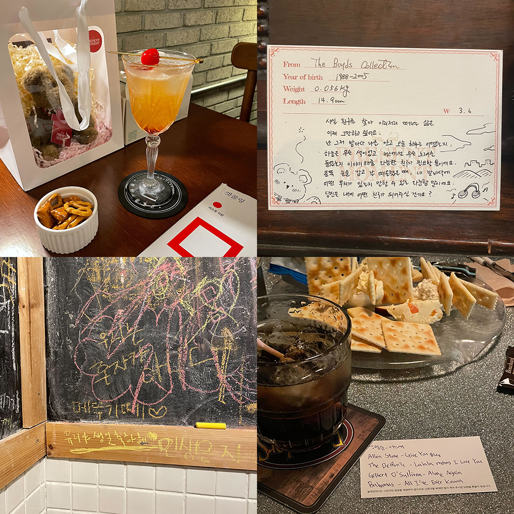

어떤 귀여운 곰돌이들보다도 이 곰돌이가 유리 것 같았다. 카드에 적힌 설명이 내 마음을 대변했고, 왜 꼭 이 곰을 골랐는지 유리 앞에서는 부연 설명 덧붙일 필요 없었다. 그저 “이 설명 때문에 이 곰돌이로 골랐어” 할 뿐이었고, 유리는 이유를 묻지도 않고 내 마음을 그대로 읽어 주었다. 눈물 닦는 모습에 나도 눈물이 고였다.

종종 혼자서 합정 골목을 돌곤 했다. 합정을 걷다 보면 사랑하는 사람들이 하나둘 떠올랐고 나는 그 마음을 곧잘 전했다. 유리랑 함께하고 싶었다 말했었던 바 두 곳을 돌았다. 유리보다도 유리 생일을 챙기며 들떠 하는 사람을 많이 보았다던, 어느 때보다 많은 축하를 받았다던 유리. 생일 축하했어.

### Mash-Up

오랜만에 매시업 정모. 걍...... 개취했던 날. 이 날 이후로 술 끊었다. 막걸리 + 와인 + 위스키를 마셨으니.... 필름 끊기는 경험도 해 보고.... 이젠 정말...... 아니다. 또렷한 기억은 없지만 지하철에서 만난 정아 끌어안은 기억이 어렴풋하게 있음…. 요즈음 사람 안는 것 너무 좋아하는 듯….

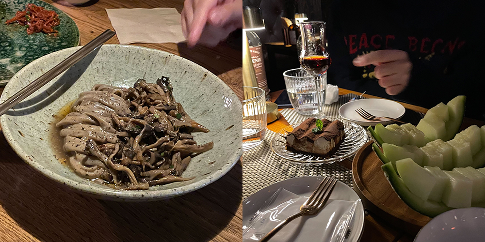

### 잭 더 리퍼

아란넴 제주로 떠나기 직전에 함께 본 뮤지컬. 올해는 아란넴이랑 뮤지컬을 세 편이나 봤네.

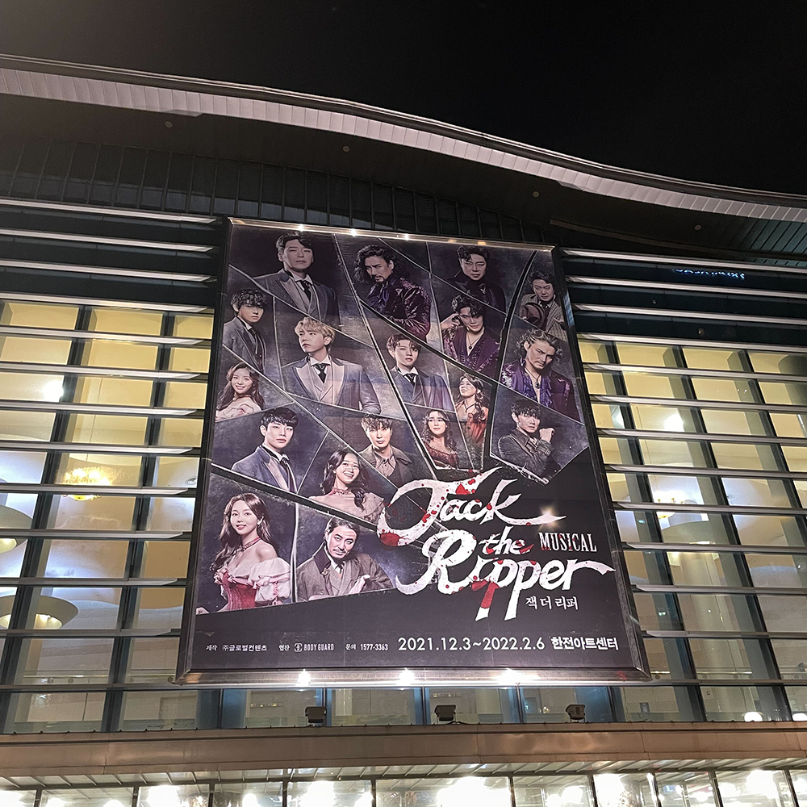

잭 더 리퍼는 빻은 구석이 많은 극이었지만 잭에게 굉장히 압도당했고 왜 5060 세대가 나훈아에 열광하는지 실감했다. 잭 배우 분 나훈아 뽕삘 지대루였는데 개멋있다 생각함.... ㅋㅋ 역할도 너무 잘 어울렸고. 나훈아와 무대 연출만이 기억에 남는 극. 빙글빙글 돌아가던 계단 신들에서 배우들은 멀미 안 났을까.

### 대전

비건 커뮤 모임이 대전에서 있어서 여행하는 마음으로 대전에 1박 2일 머물렀다. 원래 시간 맞으면 예은이도 볼까 했었는데…… 예은이 시험 때문에 우리의 조우는 다음 번으로. 대신 가고 싶었던 비건 식당 가 보고, 공연도 봤다.

#### 어플레져

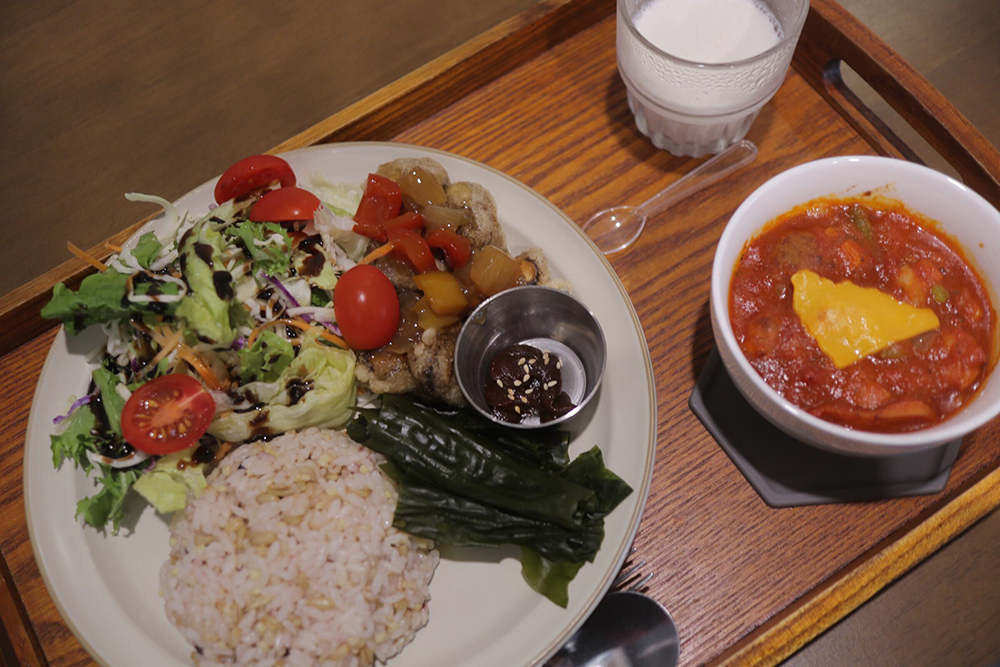

비건 브런치가 가능하다기에 방문했던 어플레져. 매월마다 음식을 다르게 내어 주시는 듯했는데, 내가 갔던 겨울에는 토마토스프와 표고탕수가 메인이었다. 양이 좀 적은가? 싶었지만 먹다 보니 매우 든든했던. 특히 저 코코넛푸딩이 예술이었다. 공간도 널찍하고 분위기도 좋았어서 언젠가 대전 올 일이 또 생긴다면 다시 방문하고 싶었다.

#### 맞배집

예은에게 대전에 비건 술집이 있다고, 맞배집이라는 곳이라고 몇 번 들은 적 있었다. 대전 방문 며칠 전에 혼자라도 방문해 볼까 하고 검색해 보니 마침 내가 갈 날에 공연이 있었고, 그때 처음으로 `안다영`의 음악을 들어 보게 되었다. `불행이 우리를 삼키려 할 때 내 사랑은 가장 영원해요`의 가사를 보자마자 예매를 꾹.

> 무한이란 없는 세상에서 덕분에 어려워진 건 나의 사랑은 여기에 완벽히 제일 큰 불행일 거여요 기쁜 우리 사랑 어느 날 불행해지려나 나는 술래가 아닌데 겁이 나요 0에 다가온 것 같아 영원은 곱게 구겨져도 매일 쓸 거야 널 사랑해

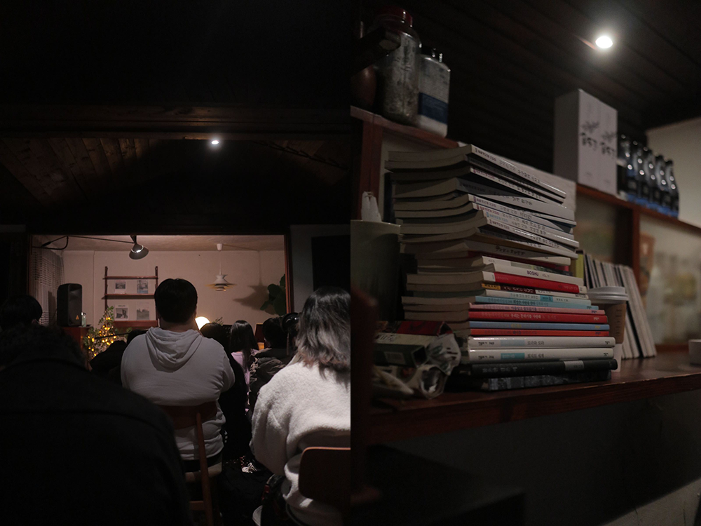

내가 사랑하는 사람들이 금방이라도 사라질까 겁내던 때에 운명처럼 위로가 되는 곡을 만났다 싶었다. 실제로 본 안다영은 훨씬 더 예뻤고, 감정이 풍부했고, 고왔다. 어떤 생각으로 쓴 곡이었는지 설명을 들을 때에는 내가 위로를 받았던 분명한 포인트들이 모두 녹아져 있었어서 더 좋았고, 아티스트의 마음을 읽는 경험, 나와 같은 감정선을 가진 사람이 있다는 게 정말 큰 위로가 되었다.

#### 복동 투어

이튿날은 모든 일정이 비건 커뮤 멤버 `복동` 님의 계획대로 짜여진 날이었다. 상상 이상으로 많은 것을 준비해 주셨고, 아침 10시부터 저녁 6시까지 알차게도 놀았는데 전혀 피곤하지가 않았다. 일곱 명의 이야기와 생각들이 끊이질 않았음에도 그 어느 하나 유해한 것도 없었고, 이렇게 좋은 것만 있는 하루도 있구나 하는 생각, 언젠가 이 날의 기억을 붙잡고 또 며칠을 살겠구나 하는 생각이 들었다.

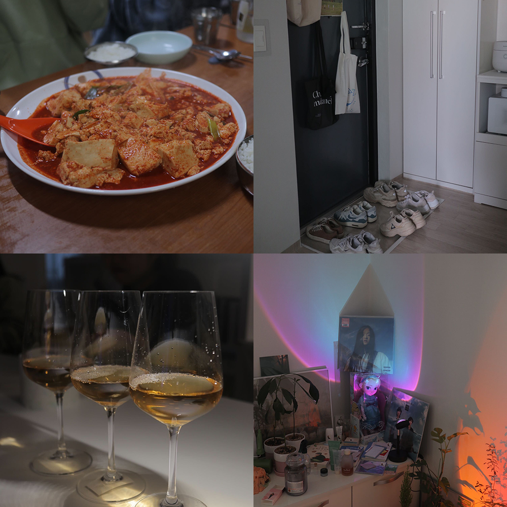

사소한 것을 사소하게 여기지 않고 귀히 여길 줄 아는 사람들, 좋아하는 것들이 많고 확실한 사람들, 대화의 확장이 자연스러운 사람들, 내가 너무 좋아하는 유형의 사람들. 좋은 날에 좋은 사람들과 함께해서 더없이 행복했다.

### 메모어

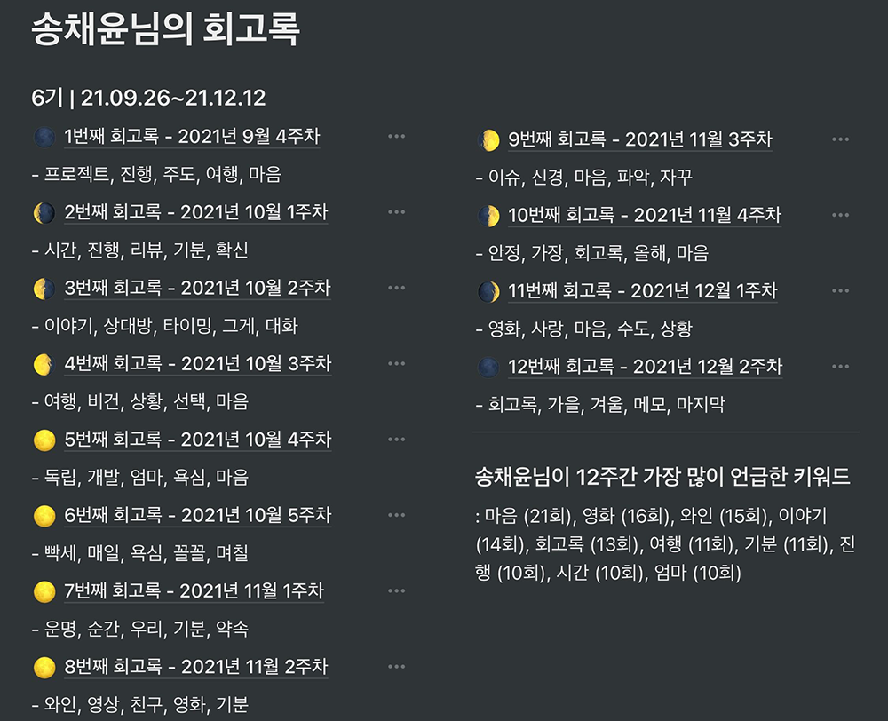

세 달 동안 매주 회고록을 올리는 메모어에 참여했었다. 세 달이 지나니 이렇게 키워드도 뽑아 주시더라. 나는 참 마음을 돌보면서 살았구나.

### 필름 스캔

잊고 있었던 19-20년도의 필름과 21년의 필름을 인화했다. 지나간 사람들이 담긴 필름이었지만 추억할 수 있는 때에 꺼내 보아야 하지 않겠어요. 필름에는 바다가 많았다.

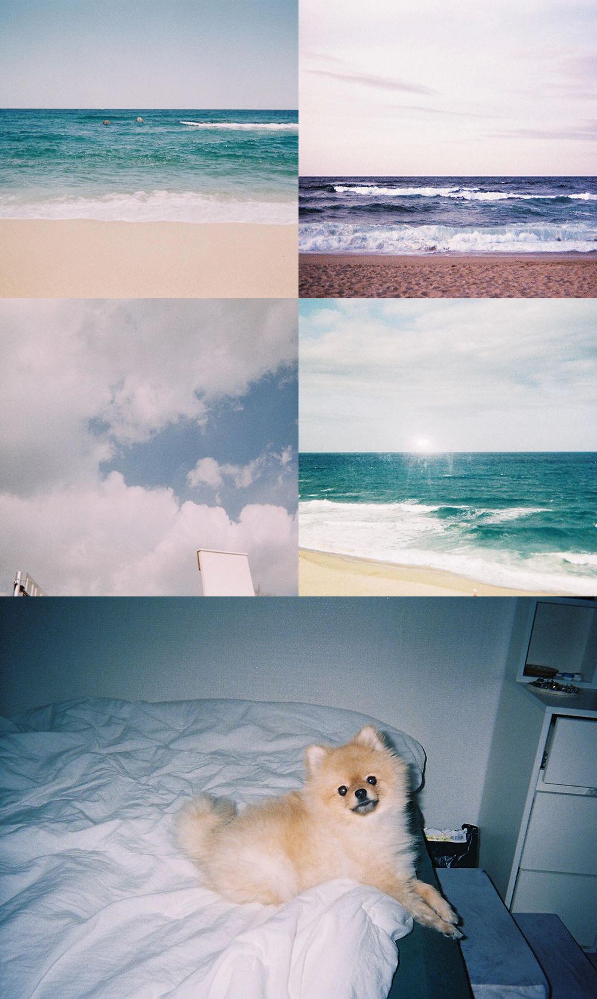

### 개포동

연말 마무리는 개포동과 함께. 그래도 계절마다 한 번씩은 만나는 우리. 셋 다 직장인일 때 만난 건 또 처음!

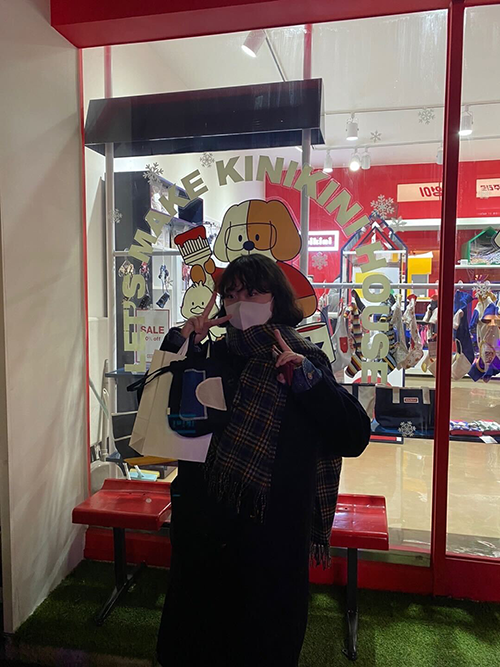

타인에게 사진 찍혀 보는 게 넘 오랜만이라고 그랬던 사진. ㅋㅋ 실로 오랜만이었음…. 요기서 땅콩이 옷 하나 샀다~!

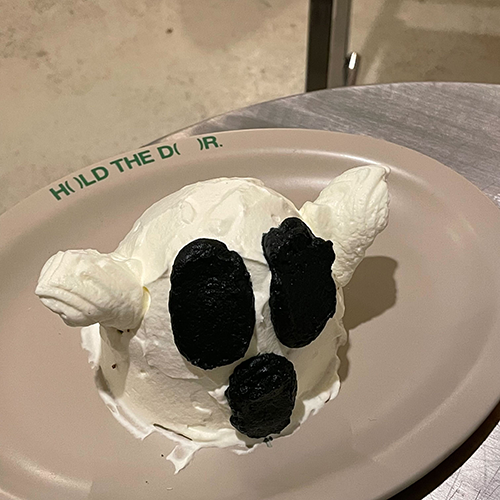

힙쟁이 은지 덕에 이런 힙한 카페도 오랜만에 가 보고!!

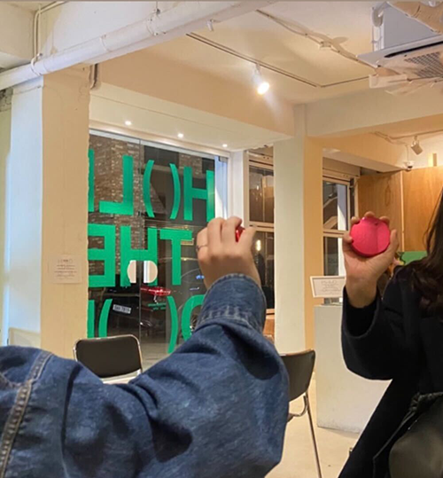

ㅋㅋㅋㅋㅋㅋㅋ 언니랑 나랑 똑같은 나스 때문에 같이 닥터 스트레인지도 돼 보고!!!!!

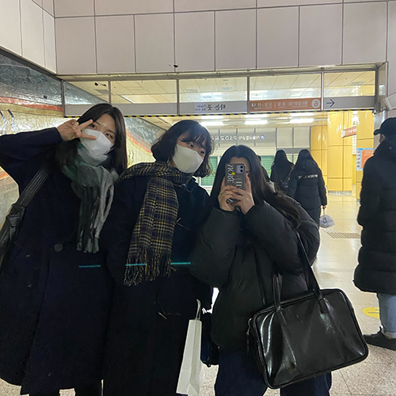

빨리 또 만나고 싶다. ღ
