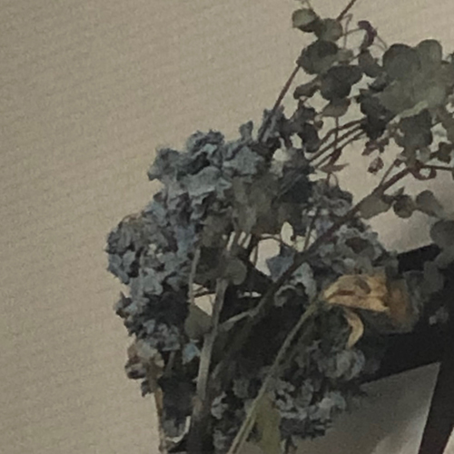
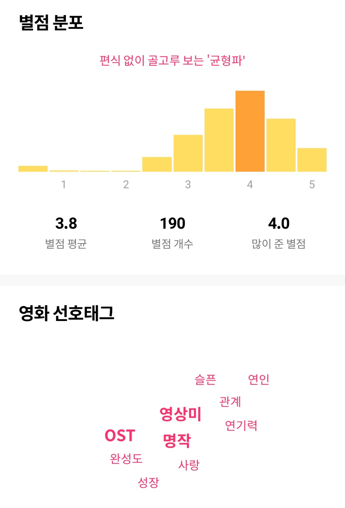
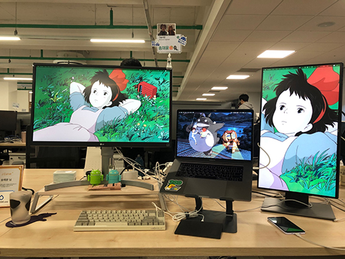
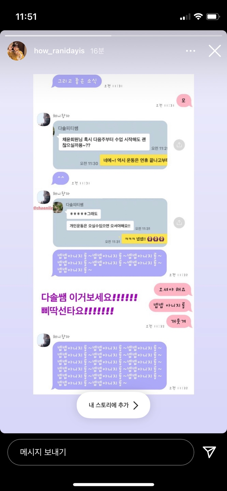
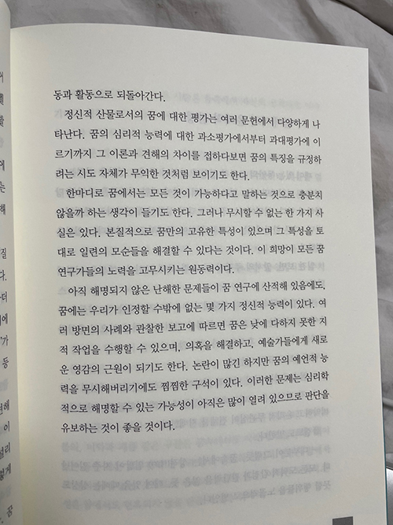

### 죽은 꽃 버리기

안 좋은 일이 생기면 죽은 꽃부터 버리라는 설이 있다고 한다. 이 이야기를 해 준 사람은 꽃을 마를 때까지 두는 게 그다지 좋은 일은 아니라는 뜻이었는데, 나는 듣고 '안 좋은 일 생길 때 버리면 그 뒤에는 다시 좋아질 수도 있겠네' 했다. 그리고 2월 초부터 마른 꽃을 버렸다.

말라 비틀어진 꼬라지 보아하니 저게 꽃인가, 곰팡인가 싶기도 하지만. 땅에 처박힌 기분 끌어올리겠다고 별 짓 다 했었는데, 버리자마자 그 뒤로 좋아지더라. 제멋대로 해석한 미신이 그럴싸한 수확을 냈다. 버릴 꽃을 두기 위해 꽃을 자주 둘 셈이다.

### 왓챠피디아

깔아 놓더라도 본 영화 기록은 또 잘 안 해서 금방 삭제했던 앱을 다시 깔았다. 몰랐는데 내 별점이 후하다더라. 무슨 내용이었는지 기억은 안 나지만 보고 나와서 개처역대급이었다고 했던 기억만 있는 영화들은 죄다 4점 때려 버렸는데, 친구가 듣더니 어떻게 그럴 수 있냐고. 내용 기억도 안 나면 2.5나 점수 안 매겨야 되는 것 아니냐고.

내용은 기억 안 나도 내 감정이 기억나면 4점 줄 만하지. 기억날 만한 강렬한 감정이었다는 그 사실이 더 중요하지. 응응.

### 케빈에 대하여

미장센이 아름다운 영화라는 것 하나로 봤다. 느낀 점을 축약하자면 선천적인 사이코패스 기질이란 것은 없을 것이다, 케빈은 그럴 수밖에, 에바는 왜 끝까지 책임을 지려 했나. 자신의 탓이라는 죄책감 때문일까. 그리고 이 영화는 이 리뷰를 읽은 뒤로 더 좋아졌다. https://bit.ly/3rN6Yd2

### 마녀 배달부 키키

PC 배경 화면으로 대문짝만 하게 해 놨으면서 정작 본 적은 없던 영화. 우습게도 그랬는데 드디어 봤다. 지브리 영화 중 가장 좋아하는 영화인 귀를 기울이면 바로 뒤로 제일 좋았던 영화로 단박에 자리매김. 아무것도 못 숨기는 명랑한 마음에 내 마음까지 환해지는 기분. 키키처럼 자기 마음 하나 못 숨기는 사람들을 보면 자꾸 친해지고 싶다. 인턴 시절에 입에 달고 살던 소리가 `저는 제 감정 상태 하나 컨트롤 못 하고 다 티 내고 다니는 것 같아요 ㅠㅠ 정말 이런 제 자신 저도 버겁고 그치만 저도 잘하고 싶은 건데 저는 왜 이렇고 어쩌고 ㅠㅠ` 이런 거여서 그런가. 최근에는 이런 사람을 본 적이 있던가. 모르겠다.

### PT

점점 게을러지는 것 같아서 다시 PT를 등록했다. 이제 진짜 운동 다시 열심히 할 거다.

ㅋㅋ

### 이태원 좋아

피티 시작 전에 맛있는 돼지 파티를 했다. 

먹을 곳 찾으려고 인스타 뒤지는 내내 사람들이 위치 태그는 안 걸어 놓고 댓글로 정보 디엠 주셨다 해서 개빡쳤지만 나는 기어코 찾아냈고, 성공했다. 음식점 정보 궁금하심 **디엠 주세요.** :D

### 꿈의 해석

최근 주변 사람들이 기이한 꿈을 많이 꾼다. 그리고 나는 늘 그래 왔다. 잠에 크게 미련도 없고, 깊은 잠을 그렇게 자주 자는 편은 아니어서 그런지 꿈을 자주 꾸는 편인데, 꿈 내용이 늘 해괴망측하다. 사람보다는 동물이 나올 때가 많고, 자연재해가 많이 일어나고, 주변 사람이 많이 죽고, 무엇이 나오든 개체 수가 엄청 많거나 징그럽다. 색채감도 뚜렷한 편이다. 최근에는 자꾸 꿈에 나오는 사람들을 두고 온 것 같은 기분이 든다. 꿈에 나온 사람이 지금은 나를 여기 두고 가더라도 다시 돌아와 줘야 한다 말한 적도 있다.

꿈을 더 알고 싶어서 프로이트의 꿈의 해석을 구매했다. 흥미로운 부분이 한두 개가 아니라 나에게 꿈 이야기를 했던 사람들한테는 다 찍어서 보여 주고 다니는 중. 읽다 보면 나까지 무의식 세계에 빠져서 말투도 이상해지고 그랬다.

흥미로운 내용이 많아서 계속 읽게 됐지만, 그와 동시에 꿈은 아무리 기이해 보여도 자신이 오래 전에 겪었던 일이나 최근에 겪었던 일 등 자신의 경험에 기인한다는 점이 자꾸 마음에 걸렸다. 나는 꿈의 세계를 완전히 초자연적인 세계로 믿고 있었기 때문. 그래도 이 부분을 읽으니 다시 기분이 좋아졌다. 꿈을 해석하는 일은 무의미한 일일 수 있지만 자신은 의미 있는 일이라 생각한다며 각종 꿈을 분석한 내용까지 연이어 나오니 최근 가장 흥미롭게 읽고 있는 책이 아닐 수 없다.

### 그리고 또 음악

https://youtube.com/playlist?list=PLpvzPo7KbWgBhLoJiV7x4BctBCyYI9tke

요즈음은 이것만 듣는다.

