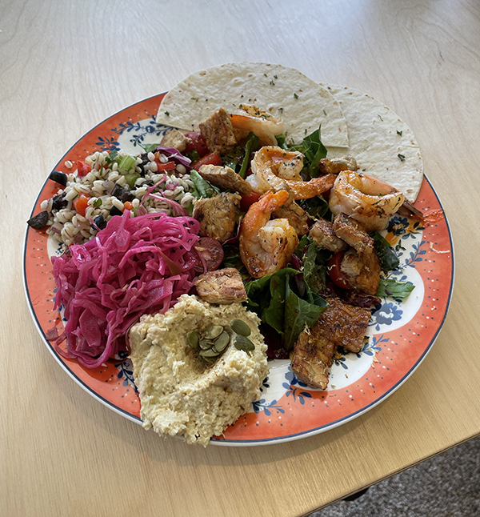
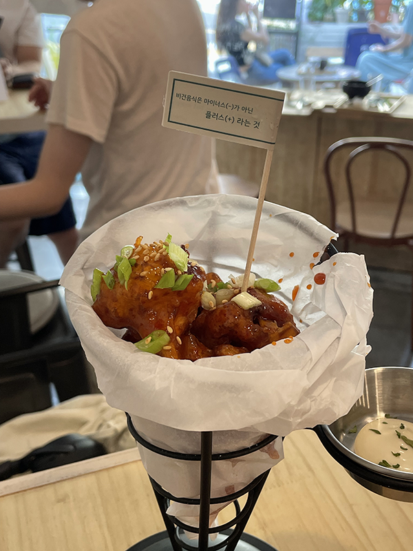

### 문학살롱 초고

올해 겨울 이래로 혼자 칵테일 홀짝이고 오는 취미를 들였다. 합정 부근 지날 때마다 넘 궁금했던  `문학살롱 초고`를 드뎌 방문. 책 이름으로 된 칵테일을 주문하면 그 책과 함께 칵테일이 나온다. (연남동의 `책바`와 비슷한 콘셉트다. 여기도 가 보고 싶음!)

첫 번째로 주문했던 칵테일은 오은 시인의 `우리는 분위기를 사랑해`. 제목이 예뻐서 좋아하던 시집이었는데(하지만 내 취향의 시는 없었던) 마침 있길래 바로 주문쓰. 되게 달았고 체리 맛이 났던가.... 한 달 지났다고 벌써 기억 안 난다.... 체리 리큐르가 들어가나 싶었는데. 아무튼 이건 도수가 좀 있었는지? 한 잔으로도 금방 술기운이 올라서 기분 수직 상승해서는 바아로 깔루아밀크 또 시켰는데 요즈음은 술 두 잔째 들어갈 때부터는 영 취하지를 않아서.... 술이 깨 버려서.... 기분 좋았던 고 느낌은 우리는 분위기를 사랑해에서 끝나 버린 것입니다.... 세 번째 잔으로 `이방인`도 시켰는데 요것도 짱 맛있었다. 요게 제일 맛있었던 것 같은데 무슨 맛이었는지는 기억이 안 나는? 사실은 취했던 게 아닌쥐? ㅎ

조용함을 지향했던 바였는데, 갔던 날 한 테이블이 되게 시끄러웠다. 두 명이서 네 명의 데시벨을 냈다고 해야 하나. 사장님께서 조금만 조용히해 달라고 두 번을 왔다 갔다 하셨는데도 계속 시끄러워서 내가 다 눈치 보였다. 초딩 때 쌤이 떠들지 말라 하셨지만 나도 모르는 사이 떠들고 있어서 반성문 썼던 전적이 있는 고로 그 테이블 분들이 왜 그렇게 시끄러우셨을지는 이해가 가면서도 사장님은 곤란하셨을지, 기분 나쁘셨을지가 궁금했다. `우리는 조용함을 지향하니까 곤란하지만 말씀드려야겠다`의 마음이셨을까, `왜 저렇게 시끄럽게 굴지`의 마음이셨을까? 조용한 공간을 지향하는 사장님들의 마음은 어떤 마음일까?

그리고 여기서는 유독 데리고 오고 싶은 사람들이 많이 생각났다. 문학을 좋아하고 조용함을 좋아하고 새로운 공간을 좋아하는 사람들이 하나씩 떠올랐다. 다음번에는 같이 갈 수 있었으면. 데리고 가서 조용하게 떠들어야지.

### 필라테스

5월부터 새로운 운동을 시작하고 싶어서 이것저것 알아보러 다녔었는데, 결국에는 필라테스로 결정했다. 결정하게 된 이유는 크게 없고 인스타그램에 소그룹 모집 광고가 떠서? ㅋㅋ 이십 대 초반에 6:1 수업은 들어 봤었지만 소그룹은 못 들어 봐서 궁금했었다. 근력 운동은 좋아하면서 스트레칭은 귀찮아하는 탓에 수축되어 있는 근육들이 많기도 했고, 필라테스가 이완에 좋을 것 같았고. 지금까지 다녀 본 바로는 만족!

아침 수업을 듣고 있어서 하루를 개운하게 시작할 수 있다는 점이 가장 좋다. 필라테스 수업 있는 날은 하루 업무 효율이 좋다. 매우매우 알찬 하루를 보내게 된다. 그리고 헬스는 아침 안 먹으면 할 힘 전혀 없고 의지도 안 드는데 ㅋㅋ 필라테스는 오히려 밥 안 먹고 가야 편하게 할 수 있는 듯. 하고 나면 개운하고, 에너지 충전되는 기분. 에너지 충전은 사실 쌤의 힘이 크다. 타고난 사랑이 많으신 분 같다. 사랑을 많이 주신다. 진짜 친화력 갑....... 두 번째 수업에 서로 인스타그램 친구까지 맺어 버리쉰. ENFP냐 여쭈었는데 맞혀 버리쉰. 나는 운동도 참 사람 영향 많이 받는다.

### 개포동

개포동에 간 건 아니고요, 개포동 자매를 만난 날입니당. 그냥 다들 포동포동허이 먹는 것 좋아해서 개포동 자매들임.... 첫째 포동이(승주) 둘째 포동이(채윤) 막내 포동이(은지)의 조합으로 이루어진 동기 모임이랍니당. 이 이름 어떻게 짓게 된 거지. 일단 손은지가 지은 것 같은데. ㅋㅋ 어떻게 수락한 거지?

승주 언니 시험 끝나는 날 맞춰서 모든 것을 언니 몰래 <승주 파티>로 기획한 만남이었다. 고생한 언니를 위한 꽃다발 쑤아비쑤~ 박지훈 좋아하는 언니를 위한 박지훈 단골 치킨집에서 치킨 포장 쑤아비쑤~ 진짜 오랜만에 만난 건데도 꼭 같이 셔틀 타고 하교하는 것 같은 기분이었다. 망원 한강 공원에서는 바다 냄새가 났고, 은지는 얼리어답터답게 애플리케이션으로 하늘의 별을 검색했고, 언니는 말하다 숨이 넘어갈 것처럼 (ㅋㅋ) 같이 나누고 싶은 이야기가 많았고. 모든 순간이 소중했고 한 순간도 빠짐없이 행복했던 날.

### 에세이 프로젝트
6월 한 달 동안 매일 한 개의 글감을 받아서 950자 내외의 에세이를 작성하는 프로젝트에 참여했다. 안 쓰면 기억하지 못한다는 걸 알고 의식적으로라도 쓰려고 신청한 프로젝트였고, 24개 이상의 글을 쓰면 책으로도 만들어 주기 때문에 기필코 좋은 글을 꽉꽉 채우고 싶었는데…. 한 달 내내 글을 쓸 때마다 마음에 안 들었다. 처음에는 쓸 때는 괜찮고 나중에 보면 과하더니, 나중 가서는 쓸 때부터 ‘이건 구리다’ 생각하면서 쓰게 됐다. 쓰고 싶은 말이 있어서 쓸 때는 술술 잘 써지는 것 같았는데 주어진 주제로 글을 쓰려고 할 때는 잘 써지지 않았다. 무언가 과하고 어딘가 비어 있는 것 같았다. 그래도 계속 썼다. 주제가 ‘글’일 때는 이런 글도 썼었다.

> 그럼에도 하루도 빼놓지 않고 글을 계속 쓰고 있는 것은 이럴 때의 내 모습이 글로 담기면 어떨지 궁금하기 때문이다. 내 마음에 한 개도 안 차는 글을 나중에 보면 그래도 느껴지는 게 있을지. 그때 봤을 때에도 여전히 못생긴 글일지. 다르게 다가오는 것이 있을지. 그래서 죽이 되든 밥이 되든 써 보고 있는 것이다.

지금 와서 내 글들을 다시 보면 썩 나쁘진 않은 것 같다. 이 기회를 발판 삼아 가끔은 강제적 글쓰기도 필요할 것 같다. 지금은 한 달 블로그 쓰는 것도 미루고 미뤄서 마지막 날에야 쓰고 있다만.

### 팬텀

아란넴이 친구 티켓팅 도와주다가 재미로 잡아 본 표가 잡혀 버려서 (?? ㅋㅋㅋ) 같이 가게 된 뮤지컬. 캣츠 이후로 두 번째 뮤지컬이었고, 모국어로 듣는 뮤지컬은 처음이었다. 이 뮤지컬을 계기로 영화나 책보다 뮤지컬이 내게 가장 강력한 자극을 주는 걸 알았다. 말로 표현할 수 없는 벅차오름을 뮤지컬 영화에서만 느끼는 줄 알았는데 뮤지컬이야말로 감동이 극에 달했다.

크리스틴이 팬텀에게 가면을 벗고 얼굴을 보여 달라 하는 것은 꼭 사랑하는 사람의 치부까지 알고 싶은 마음을 표현하는 것 같았다. 사랑하면 뭐든 알고 싶고 뭐가 됐든 괜찮을 것 같은 마음. 팬텀은 크리스틴이 감당할 수 없을 거라며 몇 번을 거절하지만 결국 사랑한다는 이유로 얼굴을 보여 주고, 크리스틴은 역시나 놀라서 도망간다. 단순한 외모지상주의를 보여 주는 것이 아니라 보여 주고 싶지 않았던 치부를 드러내고 결국 상처받는 과정을 보여 주는 것 같았다. 팬텀이 자신을 보고 도망간 크리스틴을 이해하고 미워하지 않는다 하는 대목에서 마음이 너무 아렸다. 상처받을 대로 상처받은 사람은 왜 이해하고 또 아픔을 감내해야만 하는 걸까 싶어서. 그게 너무 슬퍼서 울었다.

마음이 많이 약해져 있을 때 봐서 그랬을 수도 있지만 이 뮤지컬은 나를 많이 울렸다. 그리고 나를 위로했다. 다시 극이 올라오면 꼭 또 보러 가야지.

### 채식

자주 보는 운동 유튜버가 템페를 구워 먹는데 그렇게 맛있어 보이는 거다. 그래서 템페를 파는 식당에 꼭 가 보고 싶었다. 미용실 근처에 이집트 음식을 파는 곳이 있어서 가 봤다. 상호명은 뉴질랜드스토리.

일단 인테리어가 너무 예뻤다. 한국에서 맛보는 외국의 맛? 음식도 깔끔하게 맛있었고, 템페는 내가 생각했던 것보다 특별한 맛이 없었다. 그래도 그래도 굳이 굳이 맛을 표현해 보자면 약간 고소한 맛. 그런데 식감이 얇게 꾸덕하니 은근히 생각나는 맛이었다. 지금은 컬리로 네다섯 팩씩 시켜서 먹고 있다. 완죠니 중독됐다. 지금도 먹고 싶다. 소스를 잘 머금다 보니 이런저런 소스들 찍먹 하다 보면 진짜 금방 동난다. (추천 조합: 비비드키친 저칼로리 칠리 소스/허니머스타드)

그리고 또 궁금했던 곳, 해방촌 바이두부. 여기도 또 다른 운동 유튜버 통해 알게 된 곳인데, 비건 운동 유튜버가 추천하는 비건 맛집이었다. 단지앙 님인데…… 내가 방문한 날 단지앙 님을 봤다. (!!) 일행 분과 함께 오셨길래 멀리서 속으로만 외쳤다. ‘저 구독자예요….’

두부보울과 주말에만 판매한다는 콜리플라워 튀김을 시켰다. 두부보울은 평소에 자주 해 먹던 에어프라이어에 돌려 먹는 구운 두부 강정과 비슷한 맛이 났는데, 소스가 많이 버무려져 있어서 조금 더 자극적이었다. 콜리플라워 튀김은 야채튀김과 비슷한 맛이었다. 그릇까지도 친환경적으로 코코넛 껍질로 만들었다더라. 발상이 신선했고 같이 환경을 보호하게 된 것 같아 기분 좋았다.

나는 샐러드를 좋아하는 편이라 보통 식사도 샐러드 위주로 하는 편이었는데, 토핑은 자유롭게 올리곤 했다. 닭가슴살, 새우를 가장 많이 올려 먹었고, 때에 따라 소고기 등심이나 안심을 올려 먹기도 했다. 그런데 바이두부를 다녀온 뒤로는 토핑에도 점점 신경을 쓰게 됐다. 나 평소 먹던 것들에서 조금만 더 신경 쓰면 채식도 쉽겠는데? 싶어서. 그렇게 바이두부를 계기로 채식에 더 관심을 갖게 됐고, 이 글을 쓰고 있는 지금(7월 30일)은 비건으로 살고 있다. 비건에 관한 자세한 이야기는 7월 블로그로.

### 이태원

슈반슈 만난 날. 배 터지고 입 터지게 시끄럽게 놀았다. 얘 때문에 내가 지금도 ‘존웃탱’을 입에 달고 살게 됐다고. 대화 내용들이 비방용이라 (ㅋㅋ) 다 언급할 수는 없지만 다소 재미없던 일상들에 이렇게 재미있는 만남도 진짜 오랜만이었다. 나는 누굴 만나도 그 사람을 배려해야 한다는 강박 아닌 강박이 있어서 만남에 에너지를 많이 쏟는 편인데 이 날은 무슨 일인지 깔깔거리기만 할 수 있었다. 비가 그렇게 쏟아졌는데도.

같이 업어 온 프라이탁. 못 사면 대가리 깨고 싶을 것 같다고 해서 기어코 삼.

키에리 케이크 2인 3개. ㅋㅋ

진짜 먹을 생각 1도 없었던 술까지…. 다담 주에 보자고…. 가 보자고~~~

### 신군신양

무엇을 기념하여 어느 카페를 갔다가 (^^) 아라넌니가 가 보고 싶다던 LP바 간 날. 신청 곡이 나올 때마다 그 곡의 LP를 이렇게 전시한다. (나는 뒤에 있는 마이클 부블레의 Sway를 신청했다지) 인상깊은 인테리어였다. 사실 더 인상깊었던 건 화장실인데, 신청 곡에 제한을 두는 이유와 함께 다른 장르를 신청하고 싶을 때 가 볼 만한 다른 바들을 적어 두셨더라. 예민한 다정함이 느껴졌다고 해야 하나? 그런 느낌.

공간이 주는 힘인지 자꾸만 행복해졌다. ‘여기 다음에 또 오자’는 말을 좋아한다. 함께하는 지금 이 시간이 너무 행복하다는 말을 가장 꾸밈없이 보여 주는 말 같아서. 그 날도 그 말을 들었고 나는 여길 우리 아지트로 삼자고 그랬다. 내가 마셨던 건 논알코올이었는데 꼭 알코올 들이킨 것 같은 기분이 났다.

묘하게 중독성 있는 맛. 나중에 또 와서 요거 또 시키고 싶었다. 아란넴은 포트와인 시켜서 나도 한 입 홀짝여 봤는데…… 신세계. 엄청 달았고 아란넴 말로는 되게 빨리 취할 수 있대서 와인 마실 일 생긴다면 요걸 마셔야겠다 다짐! (취하고 싶다!)

### 체리

6월 내내 빠져 있던 과일. 칵테일체리나 먹어 봤지 내 돈 주고 체리를 사 먹기는 또 처음이었는데, 넘넘 맛있어서 대충 한 달 동안 다섯 팩 정도는 먹은 것 같다. 뽀득한 식감이 좋아서 자꾸 사 먹었다. 과육에 비해 큼직한 씨앗의 존재감이 컸다. 젤 좋아하는 과일 물으면 원래는 딸기나 바나나 같은 애들(자기주장 강한 과일)을 들었는데 이제는 체리라고 말할까 보다.

