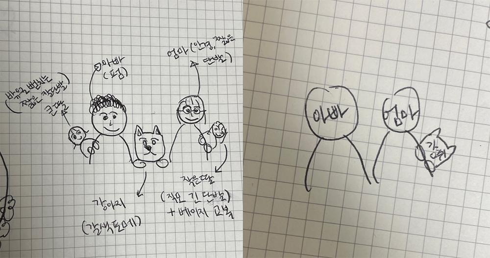
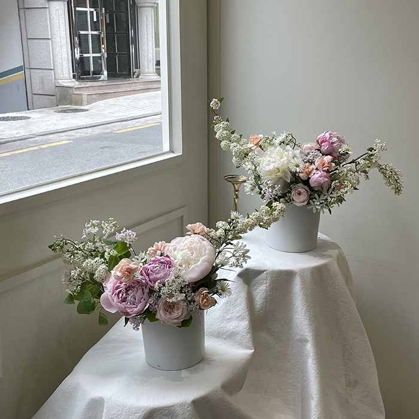
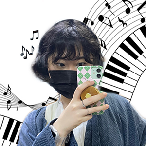
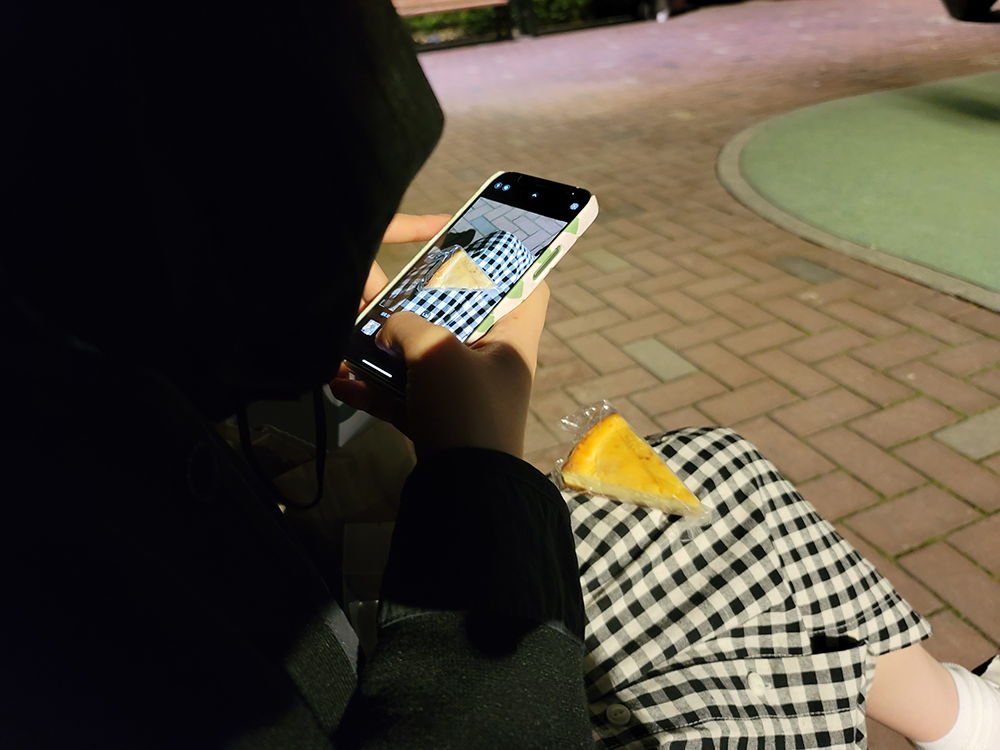
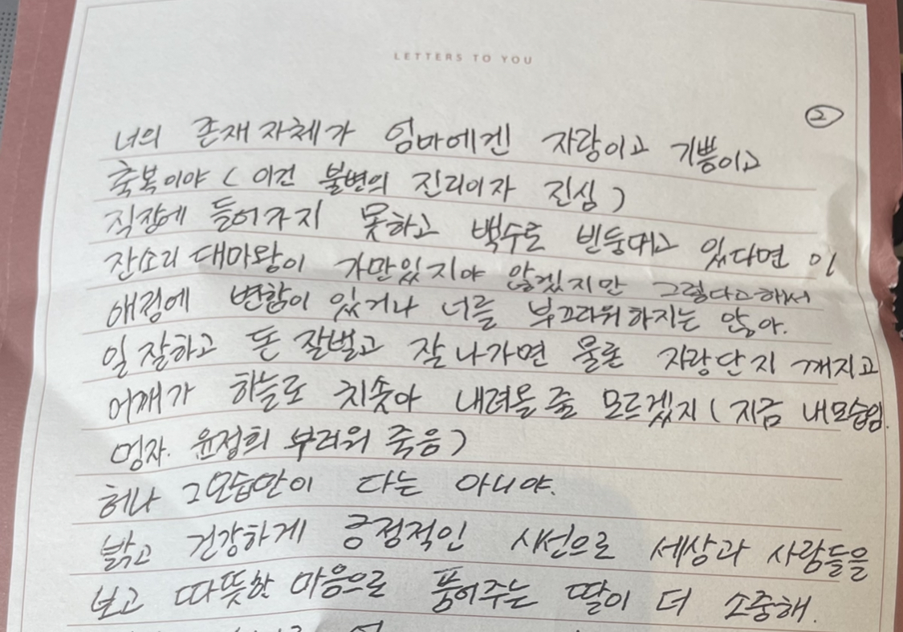
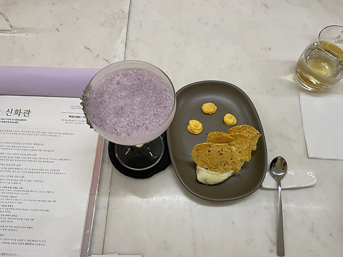

5월은 한시도 몸을 가만 두지 않았다. 4월 내내 나에게는 자극이 필요함을 깨달아 계속해서 새로운 경험을 벌이며 살았다. 그리고 계속해서 소비했쥐.

### 아이패드

5월 1일이 되자마자 아이패드를 샀다. 6월에 쓰고 있는 5월 블로그라서 왜 사고 싶었는지 가물가물.... 그런데 아이패드는 딱 이럴 때 사라던데요. 사고 싶은 이유: `그냥 아이패드를 갖고 싶음`일 때. 아무래도 글 쓸 때 맥북 들고 다니기 무거웠던 이유가 제일 컸었던 것 같다. 구매 후기는 대대대대만족. 카페 갈 때 어깨 훨씬 덜 무겁고, 이북 보기 너무 좋아서 책 자주 읽게 되고, 사이클 탈 때 영상 크게 볼 수 있는 것도 행복 그 자체라서 유산소도 덜 거르게 됨.... 플래너 쓰기도 너무 편하다. 이제 스벅 다이어리 별 모으겠다고 난리 안 피워도 될 것 같음. 애플은 소비할 때마다 뽕 지대루 뽑는 듯. 애플워치가 작년 내 최고의 소비였는데, 올해는 아이패드가 될 것 같다. 이러니 내가 앱등이 못 벗어나지.......

### 어버이날

엄마에게 썼던 어버이날 편지. [(링크)](https://brunch.co.kr/@chaeniiz/14)

올해 어버이날은 이렇게 편지(아 물론 아빠 것도 썼다구요), 각인 펜, 주문 제작 떡케이크로. 떡케이크 픽업 하러 가는 날 처음으로 분당에 가 봤는데 이 동네 분위기가 정말 좋았다. 케이크 픽업 후 집까지 가는 길은 퇴근길 9호선 러쉬 + 바리바리 싸든 짐 때문에 아주 죽음이었지만....... 동네에 대한 기억 자체는 정말 좋았던. 한산한 동네에 햇살까지 받으니 정말 봄인 것 같았다. 우리 가족이 나 말고는 케이크에 욕심들이 없으니 1호로 주문하고 싶었고, 엄마 + 아빠 + 나 + 동생 + 땅콩이까지 모여 있는 그림을 부탁드렸는데, 1호 사이즈로는 모든 인물이 들어가기 힘들 것 같다고 그러셨다. 그래서 엄빠 + 굳이굳이 땅콩이를 엄마 어깨에 올려 달라고 조악한 그림으로 설명하며 요청 드렸는데, 상상했던 것보다 케이크가 너무너무너무너무 귀엽게 나왔다. 픽업 가자마자 사장님께서 내 그림이 너무 귀여웠다고...? 절대 귀여울 리 없는 조악한 그림이었는데요......?



ㅋㅋㅋㅋㅋㅋㅋㅋㅋ 아... 진짜 사장님 넘넘 친절하셨다.... 저 그림을 칭찬해 주실 분이면 진심으로 에인졀이신 듯.... 이 날 잠시 휴직 중이던 광우 님이랑 저녁 먹으러 가기로 했어서 많이 힘드셨을까? 뭐라도 드리면 좋지 않을까? 싶은 마음에 케이크 가게 근처에 있는 예쁜 다과점도 들렸었는데, 여기 사장님도 너무너무 친절하셨었다. 친절한 사장님들을 보면 꼭 그 동네에 여행 온 것 같은 기분이 든다. 모든 선물을 다들 행복하게 받아 주셔서 내가 더 행복했었던 날.

### 두 번째 플라워 클래스, 파인다이닝

언제나 즐거운 아란넴과의 만남. 만나고 와서 우리가 했던 이야기가 있다. 취미와 성향이 비슷한 친구가 있다니. 요건 정말 큰 행복이야. 아란넴이 우리 회사 QA 엔지니어였을 때 종종 우리가 쌍둥이 같다고 하신 분들이 있었는데? 지금 생각해 보면 진짜 그래 보였을 것 같기도. 둘이 같이 있으면 약간 `우헤헤!!!` 모드라고 해야 하나.... 협업할 때는 이랬음.

```
채윤: 아란넴 제가 드린 apk 엉망진창임니다! 앱 자꼬 죽슴니다!
아란: 에에~~~ 그건 앱이 눈치 없었당 지가 먼데 죽어~~~
채윤: 그니까!! 나는 완전 억울한 개쓰렉 개발자!!
```

저 ㅈㄹ 후에는 늘 아마스빈 코코넛스무디나 스벅 햅쌀프라푸치노 같은 것 쪽쪽 빨면서 다시 돌아오고, 같이 오후 반차 써서 어텐던스 봇에 둘 반차 쪼로록 올라오자마자 미륵 님한테 `수상한데... 둘이 반차 쓰고 어벤져스 보러 가는 것 같은데...` DM오고.... 아닌데요아닌데요!!! 하고 어벤져스 보고 오고.... 회사에서 만난 내 인생 칭긔칭긔.... 이러니 회사 밖에서 만날 때도 너어무 재미있는 거고요?

나는 주로 "이거 해 보고 싶어!!" 하는 편이고, 아란넴은 추진력 갑이라 그걸 바로 실천으로 옮겨 준다. 플라워 클래스 가고 싶다고 하자마자 바로 날짜를 잡았고, 며칠 뒤에 가 보고 싶은 파인다이닝이 있는데 같이 가 보는 게 어떻겠냐기에 "미친!! 그럼 우리 플라워 클래스 갔다가 그거 먹으러 가면 되겠네엑!!!!!" "악!! 넘 신나!!!!" 한 다음 예약까지 완완. 나는 우리의 이런 호들갑이 좋다. 걍 똑같이 시끄럽게 굴어서 두 배로 신나 버리는 것이다.

두 번째 플라워 클래스는 작약 센터피스였다. 꽃다발처럼 특정 기법이 있는 것은 아니었지만, 꽃다발과 마찬가지로 큰 꽃을 먼저 꽂은 뒤 빈 곳을 채우는 방식이었다. 가장자리에는 길쭉한 꽃들을 채웠다. 역시 나는 수국처럼 큼직하고 후들후들한 꽃을 좋아해서 그런지 작약도 차아암 예쁘더라. 바야흐로 작약의 계절이라던데. 계절 따라 피고 지는 꽃들을 더 잘 알고 싶다.



아란넴이랑 나랑 둘이 같은 꽃들이었는데 꽂은 위치 차이만으로도 분위기가 엄청 달라 보였다. 둘 다 넘 예쁘지 않나요. 꽃 만들고 저녁으로는 한식 파인다이닝을 먹으러 갔다. 맛있는 음식과 함께하는 분위기를 사는 것 같아 더 자주 경험해 보고 싶었다. 와인 몇 모금 먹다가 서로 한 잔 더 마셔야겠다고 또 호들갑. 나 다 마셔 가는데 아란넴 아직 다 안 마셨길래 또 시켜야 되니까 얼렁 분발하라고 또 또 호들갑. 이런 호들갑 중일 때 다른 테이블 사람들도 다 두런두런 행복해 보여서 행복한 기운을 많이 받고 왔다. 여유로운 저녁 시간대에 여유롭게 예약한 사람들이 여유롭게 나오는 음식을 맛있게 먹으니까 행복할 수밖에 없겠지. 마주보지 않고 나란히 앉아 있는 테이블이다 보니 서로가 서로를 자연스럽게 보는 것들이 느껴졌다. 다들 먹고 나와서 우리처럼 행복하다고 외치면서 나왔을까. 집 갈 때 택시 타고 가서 더 행복했는데. 서로 최고의 이만 원이라고 그랬다고.

사실 그날은 비가 엄청 쏟아졌었다. 밖에서 꽃 들고 사진 찍자마자 하늘에 구멍 뚫린 것처럼 비가 쏟아졌다. 지금 생각해 보면 비 그렇게 쏟아졌고 + 원래 가려던 카페 못 갔고 + 멀리까지 가서는 프랜차이즈 카페 + 열심히 만든 센터피스 비에 다 젖은 채로 지하철 물품보관소에 처박아 뒀다가 + 겨우겨우 밥 먹으러 간 건데 둘 중 하나도 짜증 안 내고 헤헤거렸던 게 신기하다. '같이 있으니까 짜증 내지 말아야지....' 이런 것도 아니고 진짜 걍 헤헤 상태였다. 다 우리 둘 합이 좋은 덕이겠지. 여하간에 취미와 성향이 같은 친구가 있다는 것은 정말 큰 복이다. 얼른 또 작당모의하고 싶다.

### 머리 볶기

2-3년 전쯤인가. 회사가 논현이었을 때 항상 다니던 미용실이 있었다. 원래 동네 미용실 이곳저곳 떠돌았었는데 처음 그 미용실에 어떻게 갔더라. 무슨 이유에서였는지 뭐가 잘 안 풀려서 개빡쳤었고(?), 당장 머리 하러 가야겠다면서 회사에서 5분 거리에 있는 미용실을 당일에 예약해서 갔었다. 내 두상을 분석하는 주도면밀함과 완성도에 반했고, 머리 하면서 나누는 대화들이 너무 재미있었다. 나 원래 머리 할 때 말 진짜 안 했는데...... 선생님은 사람에 대한 관심이 많은 분인 것 같았다. 기분 좋은 추측들이 좋았다. `채윤 님 친구들은 채윤 님이랑 친구여서 좋을 것 같아요` 이 말이 그렇게 기억에 남는다. 쌤은 기억하실지 모르겠지만... 머리 하고 오면 잔뜩 사랑받고 오는 기분이라서 행복에 절여지는 기분이었다고. 쌔앰.......

회사 이사 후로는 아무래도 미용실을 논현까지 가기가 힘들어서 일 년을 또 방황했는데, 역시 펌은 그 쌤 아니면 못 맡기겠는 것이다. 복슬복슬한 시절의 내 사진을 보면 그렇게 그리운 것이다. 인턴 시절을 그 머리로 보냈는데 그때 열심히 행복하던 기억이 너무 좋았던 것도 한몫했고. 그런데 일 년을 다른 미용실 다니다가 다시 돌아갔을 때 쌤은 어떤 기분이실지가 좀 걱정됐다. 예약을 일주일을 고민했다. 고민 끝에 연락 드려서 예약을 잡고, 머리를 볶았다.



못 본 새에 쌤은 1인샵을 새로 내셨다. 단정한 쌤 분위기와 잘 어울리는 공간이었다. 구석구석 신경 쓴 인테리어가 예뻤다. 굴곡진 거울도 예뻤고, 바닥에 세워진 액자도 예뻤고, 예쁘게 난 창문에 옷걸이가 비치는 것도 예뻤다. 쌤은 내 얼굴 보자마자 어른스러워졌다 그랬다. `저 완전 앤데요 ㅠㅠ` 하면서 그동안 어떻게 지냈는지 이야기했다. 내 이야기보다는 쌤 이야기를 듣고 싶었는데 쌤은 내 이야기 끌어 내는 데 선수였고, 나는 그간의 회사 생활에 대해 이야기했다. 갑자기 왜 열심히 살아야 되는지 모르겠어서 힘들었다 그랬더니 쌤도 그랬다 했다. 닮은 점이 많았다. 쉬어 본 적 없이 인턴 생활부터 회사 생활을 시작했던 나, 미용 고등학교를 나와서 바로 취직하고 쉴 새 없이 일만 했던 쌤. 지쳐서 길게 쉬려 하셨는데, 한 달을 쉰다 하면 '한 달 뒤면 내 휴식이 끝나는구나'에 집중하게 되어 제대로 된 휴식을 즐길 수 없었다 그랬다. 그래서 퇴사하고 제주도로 가려 하셨는데, 계획 중에 갑자기 쉬어서 뭐 하겠냐는 생각이 드셨고(?!). 그렇게 퇴사 후 1인샵을 차리게 되셨다고. 못 쉬어서 힘들지 않으실까 싶었지만 혼자 일하는 게 행복하다 하셨다. 온전한 나와 손님의 공간이라 행복하시다고.

머리를 다 볶고 나니 처음 봤을 때로 돌아간 것 같다고 그랬다. 역시 이게 잘 어울리는 것 같다고. 나도 기분 좋게 끄덕끄덕. 쌤은 기한 정해진 제주도에서의 쉼보다 지금의 일상을 더 큰 쉼으로 생각하고 계실까. 어쨌거나 일은 쉼이 될 수 없지만, 매일의 자잘한 행복들이 모여서 제주 한 달의 행복만큼은 모일 수 있는 날들을 만들고 계실지. 그랬으면 좋겠다. 쌤이 행복했음 좋겠다.

### 제주

아란넴과 4박 5일 동안 즐거운 제주 여행. 제주 여행기는 나중에 따로 글로 길게 적어 봐야겠다. 숙소를 네 곳을 예약해서 매일매일 새로운 숙소에서 잤다. 이런 부지런은 나랑 아란넴이니 떨 수 있었던 것. 다른 친구들이었으면 `숙소 가고 싶은 곳 개많은데 걍걍 네 개 잡어??` < 했을 때 오바 ;; 나왔을 테지만 우리는 그걸 실제로 해냈고요...? 역시 마음 너무 잘 맞고요? 갔던 곳 중 추천하고 싶은 곳은 카페 차롱, 인디안 썸머, 집의 기록 상점. 4-5월에 정신 빠져 있었는데 아란넴이 가고 싶은 곳을 많이 알아봐 줘서 여러 예쁜 곳들을 같이할 수 있었다. 운전도 해 줬고, 호텔에 아이패드 두고 온 것도(...) 찾으러 다시 같이 가 줬고....... 함께하는 모든 순간들이 너무너무 즐거웠음과 동시에 너무너무 미안한 마음도 들었었던. 최고로 칠칠맞게 보냈던 여행이었어서 그런지 이 여행 이후로 아란넴이 나랑 여행 같이 가기 싫어지면 어떡하지 🥺 싶었다고.... 아란넴은 다른 친구들이랑 여행 가면 절대 누구 챙기고 이런 스타일이 아니라는데 나는 그렇게 챙겼다고.... ㅋㅋ ㅋㅋ 나도 누구한테 챙김받는 스타일 아닌데 왜!! 왜 그렇게 칠칠이처럼 보냈을까. 나도 모르게 너무 의지됐을까? 숙소 하나에 신발 실수로 버리고 오고, 침대에 다리 씨게 쓸려서 큼직한 영광의 상처까지 안고 돌아왔다. 아란넴의 공이 매우 컸던 여행. 고생했어, 온니....

### 생일

나의 26번째 생일!



유독 `백 퍼 송채윤이 좋아할 선물임` 하면서 선물해 준 친구들이 많아서 좋았던 생일. 내 취향을 정확히 간파하는 친구들이 있다는 것만큼 행복한 일이 또 있을까! 어버이날 편지 답장도 받았다. 유독 날 울리는 편지가 많았던 생일이기도 했던. 특별한 파티 없이도 당일에 생일을 꼭 챙겨 주는 유리와 유진이가 있어서 행복했다.



### 자전거

내 인생 첫 자전거 성공. 나 자전거 성공시키겠다고 지나쳐 간 선생님 친구들이 세 명이나 있었는데 몇 시간을 들여도 죄다 실패하더니만 얼렁뚱땅 삼십 분 만에 성공했다. 성공의 비결을 묻는다면… `상체에 힘 빼기`라 할 수 있을 것 같고요? 이때 나 자신에게 드럽게 자신 없었던 때였는데 이거 하나 성공하고 나니까 뭐라도 된 기분이더라. 다 할 수 있을 것 같은 기분! 그래서 앞으로 자신 없을 때에는 작은 성취 하나를 이뤄 보는 게 좋겠다는 생각이 들었다. 서너 번 더 공터 돌면 이제 나도 “자전거 도로”에서 자전거 타 볼 수 있지 않을까. 두근두근. (아직은 나 때문에 길 막힐까 봐 무서워서 운동장만 돌고 있음)

<div style="padding:75% 0 0 0;position:relative;"><iframe src="https://player.vimeo.com/video/567855556?badge=0&amp;autopause=0&amp;player_id=0&amp;app_id=58479" frameborder="0" allow="autoplay; fullscreen; picture-in-picture" allowfullscreen style="position:absolute;top:0;left:0;width:100%;height:100%;" title="bicycle"></iframe></div><script src="https://player.vimeo.com/api/player.js"></script>

### 알디프 티 바

예은이랑 알디프 티 바 첫 경험. 알디프 티백 한 개 선물받아 먹어 봤을 때 너어어어무 맛있길래(선물받은 티백은 무드 포 러브) 검색해 보니까 티 바가 있었다. 코스 요리처럼 티를 코스로 즐길 수 있는 곳! 한 달 만에 예약 성공해서 티 바 입성했다. 계절마다 코스도 달랐다. 봄의 코스는 신화 콘셉트. 티 마스터는 티 한 잔을 만들어 줄 때마다 한 개의 스토리를 함께 들려주었다. 매우 다채로웠던 티의 세계. 차갑게 먹거나 뜨겁게 먹는 것만이 아니었다. 뜨거운 티 위에 시나몬 향의 차가운 크림이 올라가기도 했고, ‘디오니소스’라 이름 붙여진 티는 술의 신답게 알코올이 첨가되었다. 들려주시는 이야기가 제법 재미있었는데, 어떤 내용이든 긍정적으로 해석하는 게 귀여워서 재미있었다. 사실 신화 콘셉트가 아니라 긍정 콘셉트가 아닌지. 형형색색으로 화려했던 ‘나르키소스’ 티가 화려한 이유는 자신을 사랑한 나르키소스의 비극적인 결말보다는 그 화려함에 집중했기 때문이라 하셨다. 다소 억지스러운 긍정적 시선에 웃음이 나왔다.



진심으로 티를 사랑하는 사람들이 만든 공간임을 느꼈다. “나중에 커서 이런 것 해 보면 재미있을 것 같지 않아?” 싶은 아이디어가 그대로 실현된 공간 같은 느낌. 기억에 오래 남는 날이다. 티 바가 재미있었던 이유도 있지만, 예은이의 귀여운 점을 많이 봐서 더 기억에 남는 날. 헤어지기 아쉽다고 그러던 게 너어무 귀여워서 자꾸자꾸 생각난다. 아무래도 나는 이별을 아쉽다고 말할 수 있는 사람을 좋아하는 것 같다.

TIP: 나오는 티를 다 마시고 나면 약 1.5L의 물을 섭취한 셈이기 때문에 물배가 찬다. 티 바 뒤에 저녁 약속을 잡을 분들이라면 간단한 것으로 대체하는 것이 좋을 것이다.

### 클라이밍

자전거 한 번 성공하고 나니까 새로운 운동 더 해 보고 싶어서 유진이랑 같이 클라이밍 첫 경험. 유진이는 늘 내가 무언가를 하고 싶다고 하면 기꺼이 함께해 줘서 너무 고마운 친구다.

그래도 헬스장에서 등 운동 좀 했다고 클라이밍도 잘할 수 있지 않을까 싶었는데…… 생각했던 것과 전혀 달랐다. 악력과 팔 근육이 중요했다. 후들후들…. 내가 갔던 곳은 아주 초급 코스라는데… 그리고 해 봤던 단계들도 <아장아장 아기 단계>만 했는데……. 대체 이게 왜 아기 단계인 거냐는 말만 백 번 넘게 했고요? 열심히 올라가 보다가 떨어지고 나면 OTL 모양으로 떨어지게 돼서 좌절의 연속이었다. 손바닥 아파서 더 빡센 운동. 클라이밍잘알 님들아, 요령이 뭔가요...? 끝나고 나서 팔에 근육통도 오지게 왔음. 후들후들. 그런데 언젠가 한 번쯤 더 도전해 보고 싶은 운동. 새로운 운동은 늘 짜릿해.

### 5월의 영화

- 위대한 개츠비
  - 2회차 관람. 이번에는 데이지의 입장을 상상하며 보게 돼서 좋았다. 사랑에 혼란스러운 마음. 하염없이 흔들리는 마음. 캐리 멀리건이 그 역할을 정말 잘 살린 것 같다. 지금 생각해 보니 레이첼 맥아담스여도 잘 어울렸을 듯?
- 친절한 금자씨
  - 예은이랑 일주일에 한 번 정도 아침에 시간 내서 넷플릭스 파티로 영화를 보고 있는데, 이 영화도 아침에 봤었다. 아침에 보기 매우 호달달한 영화였음. 나는 복수보다는 체념이 쉬운 사람이라 영화에 완전히 이입할 수는 없었지만서도 복수 끝난 이영애의 표정은 잊혀지지가 않는다. 임팩트 왕왕 셌음.
- 8월의 크리스마스
  - 이것도 예은이와 함께한 아침 영화였고, 나는 2회차 관람이었던 영화. 처음 봤을 때 영화 보고 울고 싶어서 본 건데 역시나 눈물 한 방울 안 나서 쩝,, 싶었었는데 요번에도 눈물은 안 났던. 여럿 울린 영화일 테지만 나에게는 깔끔한 느낌의 영화다. 잔잔한 전개 때문인지 보고 나면 마음이 비워진다 해야 하나. 두 번째 관람 때는 영상미에 집중하면서 봤던 것 같다. ex) 한석규 가디건 개잘어울린다. ;;
- 빵과 스프, 고양이와 함께하기 좋은 날
  - 5월에 봤던 모든 영상물 중에 이게 제일 좋았다. 삐딱해져 있던 내 시선을 많이 돌려 준 드라마. 예민한 사람들을 예민하지 않고 감사하게 받아들일 줄 아는 주인공이 부담 없이 스며들어서 좋았다. 필요한 순간에 필요한 영상이 찾아와 줄 때만큼 고마운 게 또 없다.
- 바다가 들린다
  - 각종 유튜브 플레이리스트의 썸네일을 장식한다는 바로 그 영화. 궁금해서 또 아침에 봤다. 생각보다 크게 남는 것 없이 흘러간 영화? 귀를 기울이면 같은 걸 기대했는데. 킬링 타임용으로는 괜찮았다.

