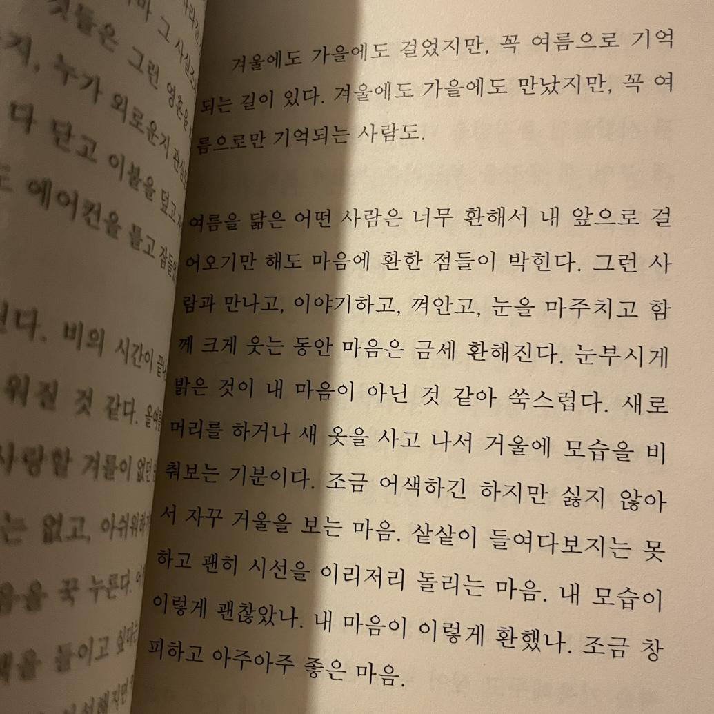
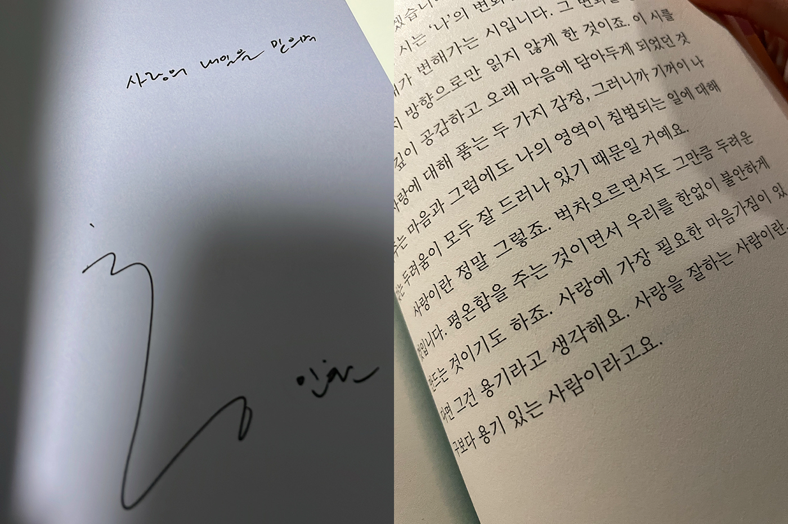

나의 사월 중 가장 덜 앓았던 사월. 사월의 사는 죽을 사 같고 환절기의 환은 근심 환 같아서 사월이면 으레 마음이 가라앉았는데. 올 사월은 생경했다. 매일 움트는 것 같았고 붕 떠 있었다. 바닥에 나뒹굴고 짓밟힌 목련 꽃잎으로도 바닐라가 생각날 수 있을 만큼. 괜히 꽃이 피고 지는 속도를 재 보고. 아름다움이 사라질 것을 아쉬워해 본 적이 언제였나 가늠하고. 어떻게 하루가 이렇게 환한지 생각하고. 노랗고 하얀 빛만 마음에 가득 차는 기분.

### 자주 출근

이번 달에는 오피스 출근을 자주 해서 #ootd 몇 장 찍어 뒀었다. 이삼 년 간격으로 스타일 바뀌는 것 같다.

### LP

더현대에 LP 파는 곳이 있길래 쳇 베이커, 킹즈 오브 컨비니언스, 마녀 배달부 키키 OST, 자미로콰이 바이닐 샀다. LP 한번 사러 가면 네 장은 기본인 듯. 하지만 두고두고 명반일 갓반들만 사기 때문에 살 때마다 후회는 없음. 모을수록 재미있다.

### 현지

이때 이후로 아이셔에 이슬이랑 콘치즈에 미쳤다고요.... 책임지시라고....

### 일기

학식이 때 썼던 일기장을 오랜만에 펼쳐 봤다. 이때의 나는 우울할 일 투성이였는데 내 감정이 겉으로 드러나는 걸 더 두려워해서 곪을 대로 곪아 있었다. 내 감정을 드러낸다고 알아 줄 사람 하나 없을 거라고 속으로 단정짓고 마음을 썩히고. 가끔 내 마음 몇몇 구석이 고장 난 것 같다는 생각이 들곤 하는데 이때부터 녹이 슨 것 같다. 어떻게 털어 내고 컸을지 모르겠다. 돌아가서 안아 주고 싶다.

### NANA IS REAL

유정의 호기심 가득한 문장을 아껴 두고 오래오래 읽다가 오랜만에 다시 꺼냈다. 담벼락들이 품고 있는 이름. 유정의 문장만으로 이어 붙인 <a href="https://youtu.be/9_xrFN2ztpE">네 번째 플레이리스트</a>는 내 마음에도 쏙 들었다. 썸네일 이미지로 담벼락 사진을 붙이고 싶었다. 검색하다 유정과 같은 마음으로 나나를 궁금해하던 사람을 발견했다. 댓글로 사용 가능 여부를 여쭈었다.

소중한 마음이 담긴 답장이었다. 호기심이 연결하는 맑고 투명한 마음. 나는 그런 것을 더 자세히 들여다보고 싶다.

### 합정

혼자 걷고 싶을 때면 합정을. 읽으면서 마시고 싶을 때에는 문학살롱 초고를. 혼자 칵테일 두 잔 연속으로 들이키면서 기분 좋아져 있었을 때 바로 앞에 회사 사람들 있다길래 신나서 합석했다. 요즈음 사람 만나는 게 너무 좋고 같이하는 시간의 소중함이 크게 느껴진다.

글을 읽고 생각나는 사람이 있다는 게 좋아서 나는 자주 읽고 싶고 또 자주 사람을 사랑하고 싶다. 이 글은 유정과 닮아 있었다.

비건을 시작하고 좋은 점이라면 수도 없이 많지만, 유독 크게 느껴지는 것은 나를 배려하고 생각하는 사람의 마음을 발견할 수 있다는 점이다. 비건이라는 이유로 따로 시켜 주신 토마토 안주. 황도 맛이 났다.

### kahlua

깔루아 채널은 여전히 열.업로드 중. 반응 보는 재미가 쏠쏠하다.

### 은빈

현지 만났을 때 취해서 오 년 만에 은빈이한테 생일 축하한다고 연락했고 보고 싶다고까지 해 버려서 기어코 만나게 됐다. 만났을 때 어색할까 걱정했는데 걱정이 무색할 만큼 너무 재미있었던 만남. 내 기억력이 자꾸 안 좋아지는 건 속상하지만 내가 기억하지 못하는 것들을 기억해 주는 친구를 볼 수 있다는 건 또 좋다. 은빈의 기억 속 나는 어린 아이로 멈춰 있었고 우리는 여전히 할 말이 많았다.

### 여름 밤, 비 냄새

예진을 닮은 글.

### 사람을 사랑해도 될까

발문이 이렇게 좋을 수가 있을까.

### 브런치

저스트에그 컬리에 들어온 뒤로 브런치 해 먹는 재미 들렸다.

### 말도안되는귀여움

강아지가 이래도 되나요? 너무 귀엽잖아요? 경업이 만났던 날. 니 교회 이 근처니까 자주 얼굴 봐도 되지 않겠니. 난 재미있었는데. 닌 아님 말고요.

### 마곡

포토 바이 현지. 유진, 현지, 채연이 만났던 날. 인간 댕댕 양유진이 만나자고 약속 잡으려 할 때마다 자꾸 취소하고 안 만나 줘서 애태우는 것 보는 게 진짜 꿀잼인데 (ㅋㅋ) 그런 지도 이제 한 몇 년 돼 가지고.... 오랜만에 만났는데도 차분하게 또라이 같아서 재미있었다. 호수도 예뻤고. 또 놀자. (언젠가)

### 한강 코딩

한강 코딩이 목표였지만 나는 퇴근 찍고 만났고 나머지 인원은 한강에서 핫픽스 쳤다. 기정, 소영, 동현 님과 함께. 일 얘기 안 해도 되는 회사 사람들과의 만남은 즐거워. 내 소중한 회사 친구들 싹 다 퇴사하고 마음 나눌 사람들 없었는데 생긴 것 같아 기분 좋았다. 이렇게 사람이 오고 가는 거겠지.

### 퀸의 여름

환한 빛에 스며드는 물 자국 같은 표현이 좋았는데 왜 말라 가냐고 이분법적으로 사고하는 애 때문에 이마 짚었던 시. 그래도 역시 좋다. 내가 좋았던 글을 나눌 수 있다는 것도.

### 그 웃음을 나도 좋아해

내가 좋았던 페이지들. 같이 나누고 싶어서 페이지 적어 주고 밑줄도 그어 줬다. 내가 느낀 것과 같은 걸 느낄지 궁금해.

### 장미성운

유독 빛이라는 글자가 자주 보이는 요즈음.

### 천년식향

너무 궁금했는데 너무 비싸서 엄두도 못 냈던 곳을 유진이 취뽀 기념으로 함께했다. 예쁜 분위기, 친절한 사장님 덕에 기념하고 싶은 일이 있을 때마다 오고 싶던 곳. 그 말에 유진이 기념할 일 없을 때에도 오자고 했던 것 같은데. 꿈꾼 것이라면...... 그렇게 말하고 싶은 곳! 기념할 일을 만들어서라도 오고 싶은 곳.

몇 년 전 그 장소, 그 자리에서 또. 유진의 마음을 편하게 해 주는 곳을 나도 좋아해서 좋아.

### 읽는 슬픔, 말하는 사랑

책 읽는 것만으로도 황인찬 시인과 같이 와인 마시는 기분. 시가 좋은 사람은 99%의 확률로 산문집도 좋다. 백은선 시인도 그랬고, 이현호 시인도 그랬고. 유정이 작가와의 만남 꼭 가던 이유를 알 것도 같았고.

### 예진

나의 가장 편안한 모습을 가장 좋아해 주는 사람을 만날 때면 빈틈없이 행복할 수밖에. 내 환상의 콤비랑 호캉스. 우리 갔던 이자카야는 우리만의 아지트로 하자.
