## 수험생 내조

아빠가 입원했다. 며칠 본가에서 지내면서 시은이 밥 해 줬었다.

나는 어릴 때부터 엄마한테 이 음식은 어떻게 하냐, 저건 어떻게 하냐 많이 묻고 곧잘 시도해 보곤 했었는데 우리 집 둘째는 요리엔 영 흥미가 없는지 레토르트 아닌 건 해 먹을 생각을 하질 않는다. 냉장고만 괜히 몇 번 열어 봤다가 "후우잉...." 같은 소리와 함께 냉장고 문 닫는 것을 여러 번 목도했다. 나는 그럴 때마다 언니 노릇 하는 척 내가 만들어 보고 싶던 음식 실험을 위해 이것저것 해 주었다. 소스를 머금지 못한 채 불어 터진 카레우동이라든가, 생각보다 그럴싸하게 완성된 일본식 오믈렛 등. 성공 확률은 오십 퍼센트인데 동생은 실패한 음식이든 성공한 음식이든 괜찮은 점만 말해 준다. 그게 나를 자꾸 시도하게 만들고 식탁 앞에 앉힌 다음 씹기도 전에 "맛있워?", "워뙈?" 하게 한다.

하루는 브이로그로 수백 번 공부한 당근김밥을 만들어 줬다. 프라이팬에 기름을 많이 붓고, 당근을 잔뜩 채썰어 넣은 다음 소금으로 간한다. 당근이 반쯤 익으면 참기름을 쪼록, 흐물흐물 힘을 잃을 때까지 열심히 볶는다. 당근이 뱉어 낸 기름은 따로 모아 두고, 달걀을 부칠 때 사용한다(향미유가 된다). 달걀 지단은 최대한 도톰하게 만든다. 김을 깔고, 참기름과 소금, 참깨로 간한 밥을 넓게 펴 준 뒤, 부드러워진 당근을 잔뜩 올리고, 김 가로 사이즈에 맞추어 자른 지단을 넣어 잘 말아 준다. 이렇게 간단한데 고소하고 부드러운 당근김밥 완성이다.

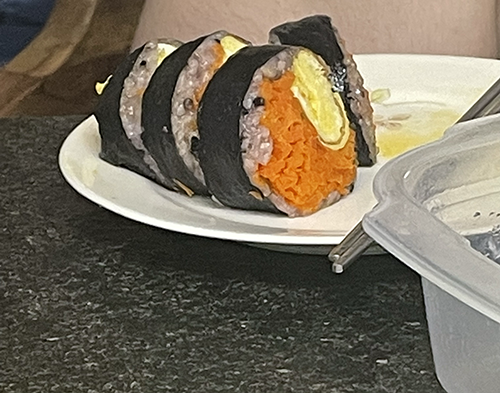

당근 네 개로 김밥 네 줄이 나왔는데 그중 한 줄만이 예쁘게 싸졌고, 세 줄은 죄다 옆구리 터졌다. 오십 퍼센트의 승률을 자랑하던 나인데 이로써 이십오 퍼센트의 확률로 성공한 음식 만드는 여자 됐다. 동생은 이번에도 역시 먹기 전에 "우왕", 나는 동생이 입에 김밥을 넣기도 전에 "워뗘?", 동생은 웃으면서 "맛있당" 했다. 방에서 책 읽을 때도 거실에서 냠냠 소리가 들렸는데 운동 다녀와서 냉장고 열었더니 남은 김밥 한 줄이 또 사라져 있었다. 어쩌면 동생은 햄스터 같은 귀여움을 보여 주기 위해 일부러 요리를 안 배우는 걸지도 모른다고 생각했다.

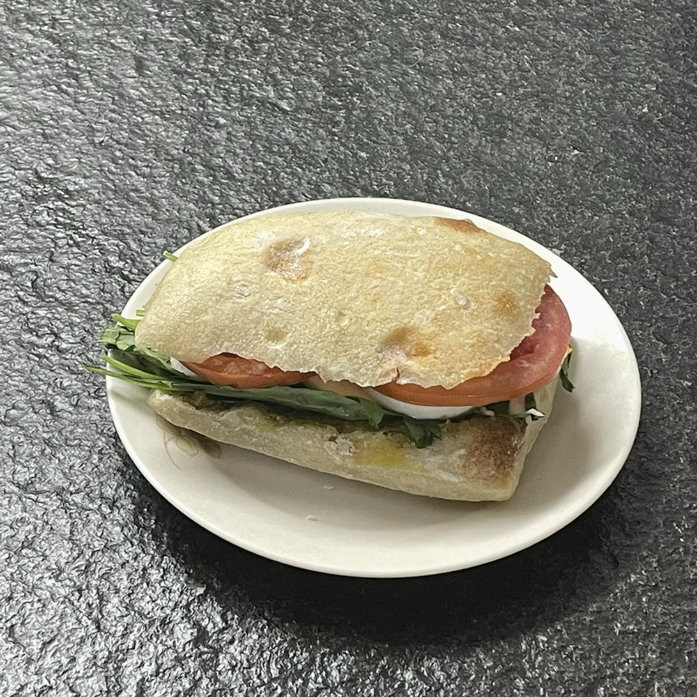

또 하루는 치아바타샌드위치를. 한쪽 면에 바질페스토, 다른 쪽 면에는 마요네즈 펴바르고 생모짜렐라, 자달토마토, 루꼴라 넣어서 살짝 구워 줬다. 바질페스토를 처음 먹어 봤는지 이 소스는 뭐냐 묻더니 신기한 맛이라면서 메모장에 적어 갔다. ㅋㅋ 귀여움. 저녁 다 됐을 때 슬렁슬렁 부엌으로 나오길래 "샌드위치 또 먹고 싶을 때 말해~" 했더니 "지금? ㅋ 앗싸. ㅋ" 해서 저녁으로 또 만들어 줬고. 제법 입맛에 맞으셨나 봄. 가볍게 완.샌 하시고 나 홈트 할 동안 옆에서 훌라후프 돌리시더니(요즈음도 훌라후프를 파는구나......) 생목으로 노래도 부르심. 화음 넣어 주면서 완창 갈기고 같이 영화 봤다. 영화 끝나자마자 왓챠피디아에 별점 매긴 것도 귀엽다. ㅋㅋㅋㅋㅋㅋ 내 동생이지만… 참….

## 싱글톤

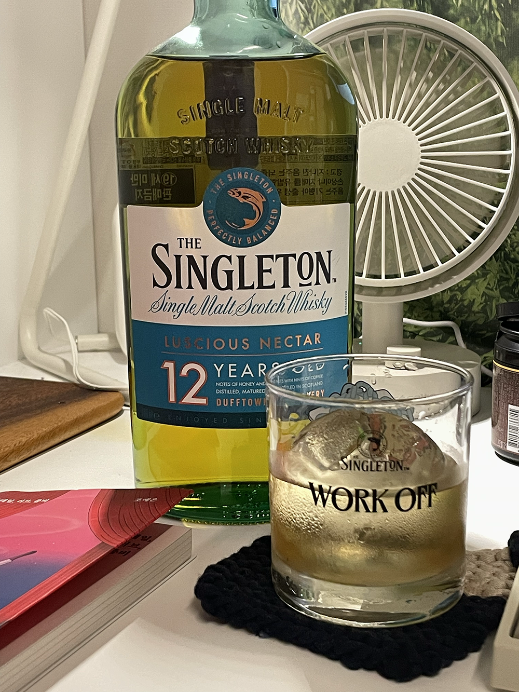

워크 오프 패키지 잔이 너무 예뻐서 싱글톤 샀던 여자(나)가 있는데요? 사 놓고 몇 달 방치만 하던 싱글톤을 ㅋㅋ 드뎌 개봉. 애주가들 사이에서는 밍밍톤이라고 불린다길래 큰 기대 없었는데 이게 웬걸? 내가 먹었던 싱글몰트 중에 아드벡 다음으로 괜찮았다. 무슨 맛인지는 기억 안 나고 맛있던 것만 기억이 나니까 집 가면 다시 먹어 봐야겠음. ㅎ

## 러브, 칵테일, 좀비

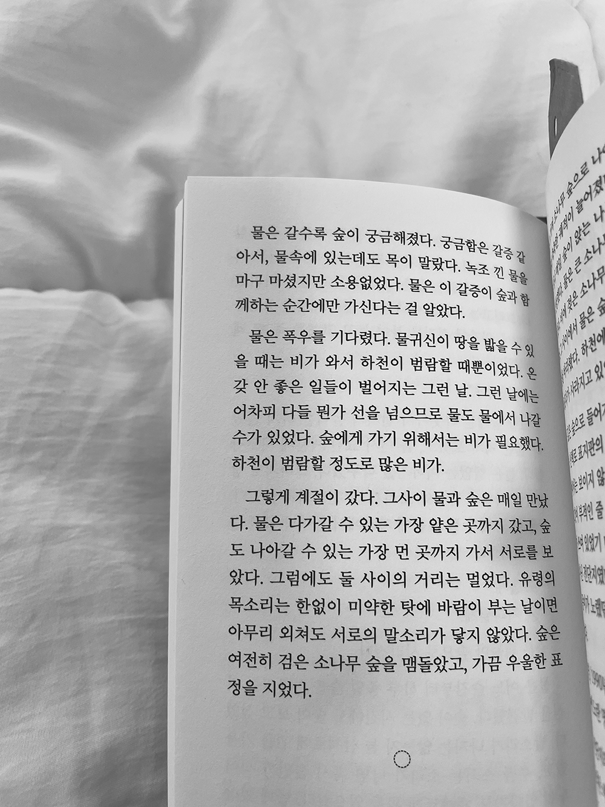

궁금해하는 마음 좋아하는 취향 참 꾸준하지.

## 연남골방

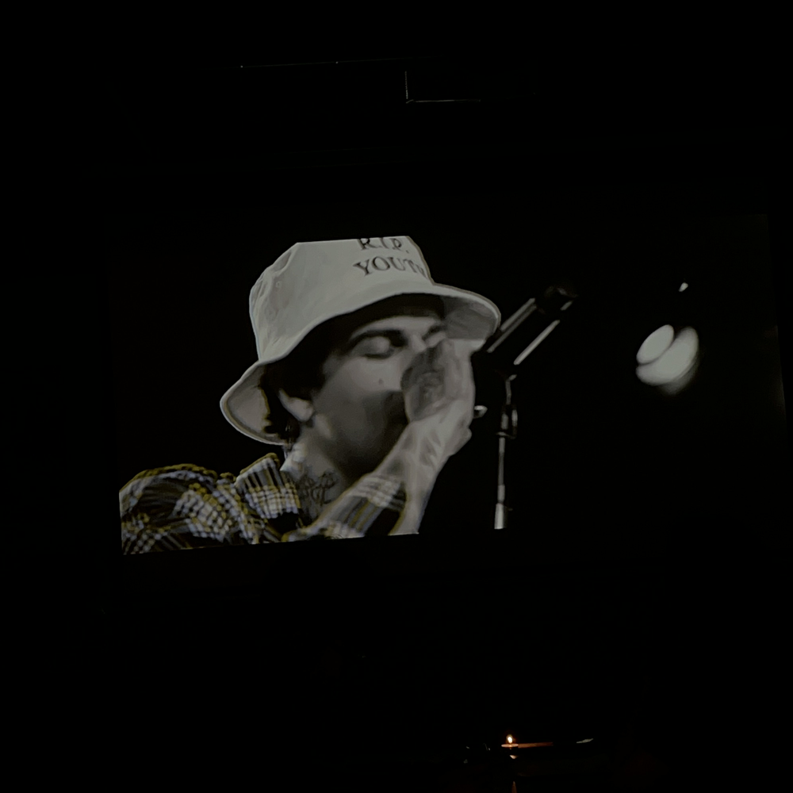

전에 갔을 때랑 구조도, 사장님도, 음료 맛도, 친절도도 바뀌어서 재방문 의사는 없을 듯. 그저 내 취향만 자랑스러웠던 시간. 이날 신청했던 음악은 아래 세 곡.

- [https://youtu.be/vxCn_p6ob8s](https://youtu.be/vxCn_p6ob8s)
- [https://youtu.be/cvbNHZdM63s](https://youtu.be/cvbNHZdM63s)
- [https://youtu.be/vv2oR5kk7XM](https://youtu.be/vv2oR5kk7XM)

## 개포동 번개

번개라는 말… 요즈음 친구들도 쓰나? ㅎㅋ 연남골방에서 혼자 칵테일 두 잔 들이키고 있었는데 마침 승주 언니랑 은지도 각자 혼자 시간 보내고 있었던 거다. 걍걍 불렀는데 바로 나와 준 사람들. ㅋㅋ 연남에서 택시 잡고 삼각지로 튀었다.

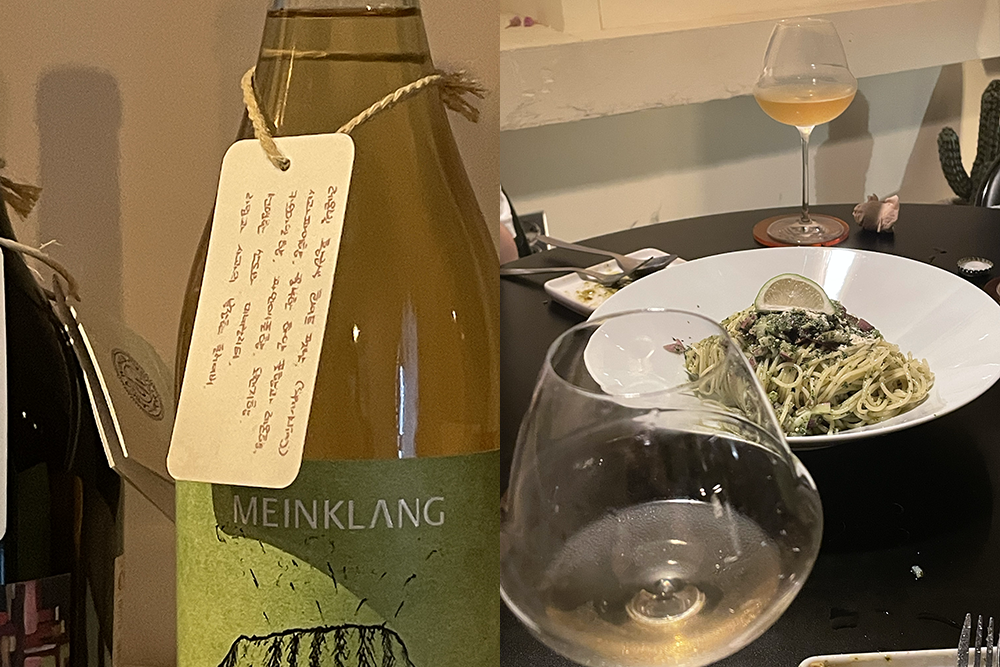

여기 사장님은 진짜 “음식 잘하시는” 분이다. 솔직히 배불러서 음식 생각 딱히 생각 없었는데 나오는 안주마다 너무 맛있었어서 ㅋㅋㅋㅋㅋ 돌아 버리는 줄…. 음미하며 먹을 수 있는 음식 진짜 오랜만인 것 같다고 동시에 말했다. 근데 진짜 그랬음…. 찐으로요….

와인 한 병에 셋 다 들떠서 행복 별거 있냐고, 오늘 진짜 기분 좋다는 소리 참 많이 한 것 같다. 이때 이후로 승주 언니가 자꾸 “그래서우리또언제봐” 하는데. ㅋㅋㅋㅋㅋㅋㅋㅋ 그래서 우리 또 언제 봐? ㅎㅎ

## 인현골방

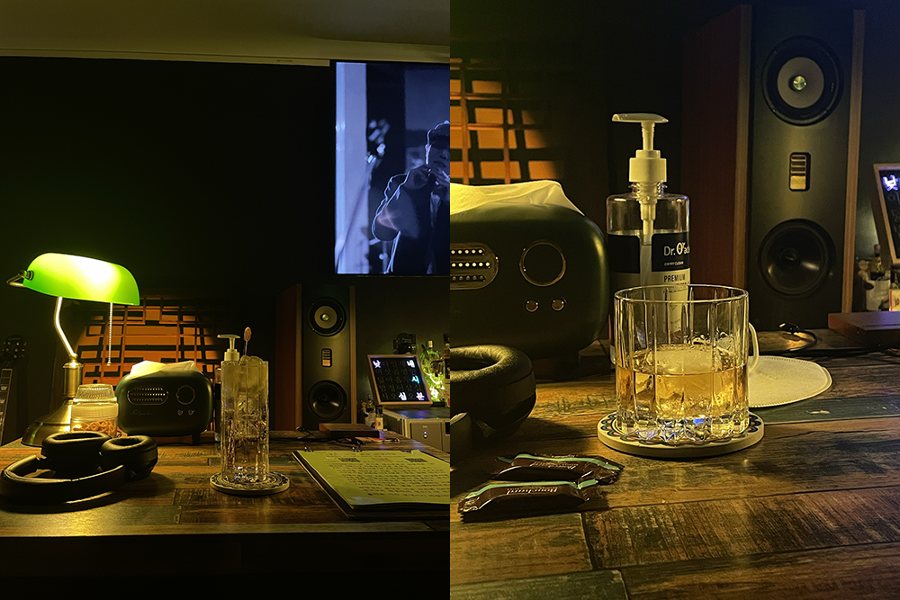

연남골방에 데인 뒤로 ㅠ 다른 골방 도장 깨러. 유진과 함께했다. 탑동골목과 비슷한 구조여서 음악 감상하기 좋았고, 궁금했던 보모어 12년을 드디어 시켜 봤다! 꿀에 절인 레몬을 숯에 구운 맛이 난다길래 기대했는데 그런 맛은 역시나 안 났음. 아드벡보다 피트한 맛도 적었고. 와인이든 위스키든 특정 과일 향이 난다는 것들 중에 진짜 그 맛 났던 건 없는 것 같다. 대체 어떻게 하면 그 맛을 느낄 수 있는 걸까? 내 미각이 구린 걸까?

신청했던 음악은 아래 다섯 곡.

- [https://youtu.be/ZUHKFUOEZEY](https://youtu.be/ZUHKFUOEZEY)
- [https://youtu.be/o_1aF54DO60](https://www.notion.so/2022-8-275e26f6ccda4545886eeda54e7e99c7)
- [https://youtu.be/GH63rq8SKEg](https://www.notion.so/2022-8-275e26f6ccda4545886eeda54e7e99c7)
- [https://youtu.be/2CclwSlcYus](https://youtu.be/2CclwSlcYus)
- [https://youtu.be/6WXmaJcguXo](https://youtu.be/6WXmaJcguXo)

## 전축

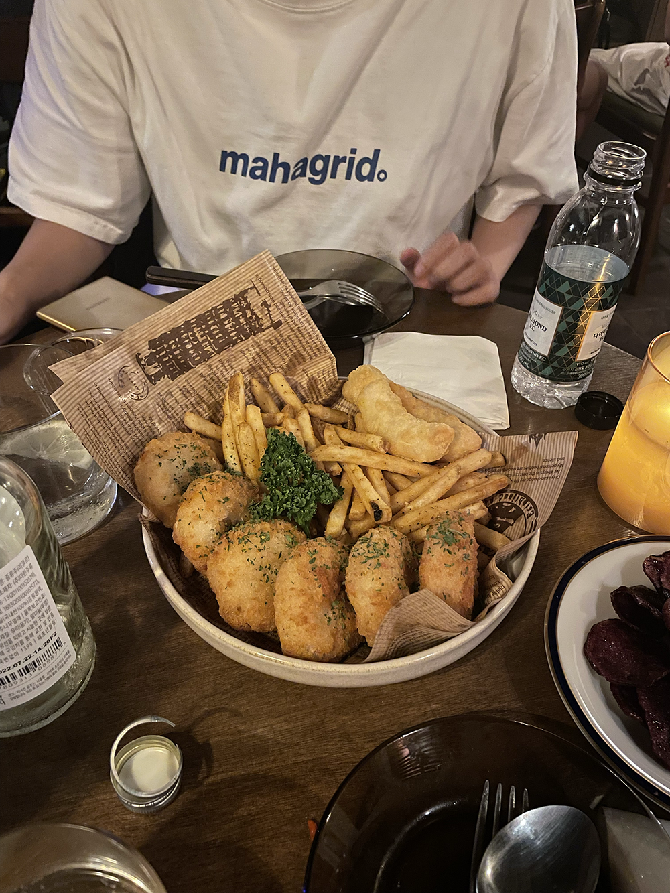

둘 다 신나게 두세 잔씩 하고 한잔 더 하러 갔다. 바삭바삭 고로케가 아직도 기억나는. 유진이도 그렇다고. 내 많은 상처를 드러내고 다독임 받을 수 있었던 날. 만나면 너어무 편한 친구! 우리 또 오자고 자주 말할 수 있는 친구. 얼른 또 보고 싶당.

## 계절곳간

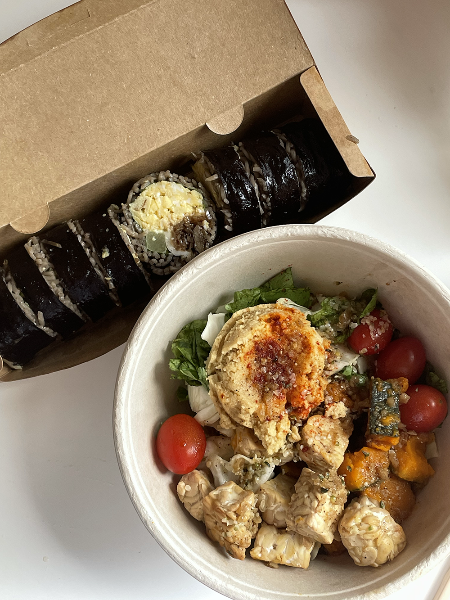

슴콘을 수원에서 하는 바람에 첫 수원 여행(?). 내가 좋아하는 헬짱 유튜버들 싹 다 여기 가 봤더라고…. 수원까지 가는 김에 땀 뻘뻘 흘리면서 사 먹었다. 진짜개개개개개개개맛있더라……. 내가 먹었던 그 어느 김밥 중에 제일. 후무스 샐러드도 진짜 처돌았던 맛. 이거 먹으러 수원 또 가고 싶을 지경이다.

## SM콘

유진, 문정과 (다른 구역에서) 같이 보게 된 SM콘. 모두의 후기는: “역시 슴콘은 오프다!”

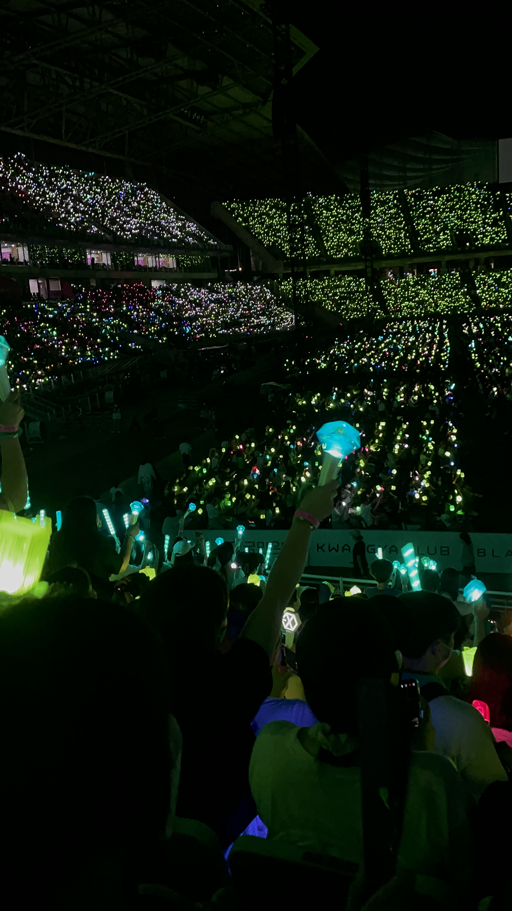

제일 재미있었던 무대는… 슈퍼주니어… 였던 것 같고. ㅋㅋㅋㅋㅋ 내 구역에서 라이징 썬 따라 부를 수 있는 사람이 나밖에 없었음에 기함했다. 확실히 세대는 진작에 교체됐구나 싶고. 시즈니 참 많더라.

콘서트 끝나고 택시가 안 잡혀서 숙소까지 사십 분을 걸었는데, 이때 기억이 참 좋다. 풀벌레 소리, 비에 젖은 흙 냄새, 여름밤 공기로 가득했다. 내가 많은 것을 놓치며 살았던 것 같다는 생각이 일었다.

## 박쥐

영화 <박쥐>를 같이 보고 이야기 나눴다. 간만에 영화 이야기 나누며 즐거운 사람이 생겼다. (스포일지도)

A: ‘태주 씨랑 오래오래 행복하고 싶었는데… 지옥에서 만나요’ 이 대사가 가장 좋다 그랬잖아. 왜?

B: 상현이 정말 그러길 바랐던 것 같아서. 태주 살리면서도 오래오래 함께 보낼 수 있다고 생각했을 것 같아.

A: 상현이 태주 망쳤다고는 생각 안 해?

B: 별로. 오히려 태주는 상현을 만났기 때문에 지옥에서 벗어난 게 아닌가 싶어. 물론 그게 또 다른 지옥이었을 수도 있지만….

A: 덕분에 긍정적인 생각으로 전환했다. 나는 그 ‘또 다른 지옥’에 주목해서 상현이 결국 태주 망친 것 같았거든. 자기가 망치고 있다는 것 알면서도 계속했으니까 오래오래 행복하고 싶었다는 말도 다 거짓말 같았어.

B: 직업 윤리와 신앙 때문에 관계하는 것도 망설였던 신부가, 양심과 도덕성 때문에 살인도 참았던 상현이, 강우를 죽인 뒤 죄책감에 벌벌 떨던 상현이 있던 곳은 천국이라 믿고 싶었지만 사실 지옥이 아니었을까. 못다한 사랑 마저 하자는 약속으로 들려서 지옥에서 만나자는 대사 좋았어.

A: 헐랭. 이 시각 좋다.

B: 어떻게 대사 하나에 이렇게 다른 시각이 나올 수 있는 거지. 박찬욱 미친놈.

A: 진짜 개변태 새끼. 짜증 나. 김옥빈이 송강호를 구원 삼는 것 같은 게 나는 너무 마음 쓰인다고. 아직도옥빈씨신경쓰인다고나는…….

B: 니 아무래도 옥빈 씨한테 제대로 홀린 것 같은데.

A: 같이 안 봤으면 끝까지 못 봤을 것 같아. 슬퍼서. 소모 오져. 못다한 사랑 마저 하자는 약속으로 들렸다는 후기 못 들었으면 괜히 내가 송강호 된 기분으로 죄책감 같은 마음 가진 영화 될 뻔했다.

그리고 우리의 해석들.

1. 상현의 검은색 옷 = 박쥐라서 일부러 까만 옷 입혔나?
2. 상현과 태주는 사랑하기 겁나는 사람과 사랑 앞에서 겁 없어지는 사람 같다
3. 태주가 흰색 옷만 입다가 점점 바뀐 것 같다. 상현이 흰색 이불로 덮어 주기라도 했었는데. 사랑의 순수성을 뜻한 걸까.
4. 상현이 신발 신겨 줬던 게 태주에게 의미가 컸나 보다. 못 벗어난다는 징표 같다.
5. ‘저 부끄러움 타는 사람 아니에요’ 라는 대사의 재활용. 태주가 상현에게 이용당하는 것 알면서도 못 벗어나는 사람 같아서 태주를 점점 불쌍하게 봤었는데, 사실 그냥 안 벗어난 걸로 보인다. 초반부와 후반부에 같은 대사를 다른 어조로 반복해서 말하는 걸 보니 그렇다.
6. 엄마는 왜 끝까지 살려 둘까? 바닥까진 가고 싶지 않았던 게 아닐까.
7. 엔딩 장면이 꼭 헤어질 결심 엔딩 같다. 동감한다. 바다도 그렇고, 결국 둘은 서로가 아님 안 된다는 것도.

## 은선

프랑스에 유학 갔던 은선이 돌아왔다.

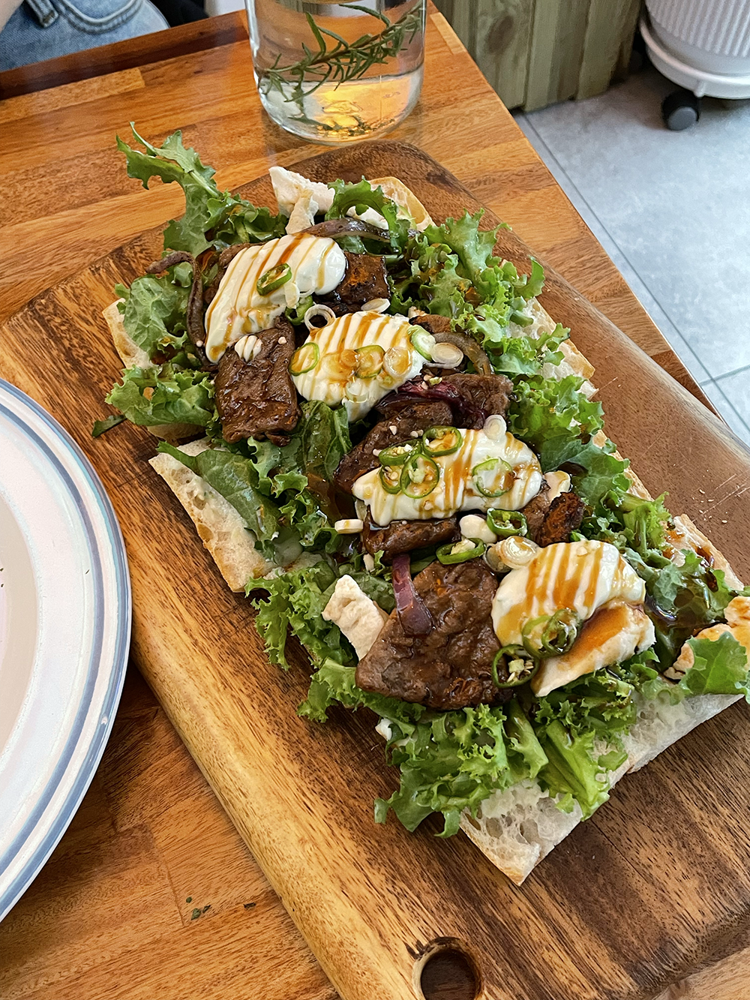

우리는 일곱 살 때부터 모든 학창 시절을 함께했다. 같은 유치원, 같은 초등학교, 같은 중학교, 같은 고등학교까지. 그렇게 대학 생활까지도 함께하려나 싶었는데 스무 살이 되자마자 은선은 돌연 프랑스로 떠나 버렸었다. 칠 년 동안 나는 많은 게 바뀌었고, 많은 걸 경험했고, 많은 걸 잊어버렸는데, 은선은 내가 잊은 그 많은 것들을 기억하고 있었다. 망원동을 걷고 양화대교까지 걸었다. 은선은 한강을 바라보며 유치원 때 이곳에 왔던 걸 기억하느냐고 물었다. 장구채로 손바닥을 맞았던 건 기억나냐고, 고구마 캐러 간 것은 기억나냐고 묻기도 하고. 아무것도 기억하지 못하던 난데 은선이 실마리를 던져 주면 마법처럼 기억이 났다. 맞아, 토끼똥 같은 고구마만 잔뜩 주워 와서 엄마가 엄청 웃었던 기억 나, 답하면서.

추억 파먹기만 하는 친구는 그다지 인생에서 큰 부분을 차지할 친구는 아니라는 이야기를 들은 뒤로 오래된 친구를 만날 때면 우리가 과거에만 머물러 있는 것이 아닌지 검열하게 되곤 한다. 은선과 나는 오늘 하루 종일 과거에만 머물러 있었지만 과거 속에서도 영원이 느껴졌다. 멀리 떨어져 있을 때에도 가까이에 있는 것 같았던 7년의 세월이 반증하는 우정. 앞으로 새로 꾸릴 우리의 역사가 궁금하다.

## 고원

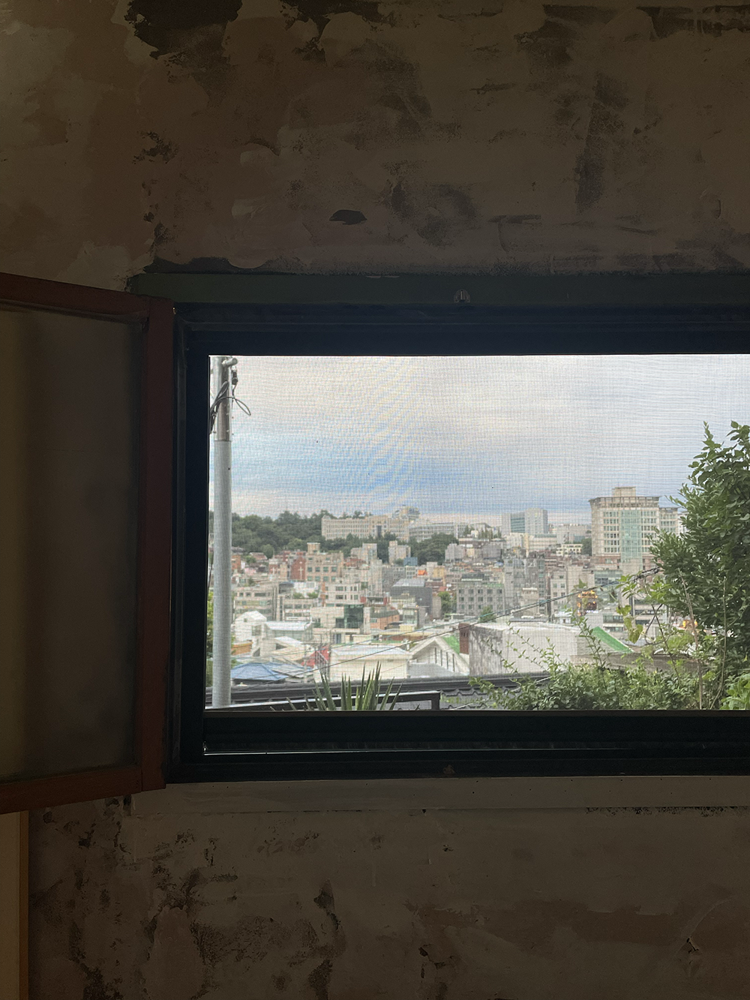

유정과 고원에서 명상.

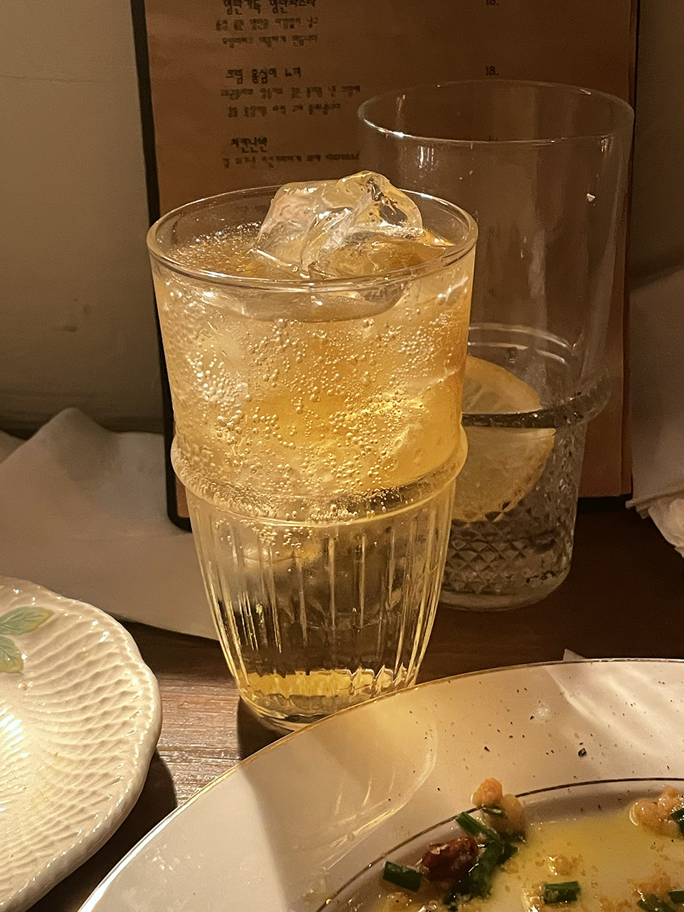

싱잉볼과 파동, 둥근 빛, 식빵 굽는 고양이, 가늘게 떨리는 손가락, 하이볼, 와사비 토마토, 밝게 웃는 너. 보고 싶다!