### 설

할아버지 댁에 출처를 알 수 없는 피규어들이 자꾸 하나씩 늘어 간다. 크기 비슷한 호두 세 알 있는 것도 웃기고, 푸랑 피글렛을 강아지랑 토끼라 하신 것도 너무 웃기고.... 드라이브 스루로 커피 쐈는데 아빠가 픽업 받을 때 'ㅊ... 채니...!' 하는 것도 너무 웃겼고.

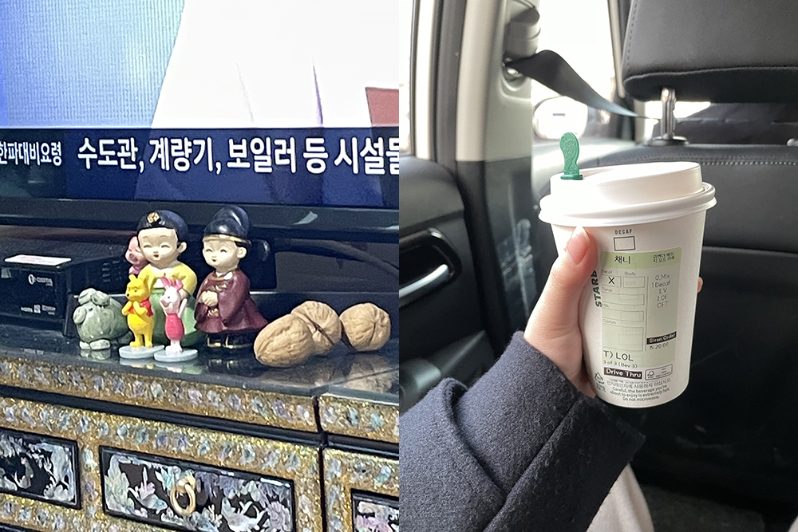

### 살바도르 달리 전

귤살롱 오프라인 밋업. 달리 전 보고, 비건 식당 가고, 제로웨이스트 바 갔었다. 전시는 정말 오래간만이었는데 사람들 틈바구니에 끼어 관람하려니 여유도 없었고, 큐피커로 오디오를 들으며 감상했는데도 집중이 어려웠다. 그럼에도 확실히 느껴졌던 것은 1) 하고 싶은 것 다 하면서 산 사람이었구나 2) 한 가지 화풍에 국한되지 않고 다양한 시도를 해 본 것이 신기하고, 단순 시도에 지나지 않고 전부 작품이 되었다는 것이 대단하다 3) 가장 좋았던 작품은 <슈가 스핑크스>, 난색이 외로워 보이기도 하네. 가장 마음에 들었던 작품의 포스터 한 장을 구매하고, 대화가 너무 재미있는 바람에 밥 -> 카페 -> 낮술 -> 밥까지 함께해 버렸다. 대화의 확장이 자연스러운 사람들이 왜 이렇게 귀한 건지. 집 밖으로 잘 안 나가니 더 그런 것 같기도 하지만, 이 날 나누었던 대화들이 정말 재미있었다. 확실히 소수성은 연대감을 자아낸다는 것을 만날수록 느끼게 되고.

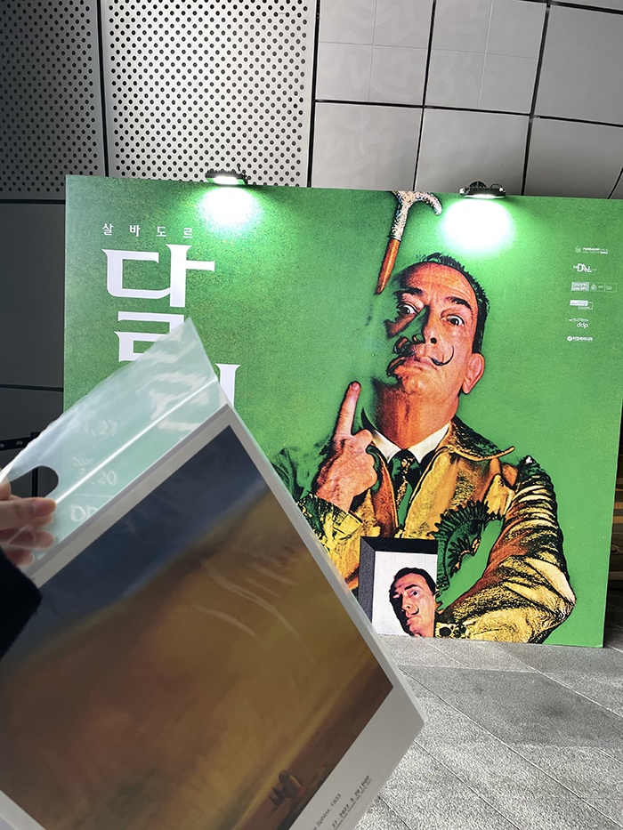

### ZEST

잡지에서 보고 궁금했던 제로 웨이스트 바. 콜라, 토닉까지도 직접 제조하는 곳. 보자마자 귤살롱에 공유했었는데, 그걸 기억해 두셨다가 혹시 달리 전 보는 날 함께 가게 될까 미리 오픈 여부까지 알아 두신 횐님 덕분에 (ㅋㅋ) 큰 맘 먹지 않으면 안 가는 압구정까지 가서 제스트 입성했다. 시그니처 칵테일이 진짜... 진짜 너무 맛있었고...... 충격적으로 맛있었고... 친절하셨고, 화장실이 너무 깨끗했다. (비누도 비건 제품이었고!) 진짜 꼭 다시 가 볼 바. 압구정... (갈 일이 있다면...) 꼭.

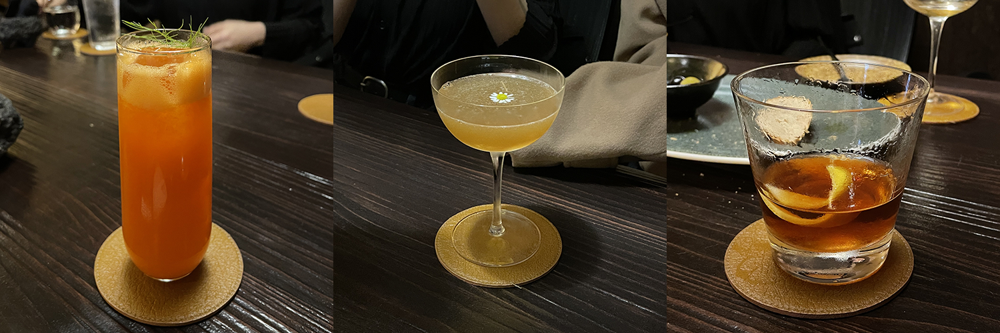

### 두 번째 LP

내가 너무 좋아하는 `Pink + White`가 있는 프랭크 오션의 바이닐.

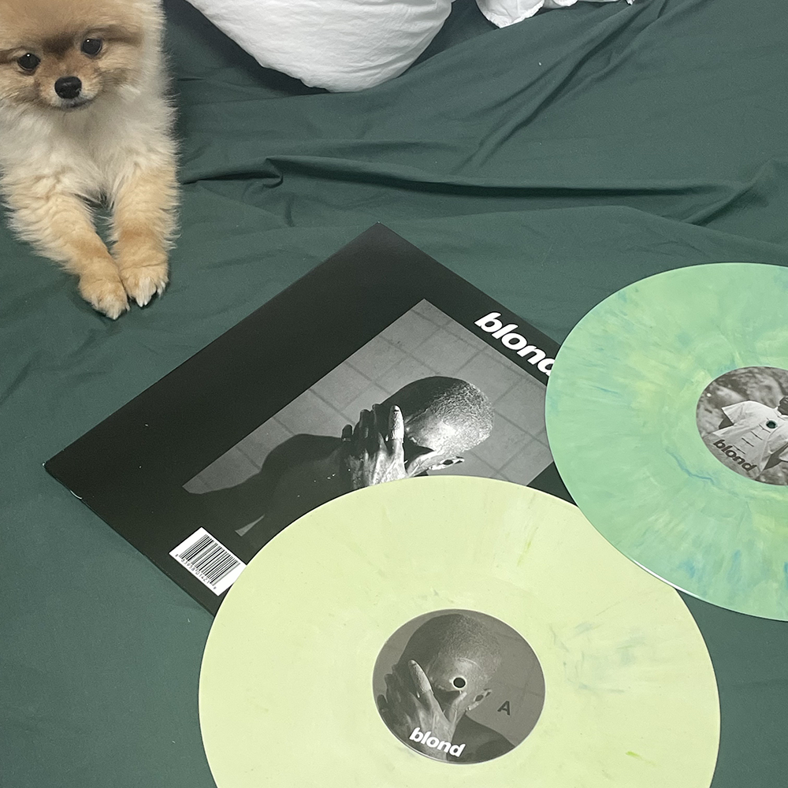

### Favorite is Blue

간만에 휴대 전화 새 옷 장만. 최애 컬러 드러내기.

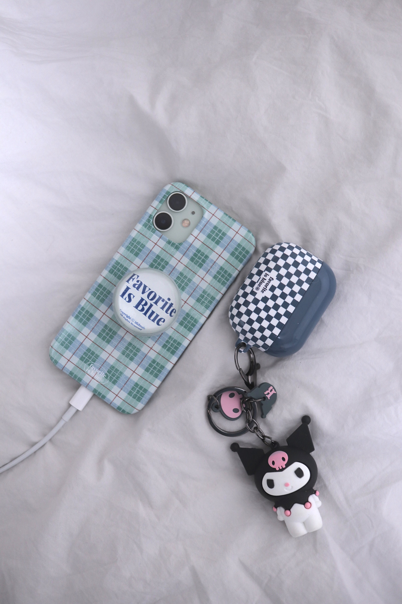

### BLIND WRITING

글쓰기 모임 마지막 회차, 오프라인 만남을 가졌다. 글을 같이 쓴 건 일곱 명이었는데 오프라인 모임에 참여한 사람은 주최자님과 나를 포함하여 총 네 명밖에 안 됐다는 것에 놀랐고, 참여한 나머지 두 분이 내가 가장 궁금했던 분들이었던 것에 놀랐고, 나와 똑같이 제일 궁금한 분들이 왔다는 이야기를 해 주신 분이 계셔서 또 놀랐다. 독자와의 만남 같기도 했고, 생각했던 이미지랑 정확히 들어맞아서 너무 신기했고, 함께 글을 나눈 분들은 생각보다 훨씬 훨씬 훨씬 더 좋은 분들이었다. 우리는 세 번째 글을 각자 낭독했고, 온라인으로 주고받던 피드백을 오프라인으로 주고받았다. 한 편의 글에 대한 피드백이었는데도 나의 앞선 글 두 편에 대한 것들까지 총 망라하여 피드백 주신 것이 참 감사했다. 세 편 만에 내 글에 깔린 감성을 파악해 알려 주시는 것도 좋았고, 단순히 글로만 읽는 것이 아니라 나라는 사람의 삶을 얼마나 깊게 생각해 보셨을지 전달되는 것이 정말... 설명되지 않을 만큼 좋았다. 세 번째 글은 관계에 대한 글이었고 나는 내 관계에 대한 불안을 글로 풀어 냈는데, 피드백을 받기 전 이 글을 어떻게 쓰게 됐는지 말로 설명하는 과정에서 생각지 못했던 치유를 받았다. 영원한 게 없는 세상에서 영원을 갖고 싶었던 마음을 풀어 썼어요, 툭 던진 말에 그 말을 듣고 나니 글이 더 깊게 느껴진다는 말을 듣고, 형언할 수 없는 위로를 받았다. 세 분 다 내가 썼던 글 중 가장 좋았다 해 주셨고, 생각이 촘촘해서 감정이 드러난다는 공통적인 피드백이 그렇게도 좋았다. 시간 가는 줄 모르고 서로의 세계에 빠져들었다. 하나부터 열까지 다 좋은 것만 있었던 프로젝트였다. 이렇게 마음 꽉 차게 행복했던 기억은 실로 오랜만인 것 같다. 빨리 책으로도 만나 보고 싶다! 몇 명의 사람에게 내 책을 선물할까. 히히!

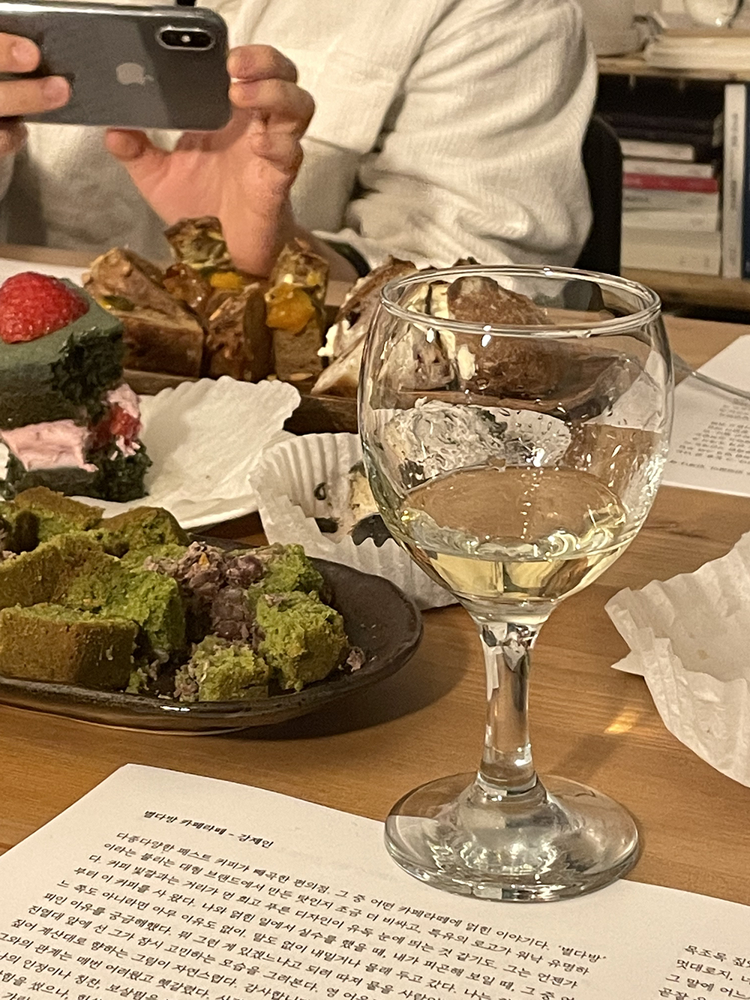

### 고상지 콘서트

사랑해 마다않는 상지 언니 단독 공연 보고 온 날. 역시 나는 출격이 가장 좋고 피아졸라 푸가보다도 언니 푸가가 더 좋다.

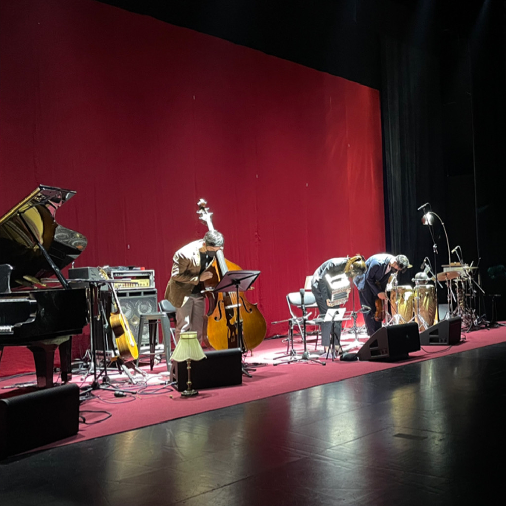

### 이사 준비

부산 여행 갔을 때 발견한 마약 매트리스. 에어비앤비 사장님께 여쭈어 퀵슬립 제품인 것 알아 냈고 쇼룸 가서 누워 보고 주문했다. Q3 생각하고 갔는데 막상 누워 보니 몸이 튕겨져 나오길래 ㅋㅋ Q4로 주문.

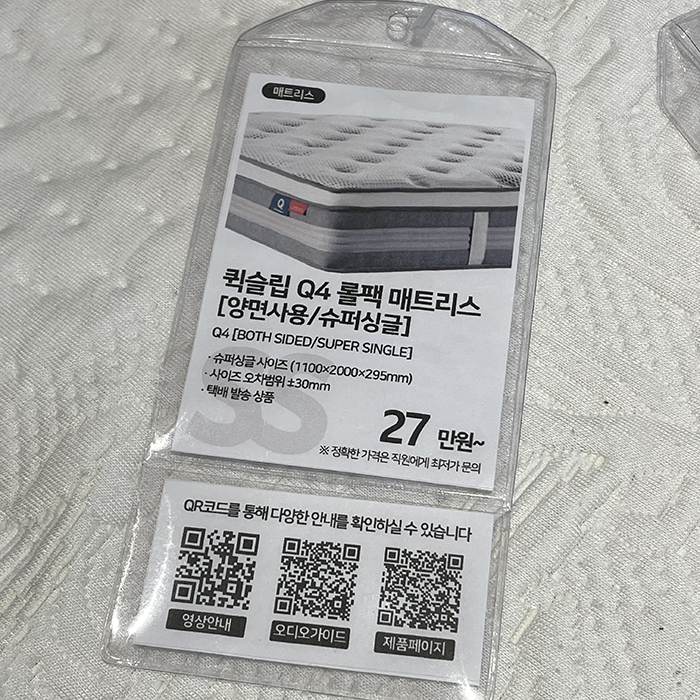

모든 살림은 제로 웨이스트로. 알맹상점에서 생수세미, 스테인리스 치약 짜개, 그랩백 등 사 왔다. 망원 간 김에 띵크비건에서 밥도 냠냠 먹고, 지난날의 서희와 나를 추억했다. 생각나는 사람이 있는 공간은 소중해.

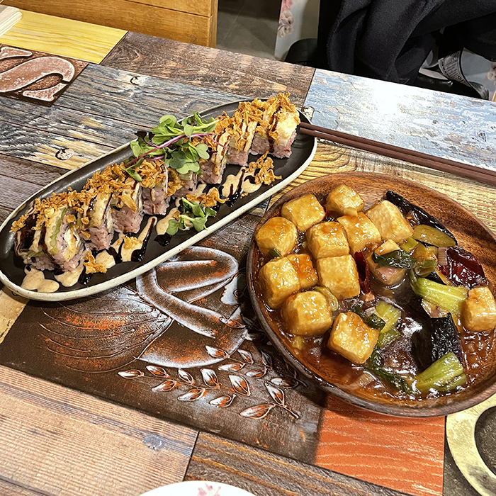

### 세 번째 LP

어느덧 세 번째로 구매하게 된 바이닐. 악틱몽키즈, 위켄드, 럭키 다예의 최애 앨범 한 장씩. 각 앨범 최애 곡 세 곡 두고 갑니당.

- <a href="https://youtu.be/nyuo9-OjNNg">arctic monkeys, i wanna be yours</a>
- <a href="https://youtu.be/atGlHRi0n4A">the weeknd, a lonley night</a>
- <a href="https://youtu.be/e3qEDcrKo-I">lucky daye, love you too much</a>

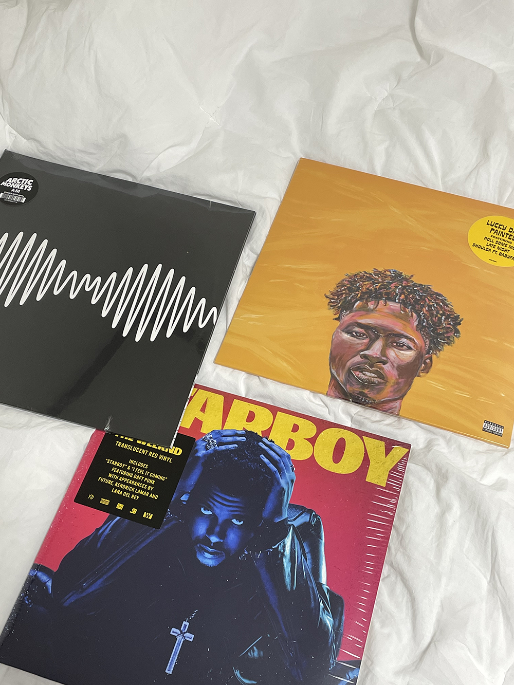

### 맥꾸

저는 이런 아티스트의 이런 앨범을 좋아해요.

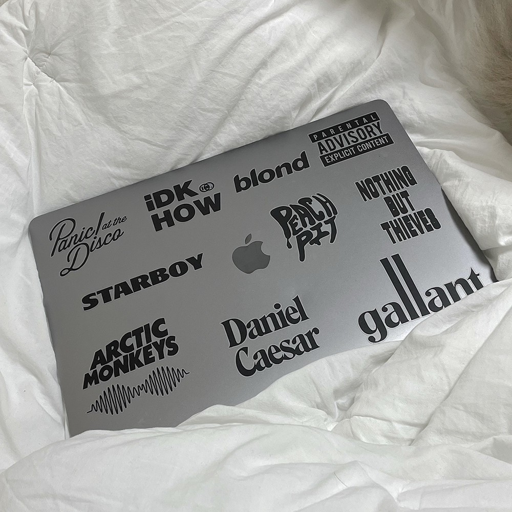

### 첫 자취

취향의 공간을 만드는 일. 한 달 남짓 구상만 하던 것을 실제로 채워 가는 것은 생각보다 더 설레는 일이었다. 생각해 보니 나는 나를 이만큼 드러내며 산 적 없었다. 내 생각을 밖으로 끄집어내기 시작했던 것도 작년 즈음 글을 쓰기 시작했을 때부터였고, 취향을 가지고 있더라도 그것을 소중히 하는 법은 몰랐다. 좋아하는 음악의 LP와 CD를 사더라도 둘 곳이 마땅치 않아 처박아 두기 일쑤였고, 타의로 배치된 책장도 방 깊숙한 곳에 있어 좋아하는 책들이 꽁꽁 숨어 있었다. 독립 전 인테리어를 구상할 때 중요하게 생각한 것은 단 한 가지였다. 나를 끄집어낸 방을 만들 것. 문을 여는 순간부터 내가 좋아하는 것들이 보이도록 벽선반을 설치했고, 음반, 알코올, 향수, 책을 전시했다. 침대에 누웠을 때에는 내가 좋아하는 엽서들이 보이도록 벽에 붙였고, 좋아하는 향기의 룸 스프레이를 침구 위에 칙칙 뿌렸다. 그동안 예쁘다 생각해도 집에 넣을 공간이 없어서 못 넣었던 것들을 사 들였다. 예컨대 수필의 한 구절이 적힌 수건이나 채소가 그려진 발매트 같은 것들. 나로 가득 찬 방에 산다는 것은 나를 아끼고 사랑하는 일과 무척 닮았다. 들어오는 가구 수와 비례하게 뚜렷해지는 나를 만들어 가는 과정이 즐겁다.

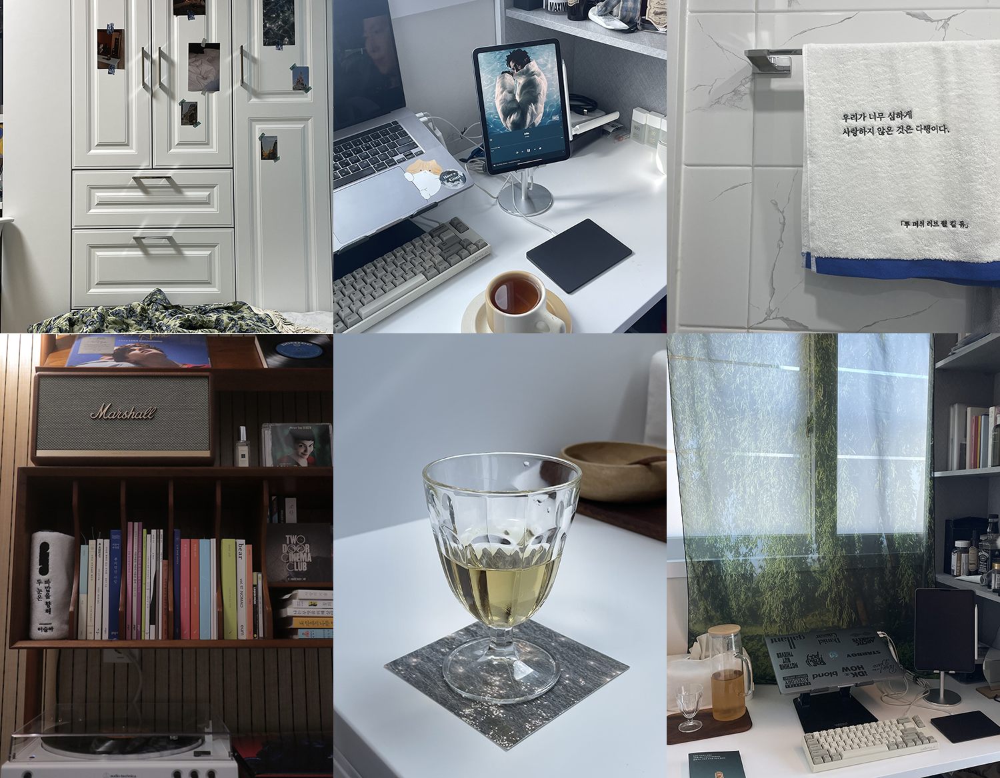

### 와인 모임

즉흥으로 만나게 된 귤살롱 사람들. 🐝, 그린 와인, 비건 참치, 석촌 호수. 갈수록 애틋해지고 더 걷고 싶었다.

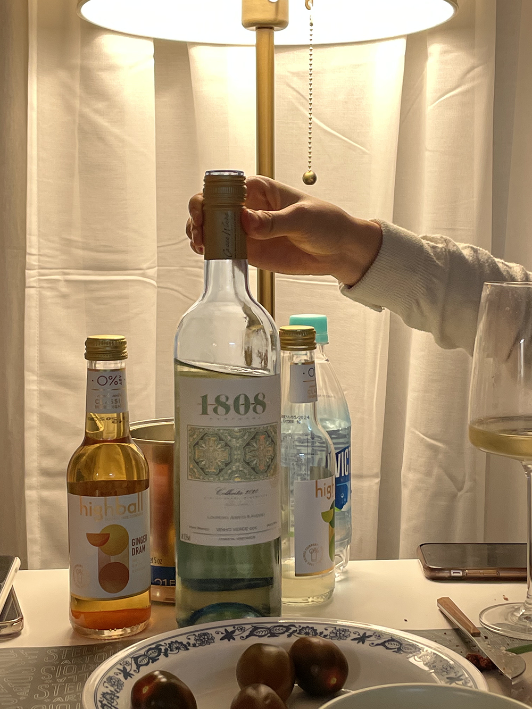

### 첫 타투

파도가 치는 마음이 두 개가 있었지.

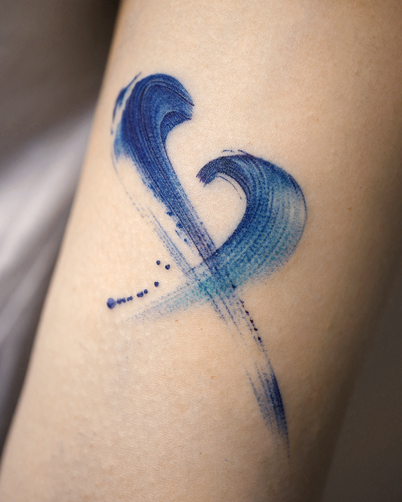

하나도 안 아팠고 타투 체질인 것 같다. 받자마자 다음 타투 뭐 받을지 고민했다.

### 유정

부산 방문한 김에 유정을 만났다. 근 일 년 만이었다. 유정을 처음 만났을 때처럼 유정은 나와 반대인 점이 많았고 무슨 이야기를 하든 크게 동요하지 않았다. 나 최근에 누군가에게 혼나는 걸 극도로 무서워하는 게 엄마한테 혼나면서 컸기 때문이라는 걸 깨달았어, 너는 혼나면서 컸어? 하고 물으면 나는 혼나기보다는 싸웠지, 했고 유정은 완벽주의에서 비롯된 벼락치기 일화와 잘 안 되면 확 포기해 버린다는 이야기를, 나는 책임감이 나를 집어삼켜 안 되는 것도 적당히까지는 하려 한다는 이야기를 했다. 컵의 표면에 물방울이 맺히는 걸 보면 꼭 위태로운 마음이 대롱대롱 매달려 있는 것 같아 보이곤 했는데 요즈음은 그냥 컵이군, 한다는 것, 그 이야기에는 나도 공감하며 크게 느껴지는 게 없다 했고, 그래서 그런 마음이 들지 않는 게 불안하냐 물었고, 유정은 그런 것 같기도 하네, 했다. 나도 딱 그 정도였다. 전과 달라 이상한 것 같긴 한데 안 느껴지는 시기도 있는 거지, 하고 넘길 수 있는 정도의 상태.

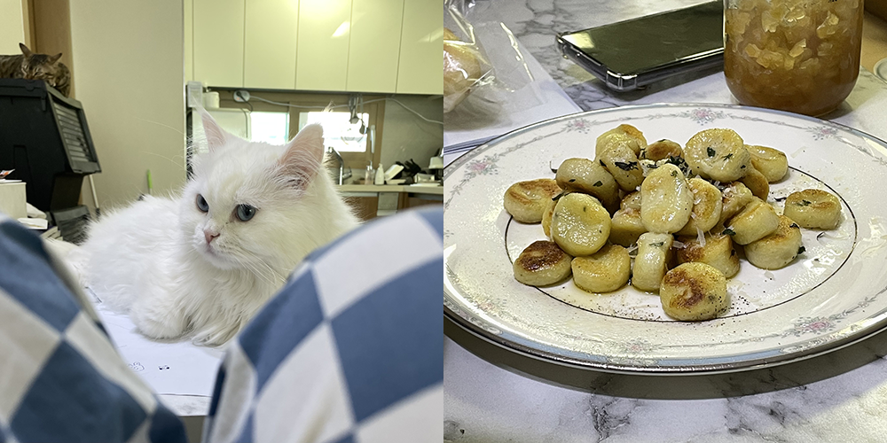

새벽 다섯 시까지 유정의 방에서 재잘거렸고 중간중간 공백도 있었다. 유정은 내가 잠들 것 같으면 이런저런 말을 걸고 내 몸을 괜히 짓눌렀다. 나는 침대 헤드를 주먹으로 쿵쿵쿵, 치고 니 안 자서 망태 할아버지가 잡으러 옴, 걔는 내가 망태 할아버지보다 더 세, 했다. 망태기 따위를 들고 다니는 할아버지보다 유정의 기가 확실히 더 셀 것 같긴 했다. 나는 엄마가 망태 할아버지만 불러 오면 무서워서 눈 꾹 감고 잤다고 했고 걔는 자기보다 엄마가 먼저 잠들면 토닥이던 손등 콕콕 치면서 엄마, 나 아직 안 자는데? 했다 그랬다. 어린 날의 나와 유정이 겹쳐 보이며 우리의 현재가 과거와 많이 닮아 있다는 걸 피부로 느꼈다. 잡혀 갈까 두려워 두 눈 질끈 감던 어린 아이는 여전히 책임감에 짓눌린 채로 적당하게만 살아 가고 있었다.