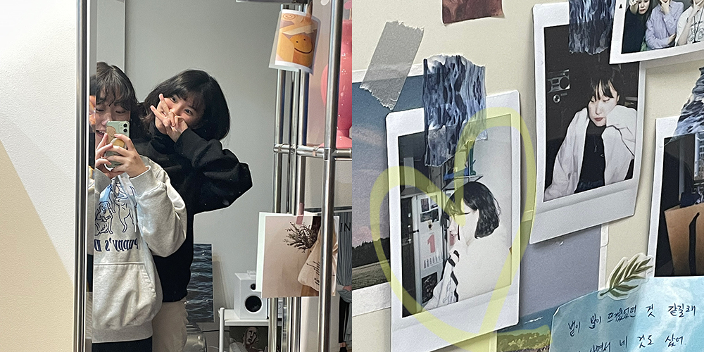
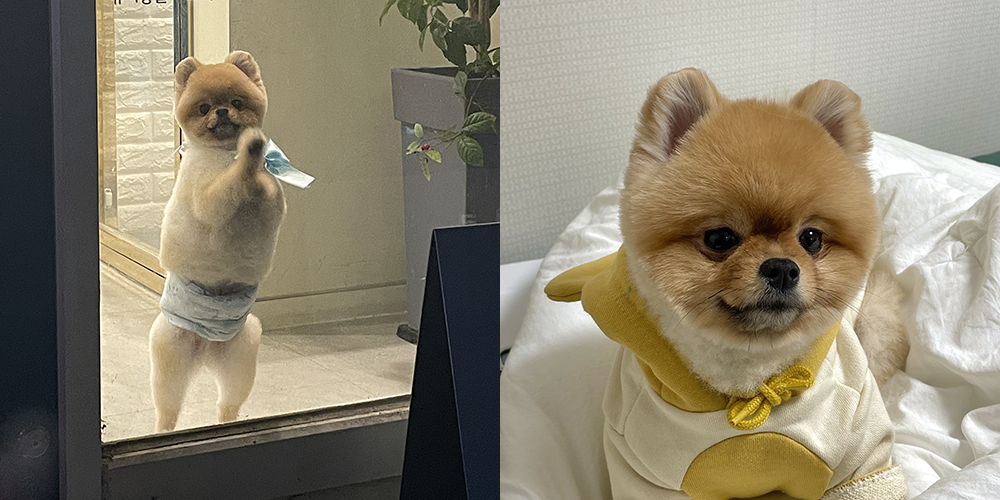
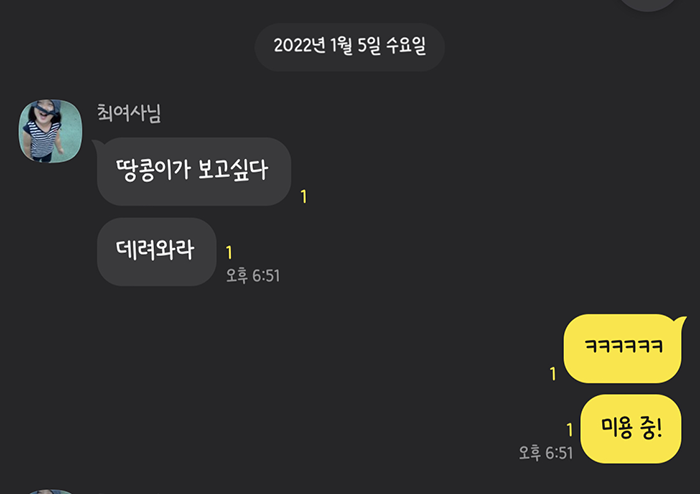
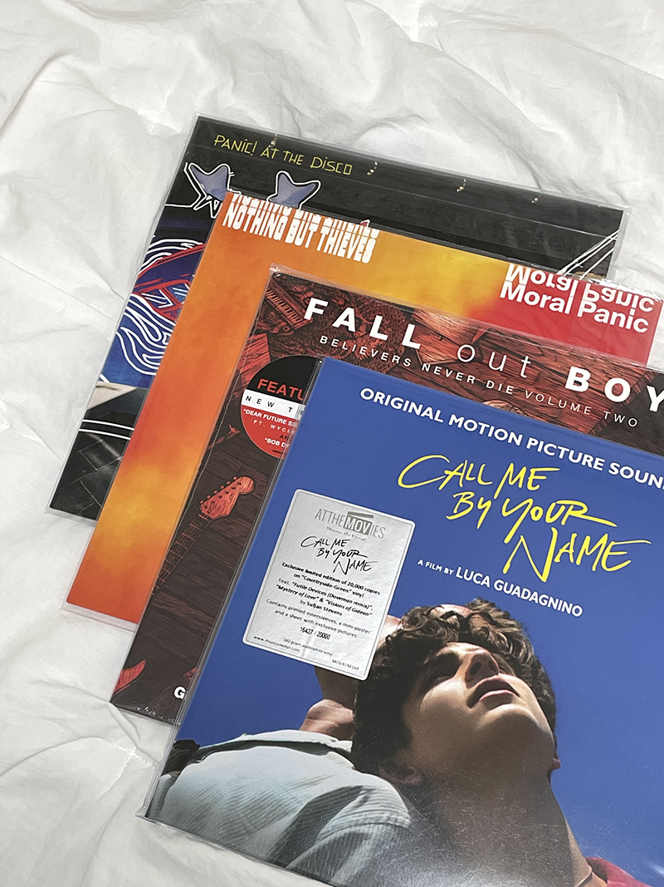
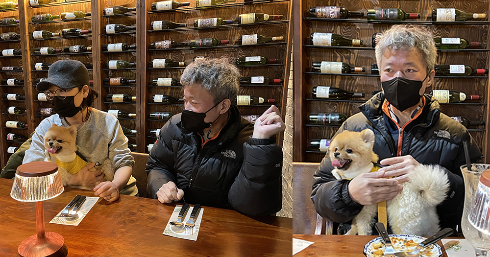
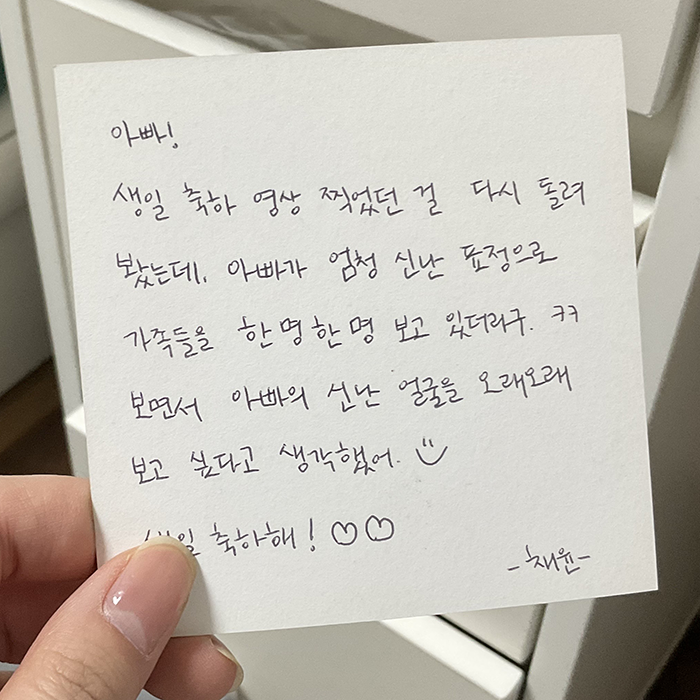
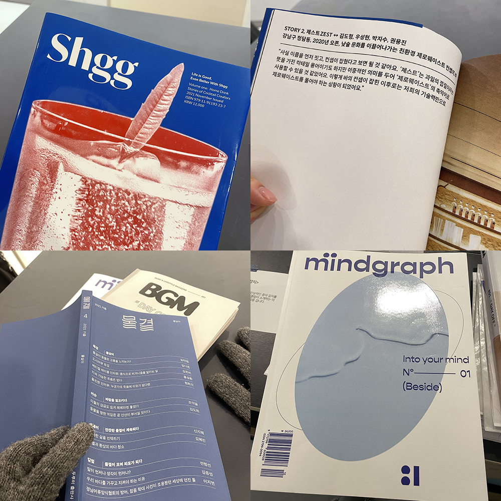

### 유진

혹독한 연말을 보낸 사람들끼리 결의를 다지기 위하여 1월 1일부터 만났다. 우리가 사랑하는 SM 아티스트들의 공연으로 액운 타파하려 했는데 빔 프로젝터 연결부터 햇빛 가리는 것까지 뭐 하나 쉬운 일이 없었다. 하지만 이미 최고로 그지같은 연말 보낸 우리라 그런지 그깟 일쯤이야 대수롭지 않았고 얼레벌레 햇빛 차단 및 영상 재생 성공. 중학생 때부터 함께해 온 우리지만 해를 거듭할수록 고민하는 일들이 달라지고, 꾸준히 멈춰 있지 않으려 하는 우리가 새삼 대견했다. 끊임없이 취향을 넓혀 가고 호기심을 확장할 수 있는 우리 유진이 덕에 2022년 힘차게 열었다. 함께 세운 올해 목표: 인깜살(인생 깜찍하게 살기).

### 땅콩이 미용

우리 귀염둥이 미용한 날. 맡기자마자 벽 긁고 우는 땅콩이나, 미용 간 지 한 시간 만에 땅콩이 보고 싶다 하는 엄마나, 다시 데리러 갈 때 또 문 긁는 땅콩이를 보면 미용 꼭 시켜야 할까...... 싶기도 하다. 사람 말로 소통할 수 있다면 미용 안 하고 싶다고 할 것 같고.... 진짜 땅콩이를 위한 일은 무엇일까.

### 첫 바이닐

명반은 나 배신 안 해. 자취 허락 받아 내고 자취방에 LP 모으기 위해 처음으로 구입한 바이닐 네 장. LP 한번 모으기 시작하면 겉잡을 수 없이 지출할 것 같아서 시작도 안 하려 했는데, 좋아하는 것을 수집하고 드러내며 사는 것이 나를 뚜렷하게 만들어 주는 일일 것이라 생각했다. 가끔 음악을 듣다 보면 앨범 전곡이 명곡이거나 앨범 자체로 아트가 되는 경우가 있는데 이 바이닐들은 모두 그런 것들. 질리도록 듣던 명반들.

- Panic! At The Disco - Death Of A Bachelor
- NOTHING BUT THIEVES - Moral Panic
- Fall Out Boy - Believers Never Die: Greatest Hits (Vol. 2)
- Call Me By Your Name OST

세 장은 컬러 바이닐이다. 콜바넴은 초록색인데 진짜 영롱. 평생 소장해야지.

### 아빠 생일 파티

온 가족 다 함께 공간녹음에서 비건 음식 먹으며 아빠 생일 축하한 날.

아빠가 키친타올을 치킨타올이라 말하는 것들이나 세기말 부장님 개그를 치는 것에 엄마는 이마를 짚었고, 나랑 동생은 엄마 반응에 배꼽 잡고 웃었고, 땅콩이는 의자에 얌전히 앉아서 쫑긋거렸다. 나는 이제야 우리 가족이 행복해지는 방법을 알게 된 것 같은데 아빠와 얼마나 더 함께할 수 있을까 날짜를 세다 보면 마음이 폭 꺼진다. 내년에도, 내후년에도 같은 식당에서 같은 식구와 같은 음식을 시켜 먹고 싶다. 아빠의 재미없는 개그에 핀잔 주고 싶다. 아빠가 그만 아팠으면 좋겠다.

### 집 계약

회사랑 집이랑 먼 것도 아니고 내 방이 없는 것도 아닌데 왜 독립해야겠냐며 엄마는 반대했지만 그럼에도 내가 가장 나다워질 수 있는 시간은 독립적인 공간에서 오는 것 같았다. 제주도에 한 달 살 때 가장 크게 얻고 온 가치가 그것이었다. 독립된 공간의 평온함. 내가 스스로 나를 지킬 때에야 알 수 있었던 나의 가치. 반대를 무릅쓰고 하고 싶은 것 꼭 하겠다며 엄마를 설득했지만, 나 같은 쫄보가 모든 것을 혼자서 한다는 게 그렇게 쉬운 일은 아니었다. 쉽지 않을 거라는 걸 알고는 있었지만 이렇게 모든 과정들을 다 겁낼 줄이야. 부동산에 전화 거는 것부터 집 보러 다니던 것, 가계약, 본 계약까지 의젓한 척했지만 사실 다 어떻게 했는지 모르겠다. 계약할 때 중요한 점 유튜브로 수십 번 보고 공부해 갔는데도 막상 계약하러 혼자 부동산에 가니 괜히 다 무서웠다. 큰 돈 들어가는 것이 처음이라 모든 게 다 불안해서 "제가 계약 처음 해 봐서 그러는데, 이게 안전한 게 맞나요?" 하며 설명해 달라고 하는데, 모든 걸 빨리빨리 넘겨 버리려 하는 부동산 사람들이나 답답해하는 눈초리 같은 게 속상했다. 내가 너무 무른 사람이라서 괜한 생각 한 거겠지만은, 그래도. 동시에 이렇게 큰 책임을 혼자 지고 무언가를 처음 해 보는 것이 정말 오랜만이라는 걸 깨달았다. 모든 처음은 이렇게 서툰 것이었지. 다 무서운 거였지. 잘했는지 못했는지 모르겠는 계약을 마치고 완공된 집을 한 번 더 본 뒤 알 수 없는 헛헛함에 보드카를(?) 사서 들어왔다. 블랙러시안 네 잔 만들어 먹고 그래도 인생 퀘스트 하나 깬 것 자축할 만하다 위로하고 침대에 누웠는데 그런 생각이 들었다. 나에게 확신이 있는 사람이 되어야지. 잘 살아 봐야겠다.

### 종이잡지클럽

제주에서 너무 좋았던 장소. 합정이 본점이라기에 잡지가 읽고 싶어진 김에 방문했다. 사람과 세상이 궁금할 때에는 잡지를 보자고 또 다짐. 그리고 언젠가는 나도 잡지를 만들어 보고 싶다.

