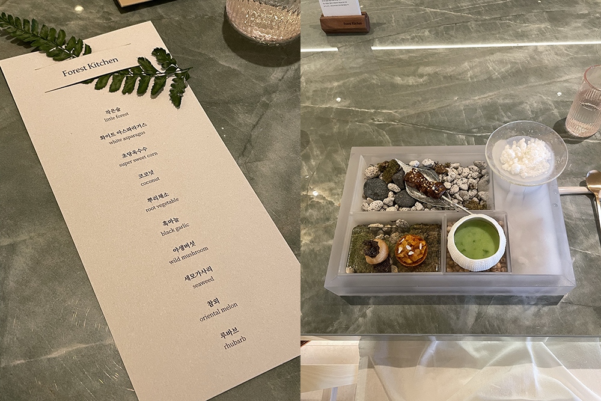

## 데드리프트

7월의 가장 큰 수확은 데드리프트 1RM 100kg을 경신했다는 것이다.

올해 버킷 리스트 중 데드리프트 100kg 드는 게 있었다. 2022 끝물에야 달성하려나 싶었는데 여름에 달성. 그 뒤로 데드가 너무 좋아서 맨날맨날 각종 데드 치는 중이다. 피티 쌤도 그런 적 있었는데 그때 엄청 강해졌단다. 엄청 강해질 수도 있어요, 그랬는데, 뭔가 몸이 커질지도 모른다는 우려 같았는데, 다 됐고 강하다는 말에 꽂혀서 엄청 강해지고 싶어졌다. 무지하게 강해져서 나 괴롭히는 인간들을 바벨 삼아 컨벤셔널 데드리프트로 들어올린 뒤 땅바닥에 내리꽂아 버릴 것이다(농담).

## 타투

7월 한 달 동안 오른팔에 두 개의 타투를 받았다. 몰랐는데 타투 의미를 묻는 게 실례라더라. 나는 딱히 숨기고 싶은 의미는 아니어서 이곳에 적어 둔다.

손목 부근에는 작게 평화를 새겼다. 내가 늘 돌아가는 곳이자 삶의 이유, 영원히 유지하고 싶은 자세이기 때문에. 잃어버릴까 겁날 때마다 보고 안정을 찾을 수 있도록 내가 자주 볼 수 있는 곳에 새겼다.

팔 안쪽, <밤과 술과 책과 음악>을 모티브로 한 추상화. 내가 가장 행복했던 제주 한 달 살이 중 한 순간을 담았다. 내도음악상가에서 혼자 술을 마시며 음악을 듣고 책을 읽던 밤. 잘 보면 밤, 술, 책, 음악, 그리고 내가 보인다.

두 타투가 꼭 세트처럼 어우러져서 마음에 든다. 온전히 내 소유인 나의 몸에 영원을 새겨 좋다.

## 힘

사실 칠월은 일적으로 자신감이 결여돼 힘에 부쳤던 달이었다. 껍데기뿐인 말들 속에서 유일하게 힘이 되었던 말. 속 깊어 고마운 은빈.

## 포리스트 키친

아란과 포리스트 키친. 코엑스에 위치한 비건 파인 다이닝이다. 전반적으로 만족도 높은 식사였다. 그런데나는왜항상에피타이저가가장맛있는걸까….

시간 얼마나 지났다고 벌써 맛 다 까먹었다. 기념일이 있다면 호텔에서 자고 식사를 이곳에서 하면 좋겠다 싶었다. 일단 돈을 뒤지게 많이 벌어 놓기로 한다.

## 아디오스 피아졸라

복동 님과 천년식향에서 식사하고 탱고 공연 보러 갔다. 다양하고 많은 것들을 깊이 좋아하는 분이라 함께할 시간이 제법 기대되었다. 그런 사람은 귀하니까. 그리고 공연을 무려 1열로 예매해 주셔서(!) 내 인생 첫 1열 직관.

춤 공연을 보는 것은 처음이었는데, 춤선 속에 얼마나 많은 대화가 함축되어 있는지 처음으로 알게 됐다. 영화나 연극과는 다르게 음악에 어우러지는 그 사람의 표정과 동작만으로 한 편의 짧은 영화를 상상할 수 있어 좋았다. 고상지 연주야 뭐 말할 것도 없고. 내가 좋아하는 김아람 바이올리니스트와 김종수 바이올리니스트 두 분을 함께 볼 수 있던 것도 너무 좋았고, 지난겨울 고상지 콘서트에서 유독 기억에 남던 퍼커션도 함께해서 참 좋았던. 시각과 청각이 모두 만족스러웠다. 행복한 표정으로 합주하는 사람들을 보고 있으면 나도 모르게 벅차오르는 감정이 든다. 내가 정말 좋아하는 taquito militar까지 듣고! 나는 참 오래도록 탱고를 사랑하겠구나.

## 아드벡

나의 최애 위스키.

아드벡과의 첫 만남은 글쓰기 모임에서였다. 아주 춥던 날, 발발 떨리는 몸을 진정시켜 주었던 진한 나무 향기의 술. 다정했던 사람들. 각자의 글을 소리내어 읽고 마음을 나누던 밤. 오랜만에 다시 맛본 아드벡은 그 겨울을 통째로 마시는 기분이었다. 일 등 자리 얘 아님 다른 놈한텐 못 내어 줄 것 같다.

## 채식주의자

어떻게 이런 책을 쓸 수 있을까. 내가 읽었던 그 어느 소설보다 가장 완성도 높았고 몰입도 높았다. 이걸… 왜 이제야 읽었지 하는 생각만 계속 들었던. 어떻게 이런 소설이 2000년대 초반에 나왔나 싶고. 진짜 천재인가 봐.

## 쓰는 하루

50일 동안 하루에 글 한 개씩 쓰는 프로젝트 진행 중. 거기 썼던 것 중 7월의 글 몇 개를 발췌했다.

### 소영

가끔 어떤 사람은 너무 환해서 어딜 가도 그곳을 환히 비추겠다는 생각이 든다. 어디서든 사랑받을 것 같은 사람. 덕분에라는 말을 자주 쓰게 되는 사람. 대체 불가한 고유성이 눈에 띄는 사람. 자유로운 다정함으로 불편하지 않을 만큼 실리를 따질 수 있는 사람. 소영이 그랬다. 오늘을 마지막으로 소영과의 회사 생활이 끝난다.

그 사람의 좋은 점을 발견하지 않았다면 이별이 덜 아쉬웠을 텐데 이미 너무 많이 발견해 버렸다. 소영의 밝음이, 솔직함이, 진취적이고 투명한 모습이, 선한 마음이 언제나 우리를 맑게 닦았다.

한국 언제 놀러 올 거냐 물었더니 여름을 좋아하니까 여름에 올 것 같다 그랬다. 여름을 좋아하는 사람은 꼭 여름을 닮았다. 한여름의 슬리브리스, 버킷 햇과 핑거 스타일 기타, 백합과 강아지. 소영이 좋아하는 것을 생각할 때면 나도 같은 생각이 날 것이고 우리는 금방 다시 만나게 될 것이다. 여름을 기다릴 이유가 생겼다.

### 지갑

지갑을 잃어버려서 차고지까지 다녀왔다. 돌아가는 버스를 기다리는데 아무리 기다려도 차가 오질 않았다. 다른 정류소까지 멀리 걸어갔다. 겨우겨우 탄 버스는 반대 방향이었다. 다시 내려서 길을 건너고 다음 버스를 기다렸다. 휴대 전화 배터리가 나갔다. 가방 속에는 책 한 권 없어서 창밖을 바라보는 일 외에는 아무것도 할 수 없었다. 한 시간 내내 바깥 풍경만 바라보았다. 해가 빠르게 저물었다. 나무가 사선으로 자랐다. 세화리까지 버스를 타고 가던 길이 떠올랐다. 아무도 타지 않을 것 같은 정류장에서 타고 내리는 사람들. 그때는 그 사람들의 삶까지 상상하고 바람의 속력을 쟀는데. 오늘은 알던 사람이 불현듯 떠올랐다. 모르는 동네를 지나는데 익숙한 기분이 들었다. 고등학생 때 좋아하던 애가 살던 동네였다. 사귀었던 것까지 잊고 지냈다. 팔등에 한자로 타투를 새기고 귀에 피어싱을 주렁주렁 매달고 찡 박힌 신발을 신고 다니던 사람. 음악을 하고 싶다 그랬는데. 이유 모를 자유로움이 보였는데. 헤어진 지 몇 년 뒤 연락이 닿았을 때에 그 사람은 현실에 짓눌려 예술과는 거리가 먼 일을 하고 지냈다. 쳇바퀴처럼 굴러가는 일상을 묵묵히 감내하면서. 가끔 한 번씩 연락이 닿아도 어떻게 지내냐는 물음에 나야 뭐 늘 그렇지라고 대답하는 사람. 버티는 것이었을까, 흐르는 것이었을까. 빨래를 널면서 한 번 더 그 사람을 생각했다. 이제는 왜 그 사람이 자유로워 보였는지 기억이 나질 않는다.

## 사브레

석촌에 보석 같은 카페를 발견했다. 귀여운 조약돌 디저트도 맛있고, 샌드위치도 정말 괜찮다. 특히나 송리단길은 어딜 가도 시끄러운데 여기는 주택가 근처라 그런지 참 조용해서 좋다. 머리 하러 갈 때마다 꼭 방문하고 싶은 곳. 방앗간 같은 공간을 발견한 게 오랜만이라 카페에 있는 내내 들떴다.
