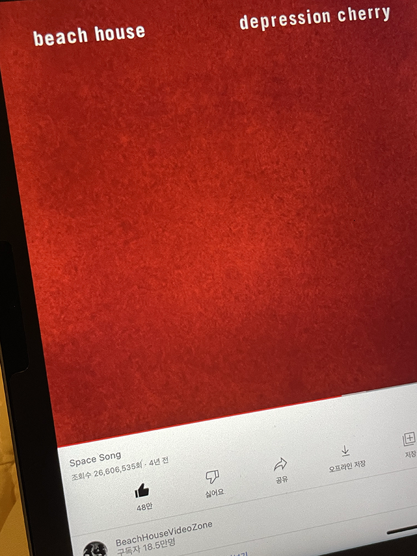

### 유리

늦게나마 유리에게 축하받은 생일.


오래된 친구를 마주할 때면 여전함에 대해 생각하게 된다. 여전히 깊은 마음에 대해 대화할 수 있는 우리, 자연스럽게 깊은 곳을 꺼낼 수 있는 우리, 편안하게 밥을 먹을 수 있는 우리, 특이한 포인트에 같이 꽂히는 우리, 여전히 나를 궁금해하는 유리, 내가 듣고 싶던 말을 해 줄 수 있는 유리…….

우리는 항상 서로가 힘들 때에 가장 편하게 이야기할 수 있었던 사람인데, 반년 가량을 그런 이야기 하나 못 하고 보내게 되었던 것을 깨달아 조금 슬펐다. 나는 상처받은 마음을 마주할 자신이 없었고 관계를 회복할 용기도 없었는데. 유리의 편지는 늘 그대로 곁에 있고 싶다고, 같이 서로를 믿어 보자고 말하는 것 같아서 여러 감정이 교차했다.


### 부산

예진과 부산으로 여행 다녀왔다. 내가 하고 싶은 것을 전부 할 수 있는 여행을 간다는 건 우리의 취향이 잘 맞아서일까, 네가 나에게 잘 맞춰 주어서일까.


눈물의 샌드위치. 얘 나한테 이거 만들어 주고 싶다고 아침에 이거 만들고 설거지까지 하고 오다가 기차 놓쳐서 혼자 기차 탔다. 꼭 같이 기차 타고 싶다고 그랬으면서. 기차 표 예매할 때부터 우여곡절이 많았던 터라 순간적으로 화가 났다.

예진과 있으면 내 감정을 멈춘 채로 보게 된다. 갈등 상황이 생길 때에 냅다 싸워 버리고 영영 빠이 치던 나날들로부터 멀어져서 상황과 감정을 분리할 수 있다. 당장 화나는 감정 꾹 참고 내가 화가 났구나 인정하는 것부터 마음이 차분해졌을 때에 내 감정을 전달할 수 있다. 꾹 참다 얹혀 버려서 회피하고 연을 끊어 버린다거나 감정이 격양된 채로 상처된 말만 하지 않을 수 있다. 그래서 잘 풀었다. 서로의 감정을 설명하면서.


지나온 세월 동안 수없이 많은 갈등 상황을 겪었다. 서로의 상황을 설명하고 “그렇구나”로 끝맺었던 대화들이 떠오른다. 그때마다 사실 나는 내 마음도 모르겠었고, 상대방 마음도 모르겠었다. 당장의 상황만 도마 위에 올려 놓았을 뿐. 칼질하지 못하거나 난도질하기만 했다. 그렇게 매 갈등을 속으로 썩히는 게 더 익숙해지던 찰나에 예진을 만났다. 예진은 내가 가장 편안해질 수 있는 만큼의 솔직함을 잘 꺼내 준다. 이상하게 얘 앞에서는 내가 설명할 수 있는 감정들이 많다.

#### 수월경화


우연히 찾았는데 예진도 마침 와 보고 싶었던 곳이라 했다. 미치게 맛있었다. 직원 분께서 우리가 간 날이 첫 출근일인 듯 했는데, 너무 떠셔서 괜히 내가 다 조마조마했다. 웃겼고 귀여우셨고. 차와 다과 설명 달달 외운 티가 났다. 나는 어떤 처음이 저렇게 떨렸을까 생각하면서 차를 마셨다. 기억이 잘 나지 않았다. 처음의 떨림이 너무 멀어져 버렸다. 스물일곱은 그런 나이인가.


차를 다 마시고 나와서 길게 난 길을 따라 한참을 걸었다. 하늘과 예진의 뒷모습이 잘 어울려서 사진도 찍어 줬고. 예쁜 하늘색. 가장 기억에 남는 순간이다.

#### 운동…


여행 가서까지 기어코 운동 가겠다고 미리 5분 거리 헬스장 1일권 가격까지 알아 놨었다. 예진 재워 놓고 나는 가서 어깨 했다. 다음 여행에서도 운동은 빼놓지 않고 갈 생각. 이박 삼일이면 적어도 하루는.

#### 우연한 서점


이름답게 우연히 발견한 서점. 빵도 맛있었고 공간도 편안해서 두 번째로 기억에 남는 곳이다. 같이 뭘 먹거나 어딜 가면 뭐가 제일 좋았냐/뭐가 제일 기억에 남냐 앙케이트하는 게 내 취미인데(손은지가 이거 캐빡쳐함 ㅋㅋ 맨날 물어만 보고 나는 안 알려 줘서) 예진에게도 가장 기억에 남는 순간을 물어보았었다. 하늘 아래 하염없이 걸었던 것과 이 서점을 꼽았다. 왜 자꾸 나 따라 하는지….

#### 아르프


우리 둘 다 흰여울마을과 영도를 좋아해서 원래는 흰여울마을을 한참 걷다가 아르프에서 비건 음식을 맛깔지게 잡솨 줄 생각이었는데, 하늘에 구멍이 뚫린 것처럼 비가 내렸다. 그래서 영도까지 택시를 타고 갔다…. ㅋㅋ 이번 부산에서 갔던 곳들 중 가장 예쁜 공간이었고 내가 좋아하는 분위기였어서 나중에 꼭 다시 오고 싶던 곳. 창밖으로 내리는 비 구경하면서 먹기도 좋았다. 음식 맛이야 말할 것도 없고.


### 책방 밀물

처음으로 해 본 독서 모임!


이렇게 다정한 편지와 예쁜 엽서들, 책갈피까지 보내 주셨다. 모임 시작 전부터 마음이 들떴다. <아무도 아닌>은 이 모임 아니었으면 끝까지 읽지 못했을지도 모른다. 읽을 수 있어 좋았고, 나눌 수 있어 좋았다. 내가 나눴던 후기는 책방 밀물 블로그에서 확인. [https://m.blog.naver.com/PostView.naver?blogId=milmulbooks&logNo=222802430072&navType=by](https://m.blog.naver.com/PostView.naver?blogId=milmulbooks&logNo=222802430072&navType=by)

### 알디프

예진이 알켓팅(?) 성공해서 티 바 다녀왔다. 1년만!


작년보다 조금 아쉬운 구성이었지만 티를 가지고 어떻게 베리에이션할지 즐겁게 고민할 티마스터를 떠올리면 덩달아 즐거워진다. 그런 경험을 할 수 있는 곳은 갈 때마다 좋다.


### 점점점점점점

이번 달 내내 예진이랑만 놀았나 보다…. 예진이가 드림 콘서트 표도 구해다 줘서 ㅋㅋ 드콘 가기 전에 방문한 점점점점점점. 비건 코스 요리다. 상호명이 점점점점점점인 이유는 가장 잉크를 덜 쓰는 글자이기 때문이라고. 이 [인터뷰](https://www.wkorea.com/2022/01/24/박서희의-점점점점점점/?utm_source=naver&utm_medium=partnership)도 좋으니 한번씩 읽어 보시길.


속 편하고 맛있었다. 코스 요리 좋아하는데 요즈음 비건 파인 다이닝도 많이 생기는 것 같아 살 맛 난다.

### 드림 콘서트


사실상 시즈니 구경 하고 온 날. 함성 속에 있었더니 옛날 생각 났다. 내가 공연을 좋아하는 이유가 이거였지. 한 마음으로 열렬하게 응원하는 사람들에게 힘을 얻어서.

### 망원

아주 오랜만에 개포동 자매님들 만났던 날. 🥺 망원에서 밥 먹고, 카페 갔다.


같이 셔틀 타고 태입 가거나 먹을 것 정하러 일단 후문으로 나가던 학식이들이… 어느덧 셋 다 직장인이 되어서 만나면 각자 회사 이야기를 한다니. 각자 이만큼 치열하고 힘들게 살아가고 있다니! 이렇게 사는 게 어린 날의 우리가 가장 원하던 모습이었을까? 생각하다 보면… 사실 어떤 사람이 되고 싶다는 생각조차 안 하면서 살았던 것 같다, 나는. 그러니까 잘 큰 거겠지. 이제는 어떻게 사는 게 좋을지 고민은 하며 사니까.

아무튼 언제 봐도 편하고 재미있는 만남. 과 생활 지리게 안 했던 나한테도 소중한 동기들이 있다는 게 새삼 감사하다.

### 낫 투 길티

회식을 낫 투 길티에서 했다. 😭 비건 팀원 나 딱 하나인데 매번 배려해 주셔서 너무 감사하다.


생각했던 것보다 공간이 작았는데도 단체석을 마련해 주셔서 열 명이 쪼로록 앉아 먹었다. 친구 집 초대받아서 맛있는 음식 대접받은 기분. 막 엄청 특별한 안주는 아니었는데, 와인이 맛있었고 팀원분들이 맛있게 드셔 주셔서 기뻤다! 말 안 하면 비건인 줄 모르겠다는 말도 많이 들었고. 이런 말 들을 때마다 느끼는 것. 비건이 디폴트고 논비건이 옵션인 세상이 온다면 얼마나 좋을까.

### Space Song



듣는 것만으로도 꿈꾸는 것 같은 음악. 차분한 마음을 주는 곡. 한참을 들었다.

### 반미리


인생 반미 발견. 이때 이후로 반미에 빠져서 두 번인가 더 시켜 먹었는데 반미리 같은 바게트 맛이 안 난다. 미친 바삭함. 원래는 분짜를 비건으로 먹을 수 있다는 것 때문에 간 거였는데…… 이름에 반미가 들어간 곳이라 그런지 반미가 갑. 메뉴가 고민될 때에는 상호명을 보자.

### 감정선 프로젝트


ㅋㅋ 취향 극명히 갈리는 두 인간. 미러 페인팅? 했다. 고민 없이 슥슥.

### 윤티하우스


비건 디저트가 있는 카페. 안경과 디저트를 같이 판다는 게 신기했고…… 예쁜 맛이 났다.

### NUMB

몰랐는데 적고 보니 이번 달에 우연한 행복이 많았네. 우연히 발견한 바였는데 너어어어어무 내 취향이었다. 내 취향을 그대로 옮겨 놓은 것 같은 곳. 좋아하는 음악 많이 신청했고, 궁금했던 위스키 세 잔이나 마셨다. 아일라 위스키 있는 것 다 마셨는데 내 최애는 아드벡이었음 확인 완. 이제 이태원 갈 때마다 여기 가고 싶을 것 같다. 내가 신청한 Masego의 Black Love가 너무너무 잘 어울렸던 곳.


그리고! 여기서 우연히 소영 님 만났다. ㅋㅋㅋ 서로 `움…? 닮았는데……?` 하고 빤히 보다가 `응?!?!` 하고 인사했음. 웃기당. 소영 님도 좋은 시간 보내셨겠쥐.

### 탑건

4D로 봐야 한다는 말에 퇴근길 예진이 잡아다가 4D 의자 앉혔다. 조종석에 앉아 있던 기분! 너무너무 재미있었다. 아래는 내가 가장 공감 갔던 리뷰.

```
나이에 발목 잡혀 새로운 도전이 망설여질 때면 그때 불현듯 떠올라서 내게 용기를 심어 줄 영화. 세월 앞에 장사 없다는 말을 온몸으로 반박하는 톰 크루즈를 아주 오래도록 존경하게 될 것 같다.
```

보자마자 울 엄마 좋아할 것 같은 영화라고 생각했는데, 며칠 뒤에 귀신같이 집사님이랑 탑건 보러 가는 중이라고 연락 왔다. ㅋㅋ 고딩 때는 액션 영화만 개봉했다 하면 엄마한테 보러 가자 했었는데. 아님 세정이. 다음 액션 영화는 같이 보자 해 봐야지.
