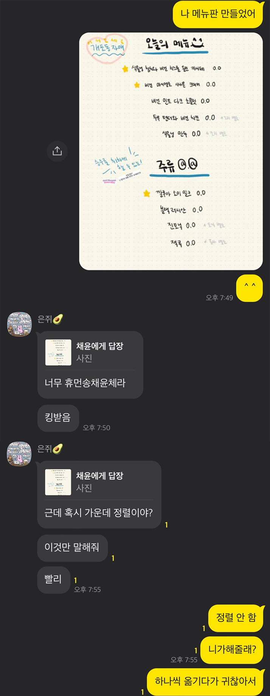

책과 술에 덮이고 절여져 살았다.

### 빛의 운

  처음을 손질하지 않으면 떠나야 해. 우리는 깨끗한 마음이 잠든 침대 앞에서 그 말을 들었고
  사람들은 가져갈 수 없는 얼굴을 만져 달라고 했다. 잠시라도. 하얗게 비운 눈을 맞는 듯이. 이러지 않고 만날 방법이 있을까. 무릎을 안고 나는 생각했다.

  ⎯수면에 천칭이 놓였어.

  ⎯그쪽으로 기울어질게.

  빛의 운이 실명을 가르쳐 주었다. 부를 수 없는 이들을 안은 점이 구르며 이동했다. 나는 그림을 바라보듯 북적거리는 글자를 만졌다.

  ⎯잡지 마. 닻이 떠오른다.

  ⎯우리가 닻이야.

  고요하여 슬프다는 말의 의미를 듣기 위해 웅크렸지만 고요한 의미가 있다는 것을 알았을 뿐이었다.

  실수가 생겨 달이 찼다. 초를 켜지 않은 어둠 속에서도 분위기를 셀 수 있었다.
  손 안에서 금이 다른 금을 만졌다. 사람들이 얼기설기 붙잡은 양팔을 흔들고 있었다. 아래에서 우리는 포도처럼 보일까. 겁에 질린 눈동자와 동공이 투명하게 드러났다. 그리고 누군가, 힘을 다해.

  ⎯별처럼 보일 거야.

  ⎯별처럼 보일 거야.

  ⎯별처럼 보일 거야.

> 수면에 천칭이 놓였다는 말에 바로 그쪽으로 기울어지겠다고 말할 수 있는 사람, 웅크리고 싶을 때에도 용기를 줄 수 있는 사람. 이런 사람을 갖고 싶다는 생각을 하면서 읽었는데, 지금은 그런 사람이 되고 싶다는 생각이 든다.

### 살아 있는 무대

아름다운 사람을 보았다
나는 불행해졌다
아름다움은 무슨 색일까
고민하고 있었는데

아름다운 사람은 아름답게 가꾼 사람이 아니라
아름다움이 빚은 사람 같고
나는 내가 되고 싶은 내가 아니라 있는 그대로의 나여서
세상은 눈부신 불행으로 환히 지워지고
나는 아름다운 사람을 향해서만 살아남자고 다짐했다

살아남자는 살아서 남자는 건지 남았으니 살자는 건지
상관없었다, 아름다운 사람은 너무 아름다워서
사랑이란 게 존재하지 않더라도 나는 그를 사랑해
사랑했기 때문에 사랑했다

긍정적인 절망으로 절망적인 긍정으로 살아서 남아가며 나머지로 살아가며
종교 없는 사제같이 신도 없는 종교같이
무대 밖의 배우같이 관객 없는 무대같이
차라리 아름답게 망해 버리기라도 했으면 기도할 때

밤은 왔다
아름다운 사람과 그렇게 만났듯이

아무도 어둠 속에서는 아름답지 않았다
우리는 빛을 잃었다
아름다운 사람에게 나는 어디 있느냐고 물었다

⎯북극점에 서서 북쪽이 어디냐고 묻는 건가요, 북극점보다 더 북쪽은 없고 나보다 더 나는 없어요

아름다웠던 사람의 이름은 혼자였고
혼자와 더불어 나는 혼자였다
날이 밝으면 나도 혼자처럼 아름답고 싶어요

⎯기도를 가장 먼저 듣는 건 나 자신입니다, 신의 귀가 우리보다 밝았더라면 애초에 기도는 그쳤을 거예요

나는 아름답게 죽고 싶다고
내가 살지 못할 인생을 두고 울고 싶지 않다고
돌이킬 수 없는 게 있다고 생각하면 울고 싶어 견딜 수가 없다고 울먹였다

⎯가장 아름다운 성당은 신앙하는 마음속에 있습니다, 이 세상에 무대 바깥은 없어요

당신은 살아 있는 무대입니다

아침은 왔다
무대에 서서히 조명이 켜지듯
아름다움은 무슨 색일까
아직 끝나지 않았는데

나와 함께 나는 혼자였다

⎯아름다운 사람을 보았다

나는 그 다음 대사를 고민하며
걸어나갔다 나의 보폭으로

살아 있는 무대의
빛 속으로

> 긍정적인 절망으로 절망적인 긍정으로 살아서 남아가며 나머지로 살아가자고 말하고 싶을 때마다 읽는다. 몫이든 나머지든 상관 없이 살아가자 하고 싶을 때.

### work. work.

숲속에서 코딩하는 기분이 났나요?

아니오

### 온더락

땅콩이랑 술 한잔.... 이해하지 못하던 것들을 이해해 가면서.

### 제주

유정과 사흘간 제주에 머물렀다. 무계획+뭐든 다 좋아 인간인 유정(극 P), 어느 정도의 가고 싶은 곳은 있어야 해 인간인 내가(소문자 j) 함께한 첫 여행. 하릴없이 내가 대부분의 동선을 짰고 컨펌 받았다. 유정은 생각보다 입이 짧았고, 햇볕에 약했고, 알코올에 약했고, 체력도 약했다. 캣만두의 유래가 무엇인지 기어코 알아내야겠다며 음식 앞에 두고 나무위키만 보고 있던 유정을 두고 나는 파스타와 커리를 흡입했고, 유정이 논알코올 칵테일 한 잔을 홀짝일 동안 나는 세 잔씩 들이켰고, 유정의 손에 들려 버린 일곱 권씩이나 되는 책 탓에 해변을 걸으려 했던 계획은 무산될 뻔했다. 그럼에도 내가 맛있게 먹었던 음식을 유정이 맛있게 먹어 주는 것이 좋았고, 내가 좋아했던 책방에서 사고 싶은 게 너무 많다며 과소비하는 것이 좋았고, 우연히 찾았던 단편 영화 상영관에서 영화를 보고 나왔을 때 또 오고 싶다던 그 말이 좋았고, 아침잠이 많은 유정을 재워 두고 혼자서 보고 온 아침 애월 바다를 동영상으로 보여 주었을 때 예쁘다고 재생 버튼을 두 번 누르던 것이 좋았고, 마지막 날 밤 뜬금없이 건네받은 고맙다는 말이 좋았고, 샐쭉 웃으며 뭘 고맙냐 물었을 때 맛있는 것 먹여 줘서 고맙다고 얼버무리는 게 좋았다. 너랑 애월 올 줄은 몰랐어, 오기로 약속했었잖아, 그럼 우리 또 가까운 약속을 많이 만들자, 내년에는 동쪽에 가 볼래? 진짜 비싼 독채에서 자자, 로 이어지는 모든 이야기가, 하루 종일 맑았던 날씨가, 자꾸 뭐가 좋은지 설명하게 됐던 우리가, 나는 이제 애월 바다를 보면 자꾸만 생각날 것이다.

### safe and sound!

아마도 언젠가 내 몸에 새겨질지도?

### 延

*김박은경의 우리는 탈각을 읽다가.*

*너는 무엇이 좋아.* 자꾸 묻게 만들었다. *그런 걸 물어보면 좋아하는 거야.* 겉잡을 수 없이 번질 마음을 알았다. *저는 왜 이렇게 당신이 궁금할까요.* 부드러운 분위기가, 너도 아는 네 분위기가, 티 내려 하지 않아도 티 나는 네가 좋아하는 모든 것들이 전부 내 마음에도 들어서, 꼭 맞아 들어서, 어떤 날에는 네가 나의 구심점이었고, 한낮과 한밤의 축이었다. 계절에도 선율에도 네가 묻어 있었다.

*[요즘 낭만이라는 단어를 제일 많이 생각하고 있는 것 같아요. / 낭만적인 일들이 자꾸 일어나요? / 그것보다도 자꾸 떠올리게 돼요.]*

*구름이 구름을 낳는다. 꽃잎이 꽃잎을 낳는다. 마음을 몸을 자꾸 구부린다. 우리가 알아야 할 운명이 있을까.* 내 생각이 나는 책갈피를 구입했다는 네가, 모르는 사이 내 생각을 꽂아 두었을 나의 삼월, 延, 당신이, 초봄 내 나를 자꾸 들뜨게 한다.

### 헨드릭스 아마조니아 진

향기를 좋아하는 사람은 위스키를 좋아할 수밖에 없다는 이야기를 들은 뒤로 위스키가 좋아지더니만 진 향기는 더 정신 못 차리겠더라고요. 파인애플 향이 나는 아마조니아 진. 오래오래 굴리고 싶은 맛.

### 테이퍼 캔들

활활 태웠다. 김사월의 지옥으로 가 버려를 들으며. 화나는 일은 없었다. 별일 없을 때 머리를 잘랐던 것처럼. 이유 없이 잘 어울렸던 음악. 밤.

### 푸른 용과 강과 착한 물고기들의 노래

자주 묻고 싶은 사람과 닮았어.

### 걸어서 광기 속으로

ㅋㅋㅋㅋ 진짜 웃겨 죽는 줄 알았고.... 이번 달에는 아란, 은지+승주 언니 초대했었는데, 시간 날 때 자세히 정리할 것.

### 초봄

초봄의 승연과 닮은 플레이리스트를 만들어 건넸더니 승연도 또 열심히 만들어 왔다. 너무 귀여워. 죽을래. 하지만 죽기엔 너무 이르지.

### 북덕방

가장 좋아하는 곳이라길래 가 보고 싶어서. 이제 같이 좋아하는 곳 됐다.

### 회식

간만에 저엉말 재미있었던 회식. 안드 팀도 회식 때 개발 얘기 안 할 수 있다는 빛을 보았다. 내가 좋아하는 곳을 좋아해 주는 사람들과 함께라면 언제나 즐거워.

### 슬픔의 힘

우리는 슬픔이 주는 힘이 무엇인지 알지.

### 유튜브를 시작했습니다

<a href="https://www.youtube.com/channel/UCgatkeA0OvqneA81YmUEsIg">https://www.youtube.com/channel/UCgatkeA0OvqneA81YmUEsIg</a>

좋아하는 사람들이 쓰고 찍은 글과 사진으로 플레이리스트를 만드는 곳. 많이 찾아 주세요.

### 유정의 마음

내가 찍은 사진을 엽서로 만들어 줄 생각은 어떻게 하는 걸까. 꾸준하게 고마워.