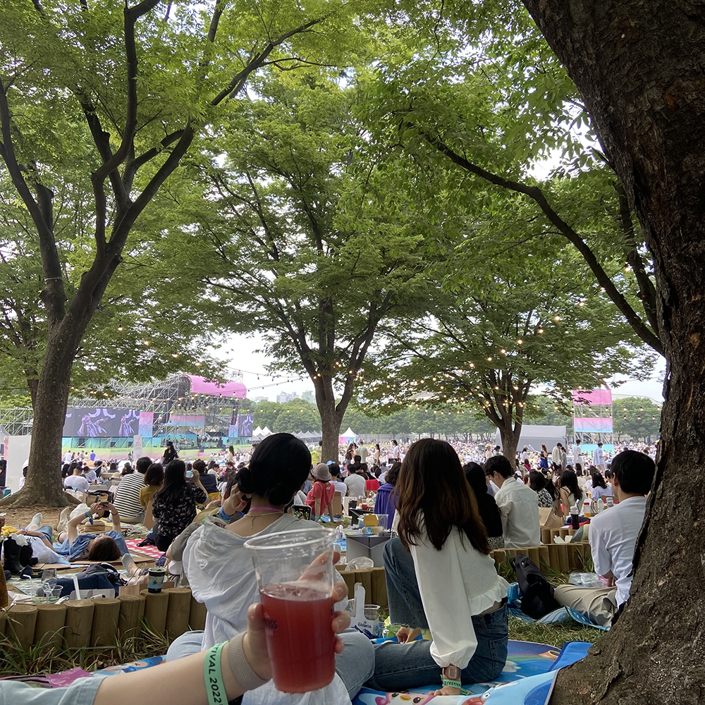

### 메모어

한 주에 한 번씩 회고록 나누는 모임. 오프라인 경험이 별로였어서 이번 기수에는 온라인 모임으로 신청했는데, 감사하게도 7기에 좋았던 분으로 선정됐다. 어떤 게 좋아서 날 골라 주셨을까? 이유가 궁금해. 내 회고 쓰는 것보다 다른 분들 회고록에 댓글 남기며 느끼는 게 더 많았던 기수였다. 이건 유독 기억에 남던 회고록.

### 합정

내가 좋아하는 사람은 나랑 합정에 가야 해.

#### 오프 모먼트

우연히 발견한 찐맛집. 그때 우리의 분위기와 잘 어울렸던 곳. 직전에 간 이자카야에서는 둘 다 은행꼬치가 최애였는데, 여기서는 또 둘 다 파꼬치가 최애였다. 오밀조밀 귀여운 식성들.

#### 문학살롱 초고

1차로는 모자라서 초고 가기. 맨날 내가 먹는 게 더 맛있대. 뭐가 됐든 우리는 분위기를 사랑하는 거다(ㅋㅋ 아 이런 인용 너무 싫은데). 아무튼 그렇게 정했다.

### 강릉

아란넴과 강릉행!

유독 기억에 남던 대화가 있어서 [브런치](https://brunch.co.kr/@chaeniiz/52)에 써 두었다. 아란과는 늘 히히덕거리기 바빴는데 부쩍 인생관에 대해 자주 이야기하게 된다. 변해도 또 같이 변해서 통하는 우리가 신기해.

### 어버이날

쑥스러워서 카네이션 뒤에 카드 숨겨 놨었는데 별 말 없길래 설마 카드 못 보고 버린 건가? 싶었더니만 아빠 카카오톡 프로필 사진에 카드 대문짝만 하게 실린 것 발견했다. ㅋㅋ 제발 공개적으로 전문 올려 두진 마시라고요. 자꾸 가족의 귀여운 면이 발견된다. 어릴 때는 나에게 가장 컸던 사람들이 귀여워 보인다는 게 문득 슬퍼지기도 한다. 잘해야지.

### Tory Lanez

<iframe width="700" height="500" src="https://www.youtube.com/embed/q9Yt4x6_wmg" title="YouTube video player" frameborder="0" allow="accelerometer; autoplay; clipboard-write; encrypted-media; gyroscope; picture-in-picture" allowfullscreen></iframe>

아주 푹 빠져 버린 아티스트. 유튜브 업로드도 했었는데 차단 먹었다. ㅠ 서글퍼. Alone At Prom < 이 앨범이 진짜 갓반임. 위켄드랑 비슷한 느낌인데 좀 더 껄렁하다. 좋다.

### 아틀라스

묻는 마음을 상상하게 됐다. 자주 묻고 싶게 되는 사람들이 있는데.

### 서촌

이때 나눴던 대화를 떠올리며 썼던 글 중 일부.

…… 다시금 잘 살아질 때면 나의 사랑을 바탕으로 알아 가야 할 남은 세상과 사람과 질문들을 떠올렸다. 삶의 궤적을 둘러보면 살아야 할 이유는 끊임없이 변해 왔고 변화를 추적할 수 있을 때까지는 어떻게든 살 성싶다. 더 많이 사랑하고 싶어서. 아직 사랑할 것들과 사랑할 마음이 너무 많이 남아서.

사랑을 연료로 살아 가는 나는 소진과 충전의 반복이 잦아서 때때로 너를 울리기도 하지만, 내 삶의 이유가 사랑이고 네 삶의 이유에 내가 있다면, 우리는 매일을 살아 낼 수 있지 않을까. 네 뒤로 부딪던 풍경 소리가 예뻐서, 그 소리를 또 듣고 싶어서, 우리 같이 먹었던 샌드위치가 맛있었어서, 꽃이 말라 갈 때쯤이면 귀신같이 새 꽃을 사 주는 네게 핀잔 주는 게 좋아서, 이걸로 나는 또 며칠을 살아 낼 것이다.

### 격리

생일 주간에 코로나에 확진될 줄은 몰랐습니다. 한창 운동 효율도 쩔어 주던 중에 갑자기 앓았고 나았ㅅㅂ니다. ㅅㅂ입니다. 그래도 뭐라도 하려고 애썼다.

#### 본 영화

 

#### 디깅 한 음악

보물 같은 목소리 발견! <maye>

- maye - Versos de Placer
- maye - Tu

간만에 신났던 일렉트로닉

- Silk City - New Love

보물 같은 목소리 발견 2 <Hope Tala>

- Hope Tala - Cherries

간만에 마음에 든 시티 팝

- Yasuha - Flyday Chinatown

나 그동안 왜 잔나비 노란 앨범만 들었냐 일케 좋은 게 많았는데

- 잔나비 - Good Boy Twist
- 잔나비 - 작전명 청-춘!
- 잔나비 - 로맨스의 왕

치명 퇴폐 알고리즘으로 강제 이행돼서 몇 곡 건짐 이런 건 들어질 때가 따로 있어서 그때만 듣기 가능한데 운이 좋았지 때가 맞아서

- Cloudy June - FU In My Head
- Dove Cameron - Boyfriend

어디서 많이 들어 봤다 했던

- dhruv - double take

왜 그동안 tadow밖에 몰랐는가 마세고의 진가는 이 앨범이었다

- Masego - Black Love
- Masego - Lady Lady

이런 음악 쉽게 질리는데 격리 중에는 이것도 좋더이다

- Peder Elias - Different

힙해서 좋아하는 <Thundercat>

- Thundercat - Dragonball Durag
- Thundercat - Fair Chance

격리 아니었음 오래 안 들었을 것 같은 음악

- Galimatias - Let Go

### 들꽃

생각 없이 구독했던 뉴스레터, 생각 없이 보냈던 답장에 기분 좋아졌던 날.

생각 못 했던 순간 귀여움이 침투해서 기분 좋아졌던 것들 추가. 이런 따스한 마음이 가득 담긴 구구절절함이 너무 귀엽다. 보자마자 귀여움당했다.

### 생일

나의 스물일곱 번째 생일.

나보다 내 생일을 더 기뻐하는 마음이 고마웠던 생일이었다. 택시에서 흘리듯 말했던 타무르 대추야자를 선물해 주려고 내 생일 되기만을 기다렸다던(’생일 되기만을 기다렸다’는 말이 왜 그렇게 좋던지!) 유정, 기어코 우리 집 어썸 하우스라고 적어서 택배 보낸 은지, 생각지도 못했던 사람들에게서 온 연락과 선물들…. 생일은 연락이라는 의무감을 만들어 내는 날 같아서 회의감이 들 때도 있었는데 그런 의무감에 온 연락마저도 기뻤다! 살 가치가 느껴졌다.

격리 중이었지만 생일 기분은 내야 된다고 ㅋㅋ 배민으로 케이크 보내 준 예진이 덕에 혼자 초도 불고. 외롭지 않은 생일 보내게 해 줘서 너무너무 고마워.

#### 늦은 생.파

늦은 생일 파티로 예진과 몽크스부처 갔다가 호캉스 했다. 갑자기 확진이어서 이것저것 예약 미루느라 참 고생했을 예진.

키에리 케이크를 너무 좋아해서 언젠가 그 가게의 케이크를 홀케이크로 먹어 보고 싶다, 그것 말고는 생일에 바라는 것 없다 했었는데, 홀케이크 주문을 받지 않는데도(홀케이크 주문 안 되는 줄도 몰랐다) 사장님께 구구절절 사연을 보내 기어코 홀케이크를 안겨 준 울 소중한 예진이. 생일 되기 한 달 전부터 자기가 준비한 게 많다며, 입이 근질거려 죽겠다고 나보다 더 들뜨더니. 예진 덕에 이번 생일은 격리가 끼어 있었음에도 생일 이틀 뒤가 진짜 생일이었던 것처럼 보낼 수 있었다. 내가 처음으로 그 예진에게 추천해 줬던 곡이 있는 LP를 선물받고, 마음 꾹꾹 눌러 담긴 편지와 호텔에 붙어 있던 귀여운 풍선들(중 하나는 터져 있었음 역시 허술함 ㅋㅋ)을 보고 웃고. 태어나 줘서 고맙다는 말을 이토록 뚜렷하게 느껴 본 적은 처음인 것 같다. 언제 또 내가 누군가에게 이만큼 소중한 사람이 될 수 있을까. 왜 안 우냐는 핀잔을 들었지만 내 감정은 눈물로 표현되지 않았기 때문이라 생각하며 고마운 마음을 전해 본다.

### 서재페

벼르고 또 별렀던 페스티벌. 은지, 서희와 함께!

은지 친구 민이 님이 티켓팅을 해 주셨는데 서재페는 본인 확인이 빡세다고…. 부랴부랴 민증 사진 카카오톡으로 받고 혹시 몰라 주민번호 외우기까지 하고 나는 부민이다 나는 제주도에서 태어난 부민이다 이미지 트레이닝 오지게 하고 떨리는 맘 감춘 채 팔찌 받으러 갔는데 그냥 넘 쉽게 채워 주셨음. ㅋㅋ

전부 기억에 남지만 유독 기억에 남던 무대는 프렙. 기대했던 혼네보다 더 좋았다. 나무 그늘 아래서 가장 좋아하던 곡을 듣는데, 프렙의 음악은 이 날씨, 이 시간에 듣기 좋겠구나, 5월 말마다 이 음악이 생각나겠구나 싶었다. 친구들은 에픽하이 무대가 가장 좋았다고!

나는 페스티벌이 너무 좋다. 내리쬐는 햇살, 자유로운 분위기, 페스티벌에서만 볼 수 있는 아티스트의 열기, 좋아하는 음악, 나만 좋아하는 줄 알았는데 나보다 더 음악 좋아하는 사람들이 내 바로 옆에 뒤에 앞에. 눅눅한 음식과 김 빠진 알코올을 마시며 좋아하는 사람들과 보내는 그 시간이 오래 기억에 남아서, 오래오래 꺼내 보고 살아갈 수 있어서 좋다.

그리고 역시 귀가는 택시로.

### 세정

5월이 다 가기 전에 생일 축하해 준 우리 세정이. 등촌역 근처에 이렇게 예쁜 카페가 있길래 킥복싱 끝나고 만났다.

기억도 안 나는데 내가 “우리 집에 물이랑 술밖에 없어”라는 말을 했다고. 그래서 생일 선물로 꼭 찻잔과 차를 선물해 주고 싶었다고. 친구들에게 물어 가며 고심 끝에 결정했다던 예쁜 티포트와 티 샘플러 한 달 분을 선물받았다. 선물보다도 세정의 기억 끄트머리에 내가 있음과 날 생각하며 고민했을 시간이 좋았다.

참 많은 이야기를 나누었다. 지나온 미성년기의 미숙과 성년기의 성숙에 대해 생각했다. 많은 것들에 크게 동요하지 않게 되었다는다는 것을 확 느꼈다. 초등학교 2학년 때부터 세정에게 무수한 편지를 받았을 텐데 이번 편지가 나는 너무 좋다.
