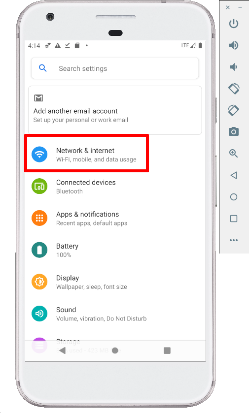

특정 리스폰스에서만 재현되는 버그 상황이 있을 때, 수많은 API 요청들 가운데 특정 값만 바꾸면서 테스트하고 싶을 때, 아직 서버 개발은 완료되지 않았는데 명세만 나왔을 때, 우리 앱을 어떻게 테스트하고 계신가요? Charles는 이 모든 것을 쉽고 빠르게, 가상 기기 위에서 테스트 가능하게 합니다.

행복한 찰스의 세상으로 입성하기 위해서는 다음과 같은 개발 환경 구성이 필요합니다.

## 1️⃣ Charles, SSL 인증서 설치

1. [Charles 공식 사이트](https://www.charlesproxy.com/download/)에서 Charles app을 다운로드

2. 다운로드받은 app을 연 뒤, Charles Menu > Help > SSL Proxying > Install Charles Root Certificate 선택

3. 키체인에 인증서 추가됨을 확인

   

4. 인증서 우측 클릭 > 정보 가져오기 > 신뢰 > 이 인증서 사용 시: 항상 신뢰로 설정 변경

   

5. SSL Host 설정
   Charles Menu > Proxy > SSL Proxy Settings
   Host: *, Port: * 추가

   

## 2️⃣ Android Emulator에 Proxy 설정

1. 2번에서 사용할 Local IP 알아 놓기
   Charles menu > Help > Local IP Address
   
2. 에뮬레이터 > ⋮ > Settings > Proxy > Use Android Studio HTTP proxy settings 비활성화 > Manual proxy configuration > Host name(Local IP), Port number(8888) 설정 > Apply
   
3. 이후 Charles에 아래와 같은 팝업이 뜨면 Allow 버튼 클릭
   

## 3️⃣ Android Emulator에 APN 추가

|                           **설명**                           | **스크린샷**                                                 |
| :----------------------------------------------------------: | ------------------------------------------------------------ |
|               1. 에뮬레이터 내 설정 버튼 클릭                |  |
|                  2. Network & Internet 클릭                  |  |
|                    3. Mobile network 클릭                    |                   |
|                       4. Advanced 클릭                       |                         |
|                  5. Access Point Names 클릭                  |               |
|                    6. + 버튼으로 APN 추가                    |                           |
| 7. 다음과 같이 APN 설정<br />Name: Charles APN<br />APN: [epc.tmobile.com](http://epc.tmobile.com/)<br />Proxy: Local IP Address<br />Port: 8888<br />MMSC: http://mms.msg.eng.t-mobile.com/mms/wapenc |                         |
| 8. ⋮ > Save 버튼으로 저장 후 뒤로 나가 Charles APN으로 APN 선택 |         |

## 4️⃣ Android Emulator에 인증서 설정

1. 에뮬레이터 내 브라우저 > http://chls.pro/ssl 접속 후 다운로드
2. Certificate Name: Charles (아무거나 해도 무방한 것 같음)
3. Credential use: VPN and apps
   

## 5️⃣ Manifest 설정

1. res > xml > network_security_config.xml 파일 추가

   ```
   <?xml version="1.0" encoding="utf-8"?>
   <network-security-config>
       <base-config>
           <trust-anchors>
               <certificates src="system" />
           </trust-anchors>
       </base-config>
       <debug-overrides>
           <trust-anchors>
               <certificates src="user" />
           </trust-anchors>
       </debug-overrides>
   </network-security-config>
   ```

2. `AndroidManifest.xml` > <application> 안에 `networkSecurityConfig` 설정

   ```
   <manifest>
       <application
           ...
           android:networkSecurityConfig="@xml/network_security_config"
           >
           ...
       </application>
   </manifest>
   ```

## 6️⃣ 설정 끝! 접속 환경

- Wi-fi **OFF**
- Mobile Data **ON**

## 연결된 Charles 종료하기

1. Charles app 종료
2. emulator > ⋮ > Settings > Proxy > Use Android Studio HTTP proxy settings
3. Wi-fi ON 환경에서 접속

## Charles를 사용하고 싶으나 Emulator 연결이 잘 안 될 땐?

1. Charles app이 켜져 있는 게 맞는지 확인
2. ⋮ > Settings > Proxy > Manual proxy configuration이 켜져 있는 게 맞는지 확인
3. Wi-fi가 OFF되어 있는 게 맞는지 확인
4. Mobile data를 OFF 했다 ON 해 보세요!