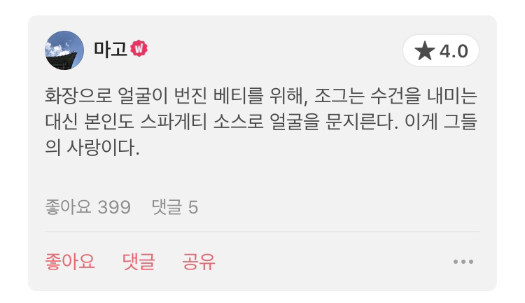
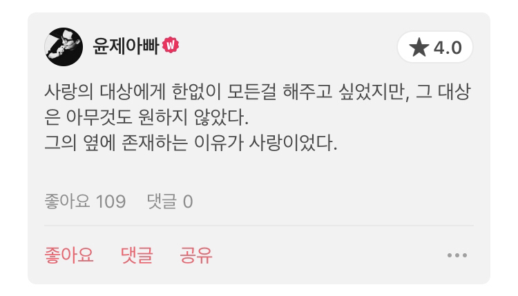
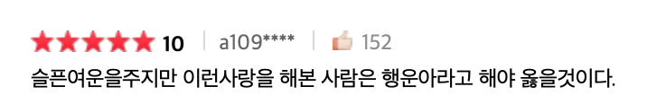

A: 베티는 사랑이 없어도 터질 사람이었을지 궁금하더라.

B: 나는 사랑 없이 살아가는 베티 모습이 상상이 안 가. 이상과 현실의 괴리가 너무 컸나 봐. 그 마음 어렴풋이 알 것 같기도 해.

A: 나도 그래. 꼭 사랑이 다 망친 것처럼 보일 수도 있을 텐데 사랑 없이는 이미 안 될 사람 같아. 그래서 조르그는 베티를 죽일 수밖에 없었을 거고.

없는 걸 가지려고 한다는 말 슬프더라. 저번에 봤을 때는 눈에 안 들어왔던 대사였는데, 그 계곡 신 이후로는 조르그가 베티를 동정하는 게 보이더라고.

B: 맞아. 사랑 없이는 안 될 사람이었어, 애초부터.

어제 나인 하프 위크 줄거리 읽고 이 영화가 생각났다고 했잖아. 그래서 나는 초반에 여기선 조르그가 베티를 진심으로 안 사랑하나? 했거든. 그런데 둘 다 사랑에 너무 진심이었어. 그게 참 슬퍼.

A: 맞아. 둘 다 사랑에 너무 진심이었고, 조르그가 베티 닮아 가는 모양도 조금 아팠어. 같이 얼굴 망치고 우는 장면도...... 나는 여기가 제일 슬퍼. 이런 사랑을 영화에서 볼 수 있는 게 좋았어.

B: 안 그래도 이 평점 보내려고 했어.

A: 와, 이 사람 나랑 똑같은 생각 했네.

B: 그때 조르그가 억장이 다 무너진 표정 짓잖아. 어쩌다 그렇게 됐냐고 얼굴 매만지면서 닦아 주는 게 아니라 자기도 같이 망쳐 버리고 키스하는 걸 보면서 상대에겐 저게 더 큰 위로가 될 것 같다고 생각했어.

A: 맞아. 앞에 아름다운 장면들 많잖아. 페인트 신도 그렇고, 자동차 신도 그렇고. 직설적으로 서로 사랑한다 표현하는 장면들보다 저 장면이 가장 저 둘의 사랑을 잘 나타내는 장면이라고 생각했어.

그리고 문득 다른 장면보다 이 장면 먼저 너랑 이야기할 수 있다는 게 좋다.

B: 나도 거기서 되게 슬펐거든. 저번에 니가 추락하는 사랑도 사랑이라고 했잖아. 그 장면 보면서 문득 생각나더라.

A: 새로운 의미의 추락이네. 둘 중 하나라도 덜 사랑하는 게 아니었고, 사랑해서 추락하는 거였으니까.

B: 평점에서 누가 덜 사랑했고 누가 더 사랑했다고 논쟁하는데, 그건 아무런 소용도 없다고 생각해. 둘은 각자의 방식으로 뼈저리게 사랑했어.

A: 저런 생각을 하는 사람도 있구나. 이 영화 보면서 어떻게 그런 생각을 할 수가 있지.

네 말마따나 각자의 방식으로 뼈저리게 사랑했지. 실컷 보여 준 게 그거였던 것 같은데.

B: 그러니까. 저걸 보고도 사랑을 저울질할 수가 있나.

그리고 이것도 너무 슬펐어. 베티는 너무 사랑해서 다 주고 싶었고, 조르그는 베티 하나만 있어 주면 다른 건 다 필요 없었고.

영화 끝나고 실컷 울고 있네. 진짜 웃겨.

A: 이거 진짜 너무 좋다. 둘이 아무리 점점 모습이 닮아 갔어도, 이건 끝까지 달랐던 것 같아서 더.

하나씩 짚으니까 슬퍼?

B: 노래 들으면서 이렇게 대화하니까 너무 슬퍼. 이것저것 다 생각나서.

너 아니었으면 이 영화 못 봤을 거야. 그래서 고마워.

좋아하는 로맨스 다섯 손가락 안에 들어.

A: 추천한 보람 있네. 대화 속에서 자연스럽게 이야기한 영화였을 뿐이었는데.

나도 너 아니었으면 이렇게까지 하나하나 못 슬퍼했어. 묘하게 좋았던 영화로 끝났겠지.

B: 짜증 나. 너무 슬퍼.

A: 그렇게 슬퍼.

B: 진짜 미친놈들 같은데 그래서 더 슬퍼.

원고 욕했다고 패 버리고, 자기 애인 욕했다고 음식물 쓰레기로 피자 만들어 주고.

고소 취하하라고 패 버리고. 진짜 미친놈들.

A: 미친놈들이야. 강도 짓도 해, 사람도 찔러.

B: 어제 니가 베티 블루 추천했을 때 잠깐 평 봤거든. 그 평이 좋아서 어떤 영화인지 궁금했는데, 아무리 찾아도 안 보여.

너무 슬픈 사랑이지만, 살면서 저런 사랑 해 봤다는 것만으로도 행운아라고.

A: 이건가?

B: 맞아. 그거야. 왜 나는 안 보여?

A: 내가 찾아 주라고.

