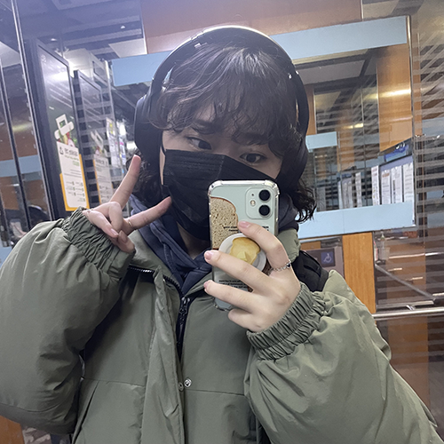

### 언리미트 제육

언리미트 구이용에 시판 볶음장, 새송이버섯, 깻잎만 넣어 주면 걍 고대로 제육볶음 완성이다. 이거에 미쳐서 진짜 자주 해 먹었었는데. 한동안 해 먹기 귀찮았다가 요즈음 다시 이것저것 만들어 보는 데에 재미 들렸다. 재미의 비결은 성공. 내 입이 즐거우니까 재미있다.

### 운동

제주에서 돌아온 뒤로 좀 쉬다가 다시금 열심히 하기 시작한 운동. 작년에는 어떻게 그렇게 열심히 했더라.

### 예은

예은이가 많이 힘들어 하길래 만나면 꼬옥 안아 주겠다 약속했었다. 계단 앞에 있는 걸 발견하자마자 나는 예은을 가볍게 안았고, 꽃을 선물받았고, 이 날 이후로 나는 내가 좋아하는 사람들을 안을 줄 알게 되었다. 해 준 것 없이 받기만 한 것 같다 느껴진 날이었는데. 사람을 아끼는 방식까지도 선물받은 기분이다. 칠흑 같았던 나의 초겨울이 사랑으로 가득 찼던 날이라 따로 적어 두었다. 오래 기억하도록. [https://brunch.co.kr/@chaeniiz/49](https://brunch.co.kr/@chaeniiz/49)

### 수빈

비건 하면 내 생각부터 하고, 비건 디저트만 보면 나랑 갈 곳이라고 그러는 게 넘 귀여븐 수빈이. 과일 향기 나는 향수 뿌리고 왔길래 과일아, 하고 불렀다. (ㅋㅋ) 치를 떠는 게 넘 웃겼다. 내가 귀여븐 수빈이라고 한 것도 알면 소리 지를 듯. ㅋ 소리 지르는 것 보고 싶네…? 반응 개재미있는데…. 아무튼 망원 갔다. 셰발레리 가서 비건 요리로 배 채우고, 두두리두팡에서 비건 디저트 왕창 먹었다. 둘 다 넘 잘 먹어서 탈. 간 곳 두 곳 다 너무 맛있었어서 탈. 내가 비건이 된 뒤로 친구들을 만나면 나를 위해 비건 식당에 ‘가 주는’ 친구들이 많은데(물론 이것도 너무너무 고맙지만), 수빈이는 ‘나랑 이런 비건 식당에 가고 싶어 하는’ 친구라서 더 고맙다.

### 브라이트룸

마지막 수업은 내가 만들었던 조악한 도자기들에 채색하는 작업이었다. 생각해 놓은 색도 없이 바쁘게 바쁘게 칠했다. 채색한 뒤 단단히 굳혀 몇 주 뒤에 픽업했다. 화병이고 싶었지만 화병으로 쓰일 수 있을까 싶었던 녀석은 마른 꽃을 꽂아 두는 데 잘 쓰이고 있고, 밥 먹을 때 제법 잘 쓰이리라 생각했던 도자기들은 전혀 사용하지 않고 있다. 쓰일 줄 알았던 게 못 쓰이는 슬픔보다 쓰일 줄 몰랐던 게 잘 쓰인다는 것의 기쁨이 더 크다. 그래서 좋았다. 슬슬 꽃 버릴 때 되긴 했는데. 꽃 버려야 좋은 일 생길 테니까.

### 준호 님 집들이

시월의 만남이 너무 재미있었던 고로 (이사한 지는 한참 됐을 텐데) 간 준호 님 집들이. 제일 즐기고 있는 것 같으면서 쓸모없는 선물에 괴로워하던 준호 님, 은근 재미있어 보였으면서 집에 붙은 이름표 압류 딱지냐면서 씅 내던 준호 님, 자꾸 빨리 집에 가라면서 바지락 술찜까지 해 준 준호 님의 모습이 기억에 남는다. 재미없었으면서 인스타 스토리에 왜 올리구 왜 자꾸 친구들이 스토리 보구 생일이냐구 연락 온다구 말해요? ( ͡° ͜ʖ ͡°)

### 청계산 플로깅

비건 커뮤니티 첫 대면 밋업. 나의 첫 플로깅, 첫 청계산. 청계산으로 가는 길에는 쓰레기가 많았지만 산은 깨끗했다. 보이는 쓰레기라고는 끽 해야 알사탕 봉지 정도. 나보다 더 열심히 쓰레기를 줍던 미취학 딸랑구들의 에너지를 잔뜩 받았다. 나는 어른들보다 훨씬 빨리 산을 오르는 아이들 때문에 혹여 무리에서 벗어날까 뛰다시피 산을 같이 오르며 전담 마크 했고, 이 덕에 어머님께서는 산과 하늘을 천천히 구경하실 수 있었다 하셨다며 고마움을 전해 주셨다. 마음이 따뜻했다. 오히려 내가 받은 게 더 많았었는데. 천이 흐르는 산이어서 더 좋았다.

정상 찍고 하산한 뒤에는 근처 두부 맛집에서 건강하고 깨끗한 한 끼를 함께했다. 비건 모임답게 국물도 비건인 것까지 미리 전화해서 확인해 주셨었다. 세심함에 감동했고, 이때 먹었던 막걸리에 또 감동했다. 진짜 개도른 맛. 최근 먹었던 막걸리 중 제일 맛있었다. 혹시 이 대마가… 그 대마인 걸까…?

### 아름다운 사람의 이름은 혼자

한동안 책장에 처박아 두기만 했다 오랜만에 읽었다. 처음 읽을 때나 두 번 읽을 때나 여전히 좋았던 시.

### 세정 번개

우리 세정이가 회사 때문에 많이 힘들어해서 우리의 아지트로 직행했다. 별 그지 깽깽이 같은 놈들이 세정을 괴롭히고 있었는데 괴롭힘당하는 와중에도 단단하고 소신 있게 할 말도 할 몫도 다 하는 내 친구가 대견했다. 마음 쓰이기도 했고. 내 친구 괴롭히면 디진다, 그지 같은 놈들아. 니들은 힘들 때 아지트 같이 갈 친구 있냐? 없을걸. 세정이는 있어.

### 머리 뽀끔밥

드디어 층 냈던 머리가 많이 길어서 내가 원하던 길이로 빠글하게 볶았다. 앗싸. 뽀글뽀글한 겨울을 보내 봐야지.

