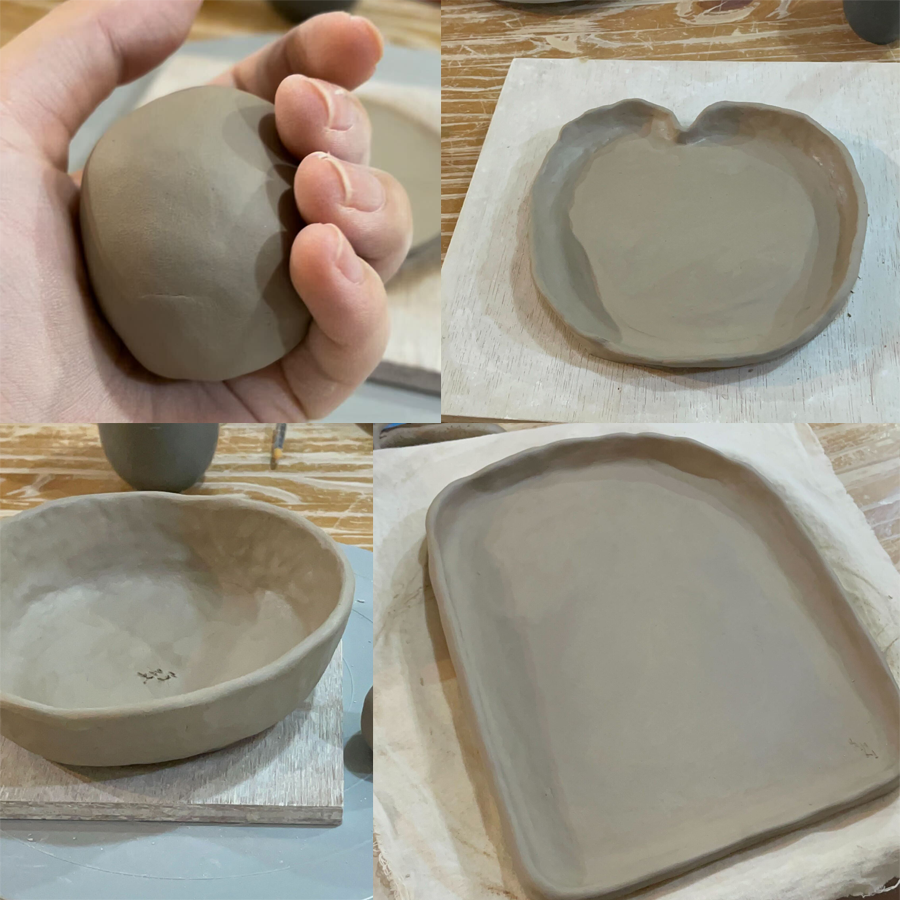
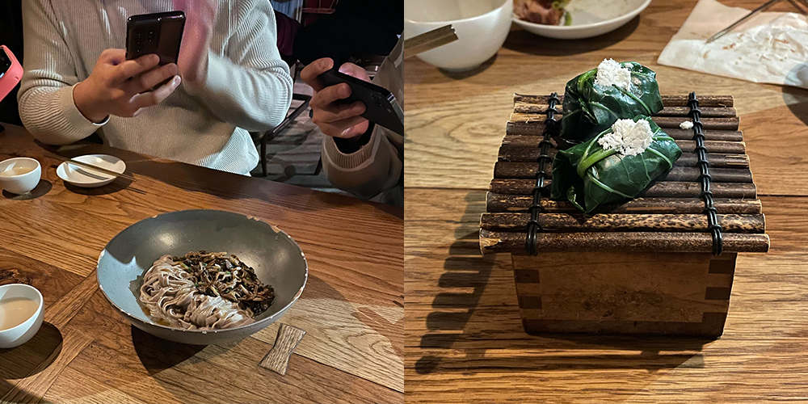
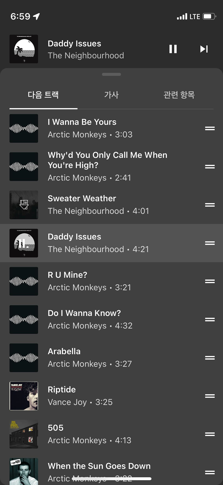
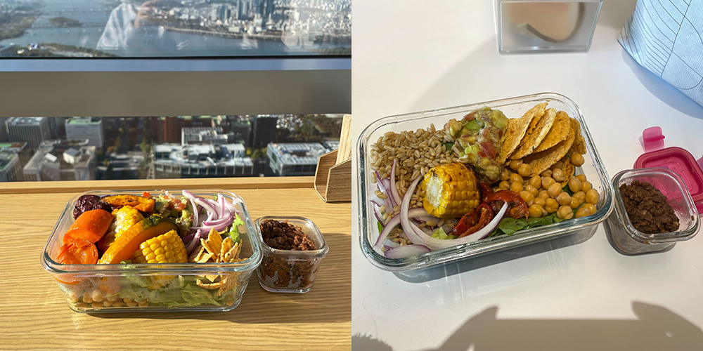
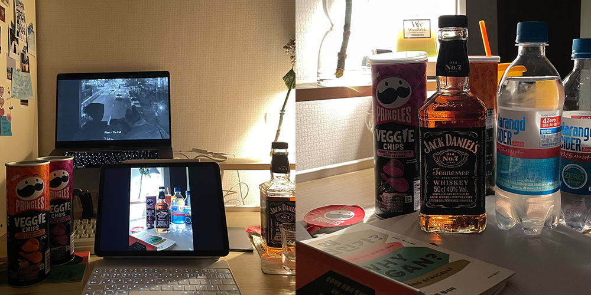
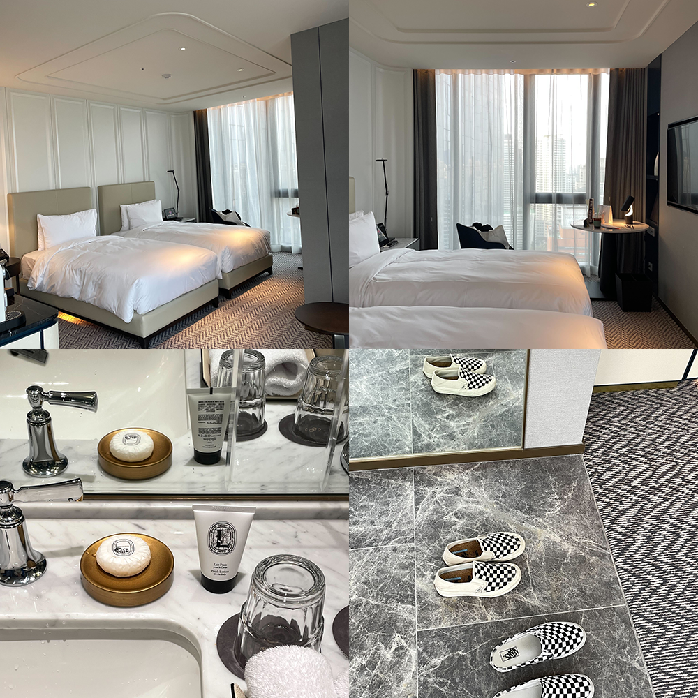
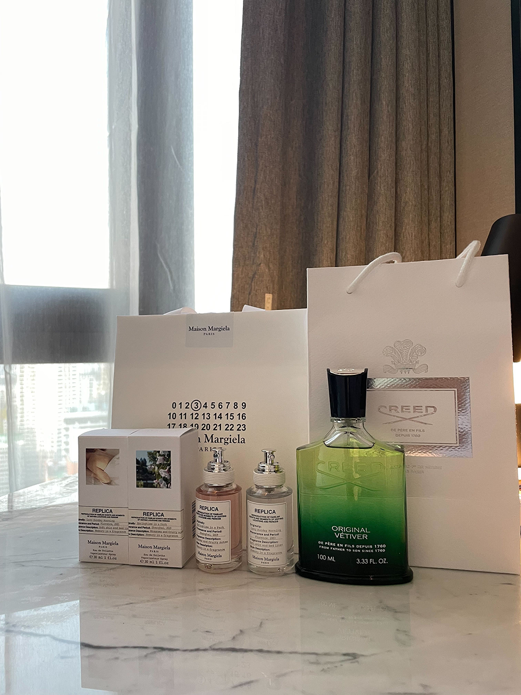
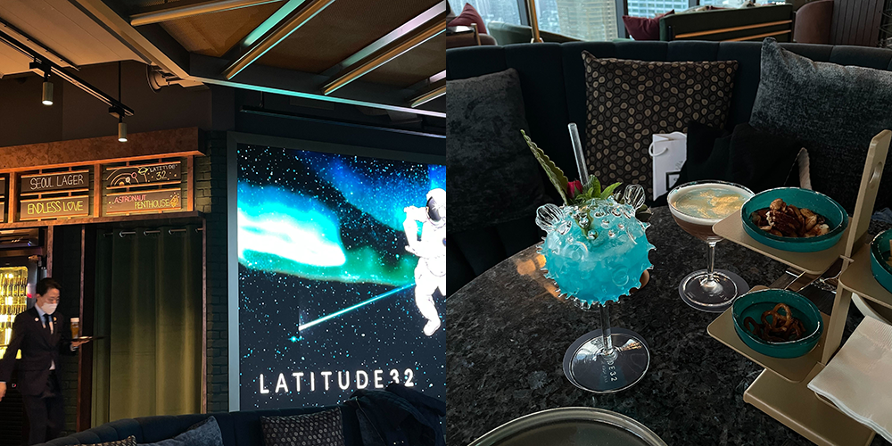
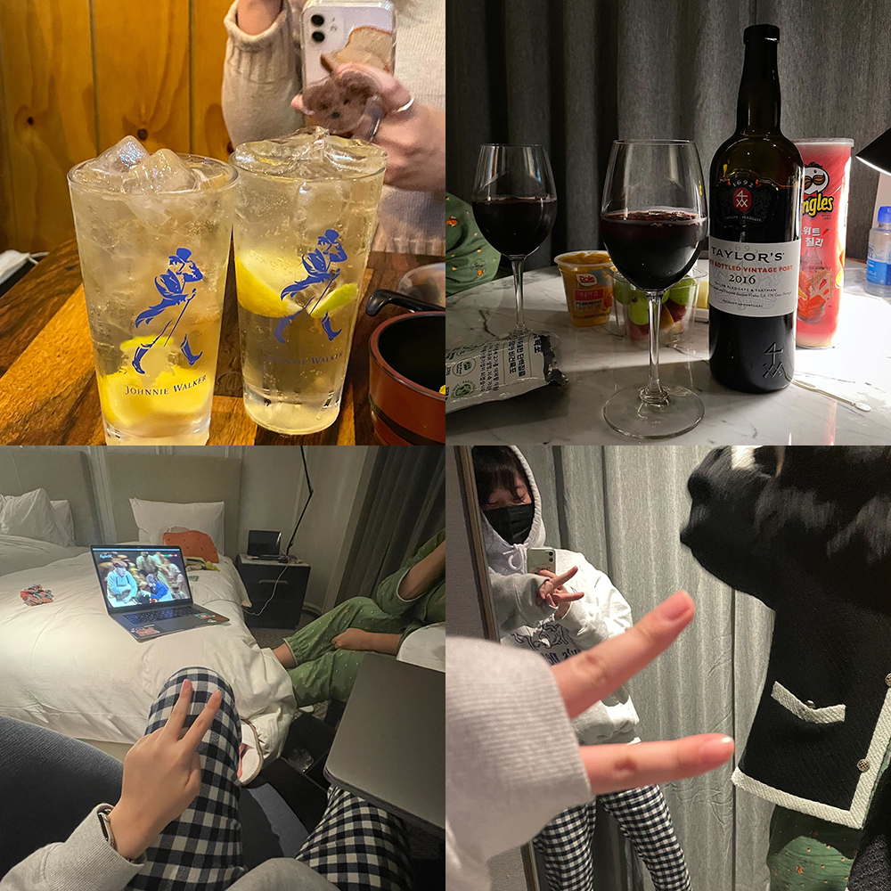

### 브라이트룸

원데이 클래스 좋지만 한 달 정도 꾸준히 할 수 있는 취미 활동도 갖고 싶었다. 그런 찰나에 마침 팔로우 하고 있던 만화 계정주가 도자 공예 클래스를 듣는 걸 올렸는데, 작고 따뜻한 공방이라는 것과 두 시간 동안 자유롭게 흙을 만지고 만든 만큼 작품을 가져갈 수 있다는 데에 끌려서 냅다 클래스 신청했다. 그림도 그렇고 공예도 그렇고 나는 미술에 영 소질이 없다. 그런데도 흙을 만지고 있으면 자유로운 기분이 들었다. 쉽게 변형되고 금이 가도 물만 묻히면 금세 돌아온다는 것도 좋았고, 차갑고 말랑하던 게 딱딱하게 굳어 가는 것도 좋았다.

### 안씨막걸리

제이 에이치 문 님의 추진력으로 동글 + 아란 + 채윤 + 준호 조합 뭉쳤다. 비건 옵션 가능한 식당 찾다가 개힙한 곳 눈에 들어와서 넷 중 둘 찬성 의견만 받고(아란 & 채윤) 예약 갈겨 버렸다. 과연 미쉐린은 미쉐린이었던 것인지, 음식 하나하나에 오만 가지 정성이 들어 있는 것 같았다. 나의 온 미뢰가 반응했다. (ㅋㅋ 오바 쫌 보탰음) 암튼 언제든 이곳을 다시 찾는다면 버섯과 메밀면은 필수로 시켜야지 싶었다. 논비건 음식들도 섞어 시켰는데 다들 비건 음식을 가장 맛있게 먹었다는 것도 기분 좋았고, 이유도 모르게 계속 웃었고, 그냥 이 모임 자체가 너무 재미있었다. 그래서 2차에서 다음 약속 또 바로 잡았고. 나는 요즈음 만남에서 다음 만남을 기약하는 그 시간이 참 좋다. 같은 행복 다시 또 누리자고 미리 예약해 두는 기분이다.

### 플레이리스트

가을에는 온통 시꺼먼 플리를.

### 출근하면 용기 내고

회사 뷰가 좋으니 출근하면 용기에 샐러드 포장해서 여의도 내 발 아래에 두고 밥 먹었다. 돌아보니 이 시간 굉장히 행복한 시간이었네. 이직하거나 퇴사한다면 두고두고 기억할 만한.

### 집에서 칵테일

행복한 출근길만 있다면 집에서 술 부어 마시고 있지는 않을 텐데요. 일 때문에 힘들었다. 취하고 싶은 날이었는데 이상하게 전처럼 잘 취하지도 않아서 깔루아 반 병 두유에 섞어 먹고 편의점으로 튀어서 잭다니엘이랑 사이다 샀다. 반 병 이상을 비우고도 나는 취하지를 않았고.... 방에 위스키 한 병 있다는 게 어떠한 위안이 된다는 게 참. 이게 좋은 건가? 이런 걸로 좋아도 되나?

### 소피텔

안 좋은 일 여럿 겪다 보니 심적으로 지쳐 있었는데, 아란넴이 신상 호텔 같이 가서 푹 쉬자 제안했다. 와이 낫, 와이 낫. 바로 예약하고 짐 챙기고 호캉스 떠났다.

별 다섯 개. 내가 가 본 그 어느 호텔보다도 제일 좋았다. 일단 어메니티가 딥디크 필로시코스였다는 점에서 내 마음 고대로 앗아갔다. 나의 원 앤 온리 최애 향을 어메니티로 만나다니. 목이랑 손목에서만 나던 향 몸 전체에 끼얹는 기분이란. 걍 지존 좋았다. 그리고 좋은 기분 더 좋으라고 나는 또 소비까지.

한두 달 고민했지만 역시 너무 좋아서 샀다. 크리드 오리지널 베티버. 9월인가 아란넴 어벤투스 포 허 살 때 시향해 보고 이건 미친 향이다, 이렇게 운명 같은 향을 만난 건 처음이다 싶었지만 악마 같은 가격도 그렇고 재고가 있는 곳도 없었어서 얘는 내 운명이 아닌 건가 싶었는데 결국 드디어 손에 넣어서 그런지 정복욕(?) 장난 없었다. 간절히 바라던 걸 손에 넣는 기분도 오랜만에 느껴 본 것 같다. 확산력은 또 얼마나 좋은지 호텔 옷장에서 베티버 향이 폴폴 났었지.

라티튜드32, 호텔 내에 있는 멋진 바. 행성 콘셉트의 시그니처 칵테일을 팔았고 창밖으로 보이는 뷰가 좋았다. 다만 창가 자리는 미리 예약해야 앉을 수 있었다는 점. 언젠가 여기 꼭 다시 오자며, 그때는 창가 자리 꼭 예약하자고 아란과 약속했다. 안주도 맛있었고 칵테일도 맛있었다.

그치만 역시나 우리는 취하지 않아서 2차로는 아란이 사랑해 마지않는 이자카야에 갔고, 3차로는 호텔에서 와인 깠다. 4차로는 와인 한 병 더 사러 갔다. ㅋㅋ 우리가 함께 사랑한 뮤지컬도 다시금 같이 보고, 무슨 이야기를 그렇게 재잘댔는지 새벽 네 시까지 잠도 안 자고 둘 다 쌩쌩하고. 물론 다음 날에는 오전 반차 갈겼지만. 꽉 채워서 분명하게 행복했다.

