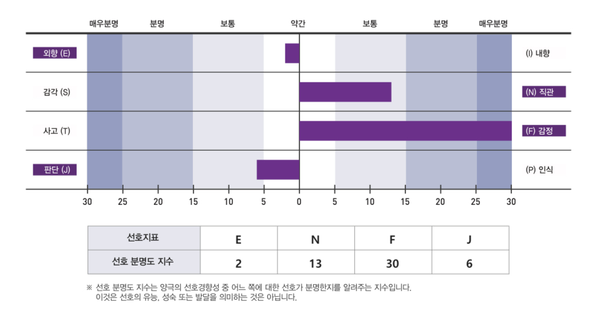
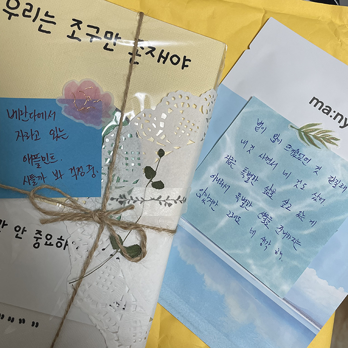
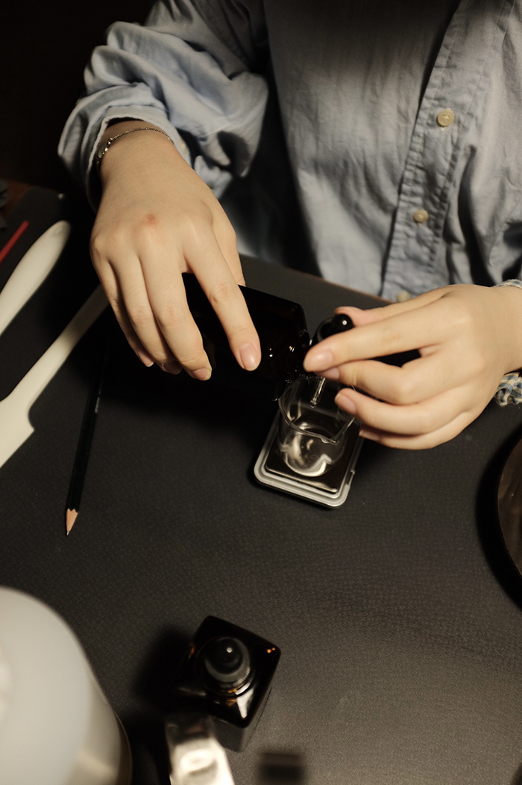
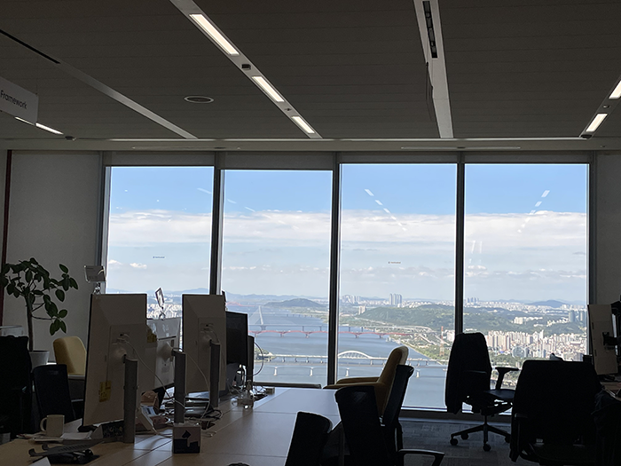
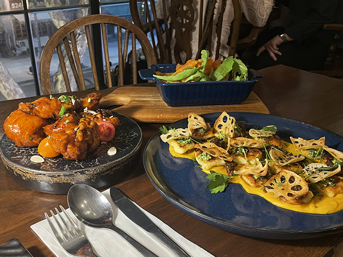
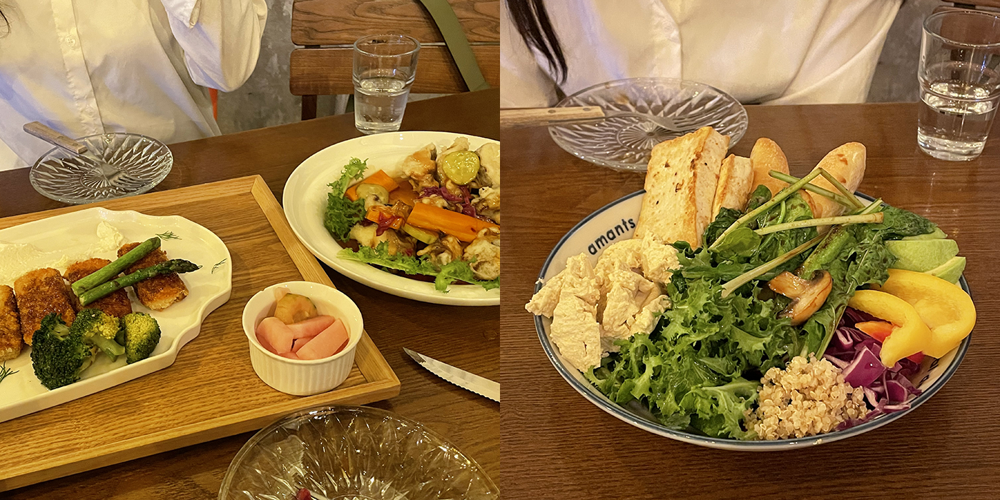

### MBTI 정식 검사

MBTI 과몰입녀답게 유료 정식 검사까지 완. 역시나 엔프제 나오셨고 웃긴 건 F 만점 받았다는 점. ㅋㅋ 이 미치도록 감정에 치우친 인간아....

### 유정

이 마음이 너무 예뻐서 책장 벽에 붙여 두었다. 유정에게 몇 번의 택배를 받았는데 나는 무엇보다도 이 포스트잇이 왜 이렇게 좋았는지. 내가 특별한 삶을 살고 있지 않을 때에도 누군가에게는 생각나는 사람일 수 있다는 게 좋았을까.

### 팜프리 비누

원데이 클래스는 할 때마다 '내 길이 아닌 것'을 찾아가는 과정 같다. 비누는 일전에 만들어 봤었던 캔들처럼 타이밍과 계량이 중요했고 나는 그것들을 지지리도 못했다. 내가 잘한 것은 향기를 맡고 어떤 향이 나는지 표현하고 고르는 일. 고등학교 2학년 때 동경하던 언니가 뿌리던 향수 때문에 좋아진 향기의 세계를 나는 여전히 열심히 쌓아 가는 중. 그 언니 잘 지낼까. 언니... 나는 비누에 풀 향기랑 나무 향기 섞었어.... 잘 지내지?

만드는 과정 중 가장 좋았던 것. 첫째, 클래스 결제 전 팜프리 비누를 원하는지 물어봐 주셨다는 점. (팜유가 없으면 세정력이 덜하지만 팜 재배 과정에서 얼마나 많은 밀림이 훼손당하는지와 더불어) 둘째, 클래스 시작 전 이삼십 분 가량 다도하는 시간을 가졌다는 점. 셋째, 향을 고르는 데에 얼마나 오랜 시간이 걸리더라도 기다려 주셨다는 점. 넷째, 클래스 내내 방문하고 싶었던 스페인 여행기를 들려주셨다는 점. 다른 클래스에도 신청해 볼 요량이다.

### 간헐적 출근

제주도에서 돌아온 뒤로도 재택 근무를 쭉 하고 있지만 간헐적으로 출근하는 날들도 있다. 한강 뷰는 익숙해질 만하다가도 오랜만에 가면 또 너무 멋있고 가끔은 내가 그만큼 멋있는 사람이 된 것 같아서 행복해지고.

### 세정 생일

세정 생일을 맞이하여 이태원 몽크스부처로. 또 또 뇨끼 먹은 우리. 또 또 음식 세 개 시킨 우리. 또 또 여전한 우리. 요즈음은 오래 만난 친구들이 점점 애틋해진다. 이 날은 웃기게도...... 우리는 항상 밥을 참 편안하게 먹는다는 사실이 새삼 크게 다가왔다. 주는 선물을 항상 소중하게 여겨 주는 것들도 또 고마웠고. 참 고마운 친구. 나의 제주 한 달과 세정의 유럽 반년이 닮아 있었어서 그 여행들을 기점으로 달라진 우리를 반추했고 그러면서 또 한 번 나는 세정이 좋아졌다.

### 다이너재키

유리랑 망원 나들이. 궁금했던 다이너재키에 함께 가서 음식 세 개 시켜 먹었다. 나 이제 친구랑 음식 세 개는 무조건 디폴트인 여자가 된 걸까. 평화에 대한 이야기를 많이 나누었는데 유리의 평화에 대한 생각은 어땠는지 덜 물었던 것 같네. 내가 요즈음 느끼는 평화의 순간은 <하고 싶은 걸 하고, 하기 싫은 걸 하지 않을 때>, <크게 와닿는 것들이 많을 때>. 유리 앞에서 말했던 <숫자로 따지면 0일 때>도 여전히 드는 생각 중 하나고. 플러스로 너무 높아지든, 마이너스로 너무 낮아지든 전부 평화와는 거리가 먼 것 같다.

### 프레젠트모먼트

망원 나들이 갔던 날에 유리가 선물 같은 공간을 발견해서 냅다 들어가 봤는데, 귀여운 테디베어들이 살고 있는 공간이었다. 심지어 각 인형마다 사연이 있는. 그리고 공간의 분위기가 365일 내내 크리스마스인.

보자마자 스토리 텔링 과몰입 & 크리스마스 과몰입 좋아하는 아란이 떠올랐고 아란 생각 났다면서 보내주자마자 받은 메시지에 또 기분 좋아졌다. 왜냐? 나도 누가 '내 생각 났다' 말하는 순간을 사랑하그등. 그 기분 사랑했다는 것 아란 덕에 다시금 떠올라서.

