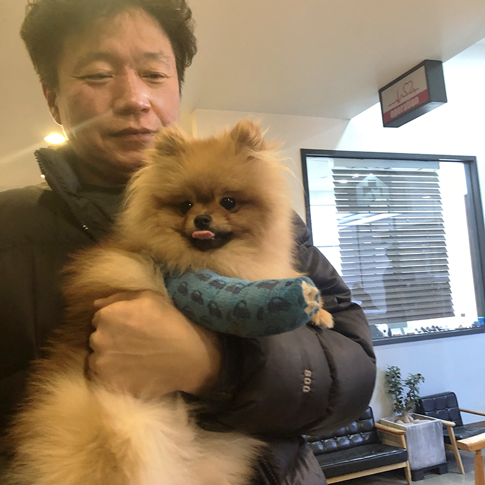
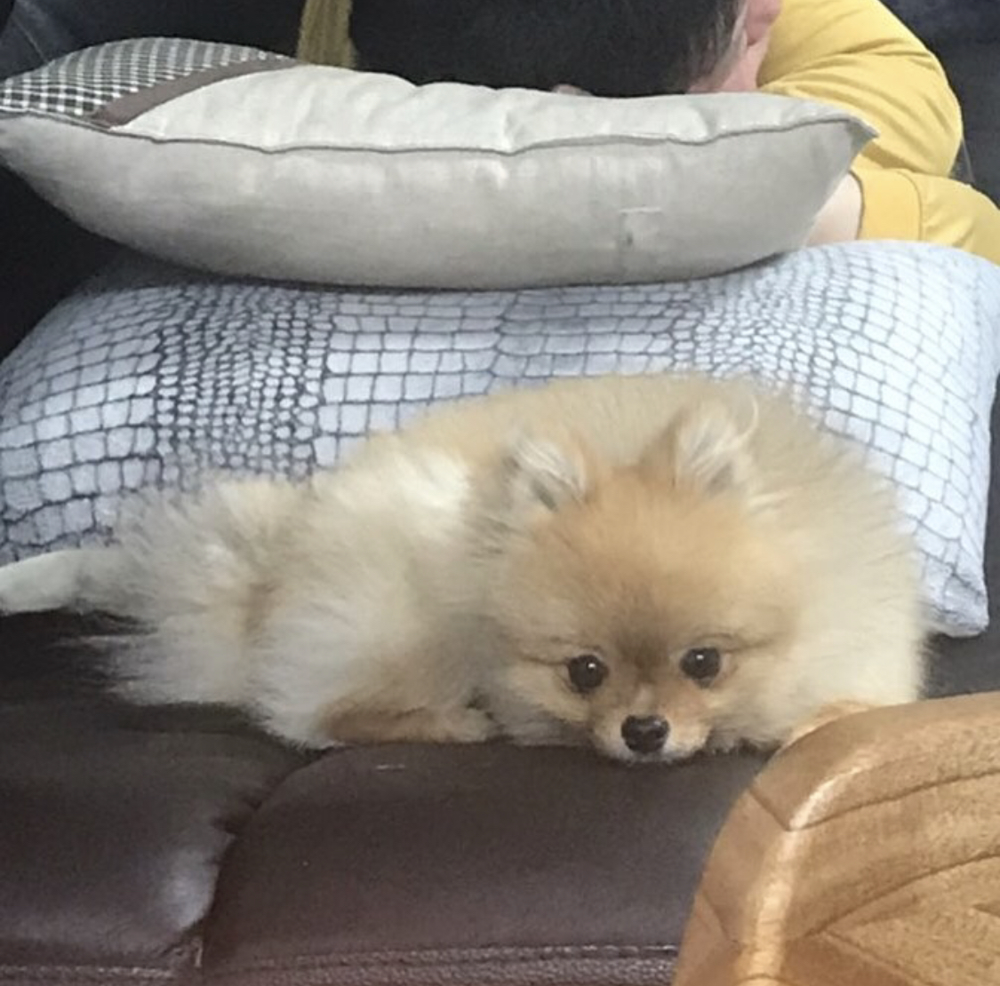

침대 위에 널브러진 못생긴 사자 인형과 귀여운 아기 사자 한 마리를 보니 땅콩이가 입원해 있었을 때가 떠올랐다.

반려동물은 가족을 들이는 일이다. 우리는 땅콩이와 올해 2월 말부터 함께 살기 시작했고, 함께하기 전 우리 가족의 마음가짐은 이러했다.

1. 우리 가족은 삶이 단조롭고, 개인 중심적이다. 조건 없는 사랑이 필요하다. 이에 모든 가족이 강아지를 새 가족으로 맞기를 원했다.
2. 우리 가족은 강아지가 아낌 없이 주는 사랑에 보답할 수 있어야 한다.
3. 가족이다. 한 명만이 돌보는 일은 없어야 한다.
4. 시작부터 끝까지 사랑하는 일임을 잊지 않아야 한다.

강아지를 가족으로 맞은 뒤부터는 온 가족이 함께하기로 했지만, 첫 만남은 오롯이 내 담당이었다. (이 덕에 내가 주 보호자가 되었다) 나는 소위 말하는 강아지 분양숍에서는 아이를 데려오고 싶지 않았고, 가족을 잃은 강아지나 가족을 잃기 직전인 강아지를 품고 싶었다. 그래서 종일 포인핸드 앱과 유기 동물 카페를 들락날락했었다. 그러던 중, 5개월령 강아지를 분양 보낸다는 글을 보게 되었다. 말이 분양이지, 파양을 잘 포장한 것이었다. 딱 한 장 있는 사진을 보자마자 마음이 홀린 것같이 쏠렸다.

간단하게 쪽지로 이야기를 나눴다. 전 주인은 내 나이, 직업, 가족 구성원 정도를 물었고, 언제 아이를 데리러 올 수 있냐고 물었다. 위치는 인천이었고, 나는 강아지를 데려오기 전에 무엇을 물어야 하는지도 모른 채 그저 빨리 가겠다고만 했다. (당장 오지 않으면 다른 사람에게 줄 것인 양 빨리 오라고도 했다) 급하게 아빠를 불러서 차를 타고 출발했고, 그렇게 연락한 지 세 시간 만에 우리 가족의 첫 강아지를 만날 수 있었다. 전 주인은 내게 강아지가 들은 가방을 건네 주면서 궁금한 점이 있으면 연락 달라고 했고, 우리가 집으로 돌아가는 사이에 카페를 탈퇴했다. 바보같이 번호도 묻지 않은 나는 연락할 방도가 없어졌지만 강아지 보낸 전 견주의 마음이 싱숭생숭해 그랬겠거늘, 별일 없겠거늘 했다.

작은 가방 안에 얌전히 앉아 있던 우리 강아지. 한쪽에 뚫려 있는 숨구멍으로 손가락을 갖다 대자 처음 보는 사람의 손인데도 날름날름 핥던 작은 강아지. 보자마자 들었던 생각은 정말 작다는 것이었다. 땅콩이는 지금도 체구가 작은 편인데, 그때는 2kg도 안 될 만큼 정말 작았었다. 품에 안으면 한 줌도 안 되는 것 같았고, 금방이라도 부서질 것 같아서 살살 안았다.

> 강아지 이름은 오래 전부터 지어 뒀었다. 갈색 강아지를 기르면 꼭 땅콩이라고 지어야지, 하고. 그때는 아주 획기적이고 기발한 이름이라고 생각했는데 지금 보니 회사 사람들 강아지만 해도 땅콩이가 넷이나 되더라. 그래도 송땅콩은 하나.

가방 문을 열어 주자 땅콩이는 아주 조심스럽게 밖으로 나왔다. 이제는 볼 수 없는 그런 소심한 몸짓이었지, 아마. 어색한 듯 집을 고갯짓만으로 둘러보고 있길래 다짜고짜 엄마, 아빠, 동생 다 모여서 간식도 줬었다. 우리 나쁜 사람 아니야, 너랑 더 친해지고 싶어, 이런 마음으로. 마음이 닿은 건지 땅콩이는 주는 간식을 전부 냠냠 받아먹었고, 금세 힘차게 뛰어다니다가 내 무릎 위에 앉아서 몸을 웅크렸다.

내 강아지가 세상에서 제일 완벽한 강아지인 것 같았다. 너무 예뻤고, (객관적으로 예쁘게 생김) 너무 착했고, 사교성까지 만점인 강아지라니. 건강만 했으면 함께하는 평생이 행복할 것 같았다. 땅콩이는 사료가 입에 안 맞았는지 한두 번씩 토했고, 처음 데려온 뒤 검진도 받아 봐야겠다 싶어 데려온 지 5일 만에 동물병원을 찾았다.

동물병원 첫 방문기는 모든 게 새롭고 신기했다. 일단 병원에 가면 보호자 이름이 아닌 아이 이름을 묻고, 검진에 들어갈 때도 보호자 이름이 아닌 아이 이름을 부른다. 그래서 처음에는 `봉식이요~` `두부요~` 하는 말들이 너무 귀엽게 느껴졌다. `땅콩이요~` 차례가 됐을 때, 나는 안는 것도 어색했지만 강형욱 선생님께 배운 대로 땅콩이 엉덩이를 손으로 힘차게 받친 채 입장했다.

어떻게 왔냐 물으셔서 아이를 데려온 지 얼마 안 됐다, 어제 한두 번 토해서 걱정이다 등을 이야기했고, 선생님은 아이 접종 여부를 물으셨다. 처음 아이를 데려올 때 카페에 올라왔던 글에서는 접종을 모두 마쳤다 되어 있기는 했다고 말씀드렸고, 그럼 진짜 맞춘 게 맞는지 검사해 보겠다 하셨다. 토하는 건 아기 때 자주 그러니 걱정 말라, 몇 살이냐 물어서 5개월이라 듣고 데려왔다 했는데 고개를 갸우뚱하셨다. 여기서 뭐지? 싶었지만 일단 검사에 들어가겠다고, 잠시 대기하라고 해서 동생이랑 같이 의자에 앉아 있었다.

검사 중간중간에 선생님이 몇 번이나 나와서 날 찾았다. 처음으로 들은 이야기는 아이 이빨이 두 줄로 나 있는 걸 아냐는 것이었다. 강아지는 적정 시기에 터그 놀이 등으로 유치를 자연스럽게 빼 주어야 하는데, 그걸 한 개도 빼 주지 않아 이빨이 두 줄이라는 것이다. 나는 몰랐다고 어리둥절했다. 장난감 던져 주기 놀이는 했지만 물고 오는 이빨을 자세히 보지는 않았으니까. 그렇게 다시 기다리다가 선생님이 다시 뛰어나오셨다. 이번에는 헐레벌떡. 놀라서 올려다보니, 아이 오른쪽 발이 이상한 걸 알고 있냐 물으셨다. 가끔 짝다리를 짚는 것처럼 보이기는 했지만 전혀 몰랐다 말씀드렸더니 한쪽 다리가 완전히 뒤틀려 있다 했고, 엑스레이를 찍어 보겠다 하셨다. 이때부터 심장이 쿵쿵거렸다.

엑스레이 결과는 참담했다. 이미 오래 전 부러진 오른쪽 다리에 가골이 이상하게 형성되어 완전히 뒤틀려 있는 상태였고, 최소 4개월은 방치된 상태라고 했다. 그리고 이빨이 이렇게 두 줄로 날 정도면 절대 5개월령 아이는 아니라고, 최소 8개월은 된 아이라고 말씀하셨다. 접종은 다 맞은 걸로 나오는데 접종 기간 동안 다리 골절을 절대 모를 수가 없다고, 그걸 알고 더 이상 감당이 안 되니 파양한 것 같다는 이야기를 듣자 감정이 너무 복잡해졌다. 전 주인을 향한 분노도 있었지만, 그보다도 아파했을 땅콩이가 너무나도 가여웠다. 아프면 아프다고 말도 못 하고 얼마나 앓았을까, 그 작은 몸으로. 지금은 잘 뛰어다니더라도 수술을 해 주지 않는다면 크면서 점점 더 아파할 거라고, 하지만 이미 부러진 지 한참 된 다리를 수술하는 과정은 매우 복잡하기 때문에 비용적인 면에서도 부담이 크다, 집에 가서 가족들이랑 상의해 보고 연락을 달라고 하셨다. 나는 이 이야기를 듣자마자 고민 없이 수술을 해 줘야겠다는 생각이 들었고, 오로지 수술에 대한 위험성만이 걱정되었다. 만나자마자 2주나 입원이라니. 보고 싶어서 어떡하지, 혹시 수술이 잘못되면 어쩌지 하는 걱정. 내 적금 하나를 깨야 할 수술 비용이었음에도 그런 건 전혀 고민이 되지 않았다. 만난 지 5일밖에 안 됐는데도 할 수 있는 건 다 해 주고 싶었다.

그렇게 땅콩이 수술 날이 왔다. 잘못 붙은 가골 부분을 골절시킨 뒤 다시 접합하는 방식이라 매우 복잡한 수술이고, 수술 시간도 길고, 부작용도 있을 수 있다고 했다. 5 퍼센트 미만의 확률로 뇌사 상태가 되는 강아지도 있다고 했다. 수술 후 마약성 진통제도 놓는다고, 그에 따른 부작용도 또 있을 수 있다고 했고. 입원 중에 못 볼 시간만으로도 괴로웠는데 저런 이야기를 듣고 나니 마음이 더 괴로웠다. 수술 동의서에 사인을 하기가 무서웠다. 저 작은 몸에 얇은 뼈를 부러뜨리고 다시 붙인다고? 혹시나 잘못되면 어떡하지? 수술 중에 무슨 일이라도 일어나서 영영 못 보게 되면 어쩌지? 아무것도 모르고 의사 선생님 좋다고 꼬리 떨어지게 흔들고 있는 땅콩이를 보는데 머리가 복잡하고 마음이 무거웠다. 그래도 다 괜찮을 거라고, 더 건강하게 오래 행복하자는 마음 하나로 수술 동의서에 사인을 하고 땅콩이를 입원시켰다.

땅콩이를 담았던 가방을 들고 집에 왔다. 병원에서는 속으로 슬퍼도 의젓한 땅콩이를 보며 씩씩하게 사인하고 나왔는데, 집에 오자마자 너무 슬퍼서 눈물만 흘렀다. 가방 문을 열어 줘도 재빠르게 나와서 몸을 털고 물 마시러 뛰어가는 땅콩이가 없다. 땅콩이는 없는데, 땅콩이가 가지고 놀던 장난감은 다 널브러져 있다. 많이도 사 줘서 아주 곳곳에 다 그대로 있었지. 아직 치워 주지 않은 배변패드도 그대로, 말썽피운 흔적도 그대로. 모든 게 그대로인데 사랑하는 내 강아지만 없다는 사실에 눈물이 줄줄 났다. 누가 보면 영영 못 보는 줄 알겠지만, 혹시라도 이 모든 게 마지막일까 봐 무서웠다. 왜 견주들이 강아지가 눈물 버튼이 된다는지 몸소 경험한 순간이었다. 나는 극한의 상황이 아닌 이상 눈물도 없고, 슬픈 영화를 봐도 눈물이 없는 사람인데 이렇게 수도꼭지 튼 것처럼 눈물이 줄줄 나다니.

여기저기 기도해 달라고 많이도 빌었던 것 같다. 시니어 견주들에게 나약해지지 말라는 조언도 많이 들었지. 덕분에 수술은 성공적이었다. 이 주 동안 열흘은 면회를 갔던 것 같다. 하루는 동생이랑, 언제는 엄마 아빠 두 분이서, 언제는 또 아빠랑 나랑. 강아지 한 번 안아 본 적 없던 아빠한테 그놈의 `아빠, 엉덩이를 받쳐야 한다니까` `강형욱 선생님이 엉덩이 받치라고 했다고` 를 면회 때마다 했더니 일주일 넘어서부터는 안정적으로 땅콩이를 안고 있는 아빠 모습이 웃겨서 웃음이 나오기도 했다. 꼬옥 안아 주고 있다가 다시 입원실에 넣어 줄 때는 문을 긁으며 우는 내 강아지 모습이 너무 짠해서 집으로 돌아갈 때는 일부러 뒤를 더 안 봤다. 

강아지가 집에 있다는 건 삶을 송두리째 바꿔 놓았다 해도 과언이 아니다. 요즈음 집에 들어갈 때 와다다 달려와서 꼬리 흔들다 몸까지 흔들고 있는 땅콩이 보면 맨날 하는 이야기. 누나는 너만 있으면 된다. 누나는 너 보고 산다. 감정의 골이 깊어질 때나 육체적, 정신적인 한계에 달하면 불필요한 우울까지 씹던 나는 퇴근하고 침대에 누워서 슬픈 음악을 틀어 놓고 우울한 시간에 뒤덮여 있던 때가 많았다. 적정량의 우울은 있어서 해 될 게 없다. 마음을 더 자세히 들여다볼 수 있는 계기가 되기도 한다. 자신을 나락으로 빠뜨리는 것 같은 때가 문제일 뿐이지. 이때마다 생각을 버리고 싶었는데, 내 강아지는 그 역할을 톡톡히 해 주고 있다. 불필요한 우울을 씹을 새가 없다. 목적 없는 사랑을 주는 땅콩이를 보고 있으면 발끝부터 목끝까지 사랑으로 차오르는 것 같다. 

또 하나의 큰 변화는 가족이다. 온 가족이 말썽쟁이 막내를 보고 행복을 찾고, 그 행복을 나눌 시간이 생겼다. 그 행복을 나누기 위해서 더 대화하게 된다. 특히 우리 아빠의 변화가 컸다. 아빠는 자꾸 했던 이야기를 또 하는 걸 좋아하는데, 요즈음 최고 빈도를 자랑하는 말은 `땅콩이가 꼭 나랑 자려고 하네`이다. 땅콩이는 자는 곳이 고정적이지 않고, 잠들기 전에 가족 구성원 방을 한 번씩 가 본 뒤 그날 기분에 따라 골라 잔다. 아빠는 건강상의 이유로 퇴직 후 종종 일감을 받아서 출장을 다녀오곤 하는데, 아빠가 집에 있을 때에는 꼭 땅콩이가 아빠 발밑에서만 잔다. 그럼 나랑 내 동생은 그 모습을 찍어서 가족 단체 채팅방에 올린다. 그리고 엄마가 웃으면서 집 좀 치우라고 한다. 이렇게 바뀐 우리 가족이 좋다.

목적 없는 사랑에 보답하며 살고자 한다. 보답을 바라고 주는 사랑이 아니겠지, 땅콩이는. 그 예쁘고 착한 마음에 사는 동안 더 행복하게 해 주고 싶다. 오늘은 아침부터 산책을 다녀왔다. 떨어진 낙엽 위를 바작바작 소리 나게 걷다가도, 도보 위를 전력질주하다가도 한 번씩 뒤돌아보며 웃는 너를 보면 나는 계속 웃게 된다. 가을과 참 잘 어울리는 우리 땅콩이. 겨울이면 벌써 우리가 맞는 두 번째 겨울이네. 내 맥북 충전기 다 물어뜯었을 때에도 난 널 사랑했어. 아프지만 말고 살아 줬음 좋겠다.

